# 环境准备<a name="ZH-CN_TOPIC_0000001628490485"></a>

## 获取软件包<a id="ZH-CN_TOPIC_0000001628610441"></a>

**支持的操作系统<a name="section2858165210250"></a>**

支持openEuler  22.03、Ubuntu  22.04操作系统。

**获取软件<a name="section86051537863"></a>**

om-sdk.tar.gz需要从Atlas 500 A2 智能小站的Firmware固件包中解压获取。

**表 1**  获取软件包

|软件包名称|说明|获取方式|
|--|--|--|
|om-sdk.tar.gz|边缘管理系统软件包。|[获取链接](https://support.huawei.com/enterprise/zh/ascend-computing/atlas-500-a2-pid-254412305/software/261455669?idAbsPath=fixnode01%7C23710424%7C251366513%7C22892968%7C252309141%7C254412305)|

> [!NOTE] 说明  
> 边缘管理系统软件包可以直接使用，关于边缘管理系统的安装、使用、升级和卸载的指导请参见[user_guide](../user_guide)。

## 准备开发环境<a id="ZH-CN_TOPIC_0000001577810552"></a>

开发环境建议使用基于Ubuntu  22.04版本操作系统的服务器，首选与运行环境相同的AArch64架构。如果开发环境使用x86\_64架构的服务器，需要开发者自行安装交叉编译工具链。

- 开发环境的Glibc版本不低于2.28。
- 开发环境的Python版本不低于3.8。

**安装工具<a name="section173453103440"></a>**

在进行二次开发之前，开发者需要参考[表1 安装工具](#安装工具table)，确认开发环境。

**表 1**  安装工具<a id="安装工具table"></a>

|依赖|说明|安装命令或步骤|
|--|--|--|
|cmake|CMake用于编译源代码、制作程序库、产生适配器（wrapper）；还可以用任意的顺序建构执行档。|执行以下命令，安装cmake。<li>openEuler<ul>```yum install cmake```</ul></li><li>Ubuntu<ul>```apt-get install cmake```</ul></li>|
|git|Git是一个开源的分布式版本控制系统，用以有效、高速的处理从很小到非常大的项目版本管理。|执行以下命令，安装git。<li>openEuler<ul>```yum install git```</ul></li><li>Ubuntu<ul>```apt-get install git```</ul></li>|
|make|Make是一个根据指定的Shell命令进行构建的工具。|执行以下命令，安装make。<li>openEuler<ul>```yum install make```</ul></li><li>Ubuntu<ul>```apt-get install make```</ul></li>|
|gcc|GCC是编译的前端程序，它通过调用其他程序来实现将程序源文件编译成目标文件的功能。|执行以下命令，安装gcc。<li>openEuler<ul>```yum install gcc```</ul></li><li>Ubuntu<ul>```apt-get install gcc```</ul></li>|
|crossbuild-essential-arm64|（可选，仅限于X86编译环境需要）交叉编译依赖工具包。|执行以下命令，安装交叉编译依赖工具包。<li>openEuler<ul>```yum install crossbuild-essential-arm64```</ul></li><li>Ubuntu<ul>```apt-get install crossbuild-essential-arm64```</ul></li>|
|pam-devel|PAM（Pluggable Authentication Modules，可插拔身份验证模块）是一种允许系统管理员设置身份验证策略的系统安全工具，无需重新编译处理身份验证的程序。|执行以下命令，安装pam-devel。<li>openEuler<ul>```yum install pam-devel```</ul></li><li>Ubuntu<ul>```apt-get install pam-devel```</ul></li>|
|node.js/npm|用于编译前端代码。|为防止自定义前端项目下载依赖失败或编译失败，请安装16.20.2版本的node.js和8.19.4版本的npm，操作步骤如下：<br>1.执行以下命令，查看当前环境架构。<ul>```uname -m```</ul><ul><li>x86_64架构使用名称为node-v16.20.2-linux-x64.tar.xz的软件包</li><li>AArch64架构使用名称为node-v16.20.2-linux-arm64.tar.xz的软件包</li></ul></br>2.根据实际情况，下载软件包。node-xxxx.tar.xz为软件包名称。<ul>```wget https://nodejs.org/download/release/v16.20.2/node-xxxx.tar.xz```</ul>3.执行以下命令，解压软件包。<ul>```tar xf node-xxxx.tar.xz```</ul>4.进入解压目录，查看软件包node版本。<ul>```cd node-xxxx```<br>```./bin/node -v```</ul>5.执行以下命令，在root权限下设置软连接。<ul>```ln -s /path_to_node-xxx/bin/node /usr/bin/node```<br>```ln -s /path_to_node-xxx/bin/npm /usr/bin/npm```</ul>6.执行以下命令，查看全局node和npm版本。<ul>```node -v```<br>```npm -v```<br>以node为例，回显示例如下：<br>```v16.20.2```</br></ul>|
|zip|压缩文件工具。|执行以下命令，安装zip。<li>openEuler<ul>```yum install zip```</ul></li><li>Ubuntu<ul>```apt-get install zip```</ul></li>|

# 样例工程（AtlasSample）说明<a name="ZH-CN_TOPIC_0000001628490509"></a>

样例工程（AtlasSample）目录结构和文件说明如下，开发者需要参考样例工程的实现逻辑，创建自己的开发工程。

默认工程样例目录：

```text
├── build                                                    //构建目录
│   ├── build.sh                                            //构建脚本
├── config                                                   //产品配置目录
│   ├──module_def                                           //模组配置文件目录
│   ├──project_cfg                                          //产品配置目录
│       ├──project.conf                                     //产品配置文件
├── output                                                   //存放编译版本目录
├── platform                                                 //  om-sdk.tar.gz存放路径
└── src                                                      //用户增量源码目录
     ├── app                                                 //后端代码目录
           ├── add_extend_fusion_director_interface         //新增云边协同接口目录
           ├── add_extend_restful_interface                 //新增RESTful接口目录
           ├── add_custom_define_cms_verify                  //构建自定义签名校验目录
           ├── add_extend_driver_adapter                     //新增驱动适配器目录
           ├── add_customized_alarm                          //新增自定义告警目录
           ├── add_customized_config                        //自定义软件配置
           ├── add_extend_device                            //自定义外设配置
           ├── set_customized_web_nav                        //动态加载组件目录
           ├── build_customized_web_project                  //自定义前端编译目录
           ├── add_customized_web_assets                     //配置自定义图片和厂商信息目录
```

**配置文件说明<a name="section18171114533217"></a>**

> [!NOTE] 说明  
> OM SDK开发涉及到的project\_dir参数为项目工程目录，开发者需要根据自己的项目工程目录进行替换。

配置文件路径需要在“<i>{project_dir}</i>/config/project_cfg/project.conf”，该配置文件的\_Vendor字段说明如下。开发者在进行相应开发前，需要将配置文件的功能开关打开。

```text
_ProductName="xxx"                          # 修改_ProductName字段为用户的工程名
_Version="6.0.RC2"                          # 修改version.xml中的Version字段的版本号
_Vendor="custom-sdk"                        # 修改version.xml中的Vendor字段的厂商信息，不能为huawei
_Module="MindXOM"                           # 修改version.xml中的Module字段的omsdk固件类型
_NeedAdditionalDriver="no"                  # 配置编译打包模组开发示例,可选配置，默认关闭
_NeedAddExtendRestfulInterface="no"         # 新增RESTful接口，可选配置，默认关闭
_NeedAddExtendFusionDirectorInterface="no"  # 新增云边协同接口，可选配置，默认关闭
_NeedCustomizedWebAssets="no"               # 配置自定义图片和厂商信息开关，可选配置，默认关闭
_NeedCustomizedWebNav="no"                  # 动态加载组件功能开关，默认关闭
_NeedBuildCustomizedWeb="no"                # 自定义前端编译功能，默认关闭
_NeedCustomizedAlarmCheck="no"              # 配置自定义告警检测开关，可选配置，默认关闭
```

# OM SDK开发<a id="ZH-CN_TOPIC_0000001577530740"></a>

## 开发前必读<a name="ZH-CN_TOPIC_0000001634611793"></a>

OM SDK支持开发者基于边缘管理系统开发包进行二次开发，可二次开发的功能包括自定义厂商信息、自定义告警、模组开发和接口开发等。

开发者可以根据实际需求选择需要的功能进行二次开发，OM SDK为开发者提供开发相关功能配置文件，预留接口、规格说明和开发示例指导。本章节开发示例涉及到的配置文件、示例代码都可以在AtlasSample样例中找到，AtlasSample样例仅作为指导示例，不包含实际功能。开发者需要基于AtlasSample样例的实现逻辑创建自己的开发工程。

**表 1**  支持二次开发的功能

|支持开发的功能|功能说明|
|--|--|
|自定义厂商信息|支持开发者对边缘管理系统进行白牌操作。|
|自定义告警|支持开发者开发扩展的硬件设备告警，并由边缘管理系统上报到Web界面或者FusionDirector的Web界面。|
|动态加载组件|支持开发者选择是否显示边缘管理系统Web界面的功能模块。|
|模组开发|支持开发者扩展新的硬件设备。|
|配置外部设备|支持开发者通过配置文件，使边缘管理系统可以识别外部设备，并对其进行管理。|
|RESTful接口开发|支持开发者开发RESTful接口，扩展边缘管理系统已有功能。|
|云边协同接口开发|支持开发者开发云边协同接口，帮助FusionDirector和边缘管理系统之间进行数据传输和通信，实现数据的实时处理和分析。|

> [!NOTE] 说明 
> 只要进行过上述功能的开发，都需要参考[构建软件包](#构建软件包)章节重新构建软件包，再通过[user_guide](../user_guide)中的“installation_guide”章节安装边缘管理系统。

## 自定义厂商信息<a name="ZH-CN_TOPIC_0000001628729953"></a>

### 配置文件说明<a name="ZH-CN_TOPIC_0000001637196025"></a>

用户可以对厂商信息进行定制化修改，包括系统名称、设备型号等字段。用户修改配置文件会影响Web页面相关显示，同时用户上传的自定义图片也会影响Web页面的图片显示。

自定义厂商信息配置文件和自定义图片的目录结构（_**\{project\_dir\}**_**/src/app/add\_customized\_web\_assets**）如下：

```text
{project_dir}/src/app/add_customized_web_assets
├── WhiteboxConfig
│   ├── img                                       # 自定义图片所存放的目录
│      ├── device.png
│      ├── device-en.png
│      ├── favicon.ico
│      ├── login.png
│      ├── logo.png
│      └── model.svg
│   ├── json                                       # 自定义厂商信息配置文件所存放的目录
│      └── config.json
├── build_customized_web_assets.sh             # 配置脚本
```

自定义厂商信息配置文件config.json存放于“_\{project\_dir\}_/src/app/add\_customized\_web\_assets/WhiteboxConfig/json”，其格式如下：

```json
{
  "model": "",
  "systemName": {
    "zh": "",
    "en": ""
  },
  "websiteTitle": {
    "zh": "",
    "en": ""
  },
  "userGuide": {
    "zh": "",
    "en": ""
  },
  "copyRight": {
    "zh": "",
    "en": "."
  }
}
```

**表 1**  配置信息参数说明

|参数名|参数说明|
|--|--|
|model|设备型号。参数名不支持修改，参数取值支持大小写字母、数字、空格、英文小括号，长度为1~128个字符。|
|systemName|系统名称。参数名不支持修改。|
|websiteTitle|网站标题，参数名不支持修改。|
|userGuide|系统用户指南名称，参数名不支持修改。|
|copyRight|版权信息描述，参数名不支持修改。|
|zh|对应字段的中文描述，支持大小写字母、数字、空格、中文、中英文小括号，长度为1~128个字符。|
|en|对应字段的英文描述，支持大小写字母、数字、空格、英文小括号、句号、逗号，长度为1~128个字符。|

以上自定义厂商信息在边缘管理系统的Web页面上的显示位置如以下各图所示：

> [!NOTE] 说明  
> “model”字段内容将不在Web界面展示，而是会体现在用户导出的日志压缩包名称中。

**图 1**  systemName<a name="fig14777152620281"></a>  


**图 2**  websiteTitle<a name="fig1738355014910"></a>  


**图 3**  userGuide<a name="fig850411813518"></a>  
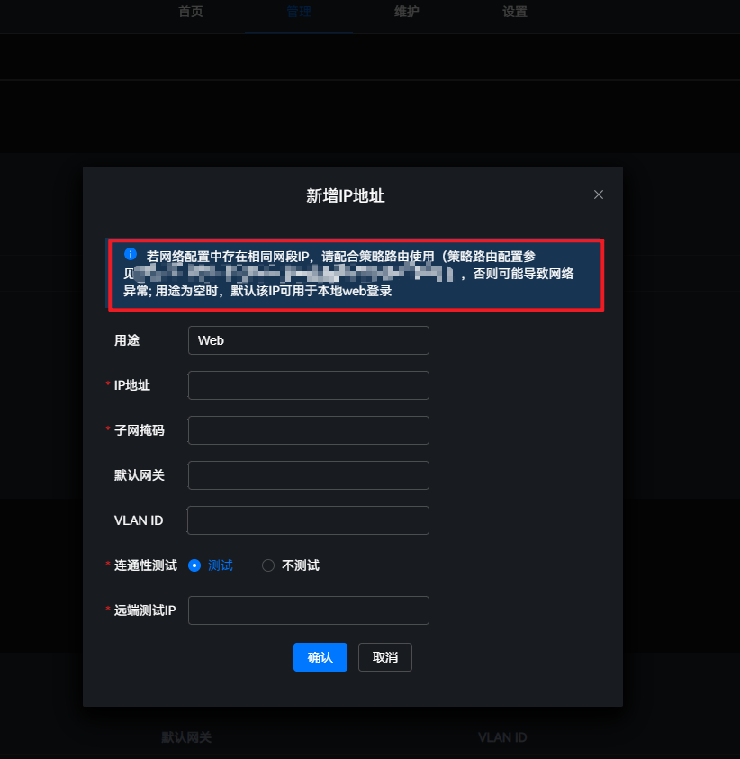

**图 4**  copyRight<a name="fig18962144425120"></a>  


### 自定义图片<a name="ZH-CN_TOPIC_0000001637475461"></a>

自定义图片存放于“_\{project\_dir\}_/src/app/add\_customized\_web\_assets/WhiteboxConfig/img”目录下，用户必须严格按照文件名、尺寸和格式替换相应文件，其说明如下：

**表 1**  图片文件说明

|文件名|尺寸|格式|
|--|--|--|
|device.png|230px × 186px|png|
|device-en.png|230px × 186px|png|
|model.svg|-|svg|
|favicon.ico|32px × 32px|ico|
|login.png|3840px × 2160px|png|
|logo.png|32px × 32px|png|

> [!NOTE] 说明  
> device.png和device-en.png的区别在于边缘管理系统切换语言时会显示对应的图片，系统语言为“简体中文”时显示的图片为device.png，系统语言为“English”时显示的图片为device-en.png。

以上图片在边缘管理系统的Web页面上的显示位置如以下各图所示。

**图 1**  device.png<a name="zh-cn_topic_0000001397241130_fig657133213141"></a>  
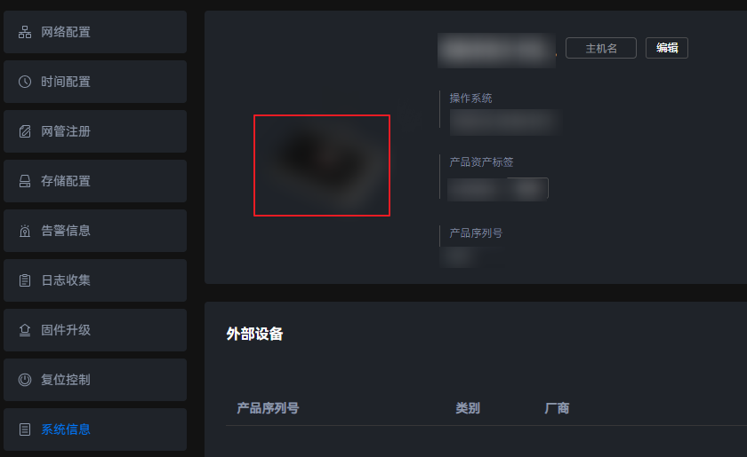

**图 2**  model.svg<a name="zh-cn_topic_0000001397241130_fig373116512196"></a>  
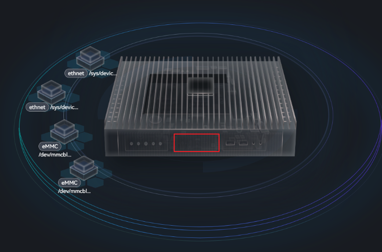

**图 3**  favicon.ico<a name="zh-cn_topic_0000001397241130_fig286011326468"></a>  


**图 4**  login.png<a name="zh-cn_topic_0000001397241130_fig19844191614720"></a>  


**图 5**  logo.png<a name="zh-cn_topic_0000001397241130_fig595442916291"></a>  


### 开发示例<a name="ZH-CN_TOPIC_0000001637970781"></a>

本章节提供开发者在准备好自定义厂商信息后的操作步骤，从而实现自定义厂商功能。

**操作步骤<a name="section931142620468"></a>**

1. 打开自定义厂商信息功能开关。

    将配置文件project.conf的“\_NeedCustomizedWebAssets”字段改为“yes”。

2. 准备自定义厂商信息配置文件**config.json**，并将其存放在“_\{project\_dir\}_/src/app/add\_customized\_web\_assets/WhiteboxConfig/json”路径下。
3. 准备自定义图片，并将其存放于“_\{project\_dir\}_/src/app/add\_customized\_web\_assets/WhiteboxConfig/img”目录下。
4. 在“_\{project\_dir\}_/src/app/add\_customized\_web\_assets”目录下，实现配置脚本**build\_customized\_web\_assets.sh，**参考示例如下**。**

    ```shell
    #!/bin/bash
    VENDOR_CONFIG_PATH="."
    WEB_MANAGER_PATH=""
    IMG_DIR="WhiteboxConfig/img"
    IMG_LIST=("${IMG_DIR}/device.png" "${IMG_DIR}/device-en.png" "${IMG_DIR}/favicon.ico" "${IMG_DIR}/model.svg" "${IMG_DIR}/logo.png" "${IMG_DIR}/login.png")
    
    JSON_DIR="WhiteboxConfig/json"
    CONFIG_JSON_PATH="${JSON_DIR}/config.json"
    OS_NAME=$(< "/etc/os-release" grep "^NAME=" | awk -F "=" '{print $2}' | tr -d '"')
    
    function check_img()
    {
        local image_path="$1"
        local img_suffix=""
        local img_max_size="10485760"  # 最大10M
    
        img_suffix="$(basename "${image_path}" | awk -F "." '{print $2}')"
        if [[ ! -f "${image_path}" ]]; then
            echo "${img_suffix} image ${image_path} file not exist"
            return 1
        fi
    
        # 检查文件大小
        if [[ $(stat -c %s "${image_path}") -gt "${img_max_size}" ]]; then
            echo "${img_suffix} image ${image_path} is too large"
            return 1
        fi
    
        echo "check ${img_suffix} image ${image_path} success"
        return 0
    }
    
    
    function check_config_json()
    {
        if [[ "${OS_NAME}" != "Ubuntu" ]]; then
          if ! dos2unix "${VENDOR_CONFIG_PATH}/${CONFIG_JSON_PATH}" &> /dev/null; then
              echo "convert ${VENDOR_CONFIG_PATH}/${CONFIG_JSON_PATH} failed, please check "
              return 1
          fi
        fi
    
        if ! python3 -m json.tool "${VENDOR_CONFIG_PATH}/${CONFIG_JSON_PATH}" &> /dev/null; then
            echo "Invalid json ${VENDOR_CONFIG_PATH}/${CONFIG_JSON_PATH}"
            return 1
        fi
    
        if ! grep -P '^\s*"model"\s*:\s*"[a-zA-Z0-9()\ ]{1,128}"' "${VENDOR_CONFIG_PATH}/${CONFIG_JSON_PATH}" &> /dev/null; then
            echo "check ${VENDOR_CONFIG_PATH}/${CONFIG_JSON_PATH} failed, please check <model> field"
            return 1
        fi
    
        if ! grep -P '^\s*"systemName"\s*:\s*{' "${VENDOR_CONFIG_PATH}/${CONFIG_JSON_PATH}" &> /dev/null; then
            echo "check ${VENDOR_CONFIG_PATH}/${CONFIG_JSON_PATH} failed, please check <systemName> field"
            return 1
        fi
    
        if ! grep -P '^\s*"websiteTitle"\s*:\s*{' "${VENDOR_CONFIG_PATH}/${CONFIG_JSON_PATH}" &> /dev/null; then
            echo "check ${VENDOR_CONFIG_PATH}/${CONFIG_JSON_PATH} failed, please check <websiteTitle> field"
            return 1
        fi
    
        if ! grep -P '^\s*"userGuide"\s*:\s*{' "${VENDOR_CONFIG_PATH}/${CONFIG_JSON_PATH}" &> /dev/null; then
            echo "check ${VENDOR_CONFIG_PATH}/${CONFIG_JSON_PATH} failed, please check <userGuide> field"
            return 1
        fi
    
        if ! grep -P '^\s*"copyRight"\s*:\s*{' "${VENDOR_CONFIG_PATH}/${CONFIG_JSON_PATH}" &> /dev/null; then
            echo "check ${VENDOR_CONFIG_PATH}/${CONFIG_JSON_PATH} failed, please check <copyRight> field"
            return 1
        fi
    
        if [[ $(grep -cP '^\s*"zh"\s*:\s*"[a-zA-Z0-9()x{4e00}-\x{9fa5}（） ]{0,128}"' "${VENDOR_CONFIG_PATH}/${CONFIG_JSON_PATH}") -ne "4" ]]; then
            echo "check ${VENDOR_CONFIG_PATH}/${CONFIG_JSON_PATH} failed, missing <zh> field, please check "
            return 1
        fi
    
        if [[ $(grep -cP '^\s*"en"\s*:\s*"[a-zA-Z0-9()., ]{0,128}"' "${VENDOR_CONFIG_PATH}/${CONFIG_JSON_PATH}") -ne "4" ]]; then
            echo "check ${VENDOR_CONFIG_PATH}/${CONFIG_JSON_PATH} failed, missing <en> field, please check "
            return 1
        fi
    
        return 0
    }
    
    
    function check_assets()
    {
        if [[ ! -f "${VENDOR_CONFIG_PATH}/${IMG_DIR}/device-en.png" ]]; then
          cp "${VENDOR_CONFIG_PATH}/${IMG_DIR}/device.png" "${VENDOR_CONFIG_PATH}/${IMG_DIR}/device-en.png"
        fi
    
        for (( i= 0; i < "${#IMG_LIST[@]}"; i++)); do
            if ! check_img "${VENDOR_CONFIG_PATH}/${IMG_LIST[i]}"; then
                echo "check config img failed, please check"
                return 1
            fi
        done
    
        if ! check_config_json; then
            echo "check config json failed, please check"
            return 1
        fi
    
        return 0
    }
    
    function copy_config_and_assets()
    {
        # 拷贝json配置
        if [[ ! -d "${WEB_MANAGER_PATH}/${JSON_DIR}" ]]; then
            mkdir -p "${WEB_MANAGER_PATH}/${JSON_DIR}"
        fi
    
        if ! cp -rf "${VENDOR_CONFIG_PATH}/${CONFIG_JSON_PATH}" "${WEB_MANAGER_PATH}/${CONFIG_JSON_PATH}"; then
            echo "cp ${CONFIG_JSON_PATH} failed, please check"
            return 1
        fi
    
        # 拷贝图片配置
        if [[ ! -d "${WEB_MANAGER_PATH}/${IMG_DIR}" ]]; then
            mkdir -p "${WEB_MANAGER_PATH}/${IMG_DIR}"
        fi
    
        for (( i= 0; i < "${#IMG_LIST[@]}"; i++)); do
            if ! cp -f "${VENDOR_CONFIG_PATH}/${IMG_LIST[i]}" "${WEB_MANAGER_PATH}/${IMG_LIST[i]}"; then
                echo "cp ${IMG_LIST[i]} failed, please check"
                return 1
            fi
        done
    
        if [[ "${OS_NAME}" = "Ubuntu" ]]; then
          chown -R nobody:nogroup "${WEB_MANAGER_PATH}"
        else
          chown -R nobody:nobody "${WEB_MANAGER_PATH}"
        fi
    
        return 0
    }
    
    function main()
    {
        # 校验 web manager 路径
        WEB_MANAGER_PATH="$1/platform/omsdk/software/nginx/html/manager"
        VENDOR_CONFIG_PATH="$1/src/app/add_customized_web_assets"
        echo "WEB_MANAGER_PATH: ${WEB_MANAGER_PATH}"
        if [[ ! -d "${WEB_MANAGER_PATH}" ]]; then
            mkdir -p "${WEB_MANAGER_PATH}"
        fi
    
        # 检查静态文件
        if ! check_assets; then
            echo "check asset files failed."
            return 1
        fi
    
        echo "check environment and assets successfully, start copy assets to web project directory...."
    
    
        if ! copy_config_and_assets; then
            echo "cp asset files to web project directory failed, please check"
            return 1
        fi
    
        echo "The customized configuration files has been copied."
    
        return 0
    }
    
    
    echo  -e "\n####################### begin to copy customized configuration files #####################################\n"
    main "$@"
    RESULT=$?
    exit "${RESULT}"
    ```

5. 在“_\{project\_dir\}_/build/build.sh”中，实现调用扩展<b>_NeedCustomizedWebAssets</b>开关的编译脚本。

    ```shell
    # 配置自定义图片和厂商信息
    # build_customized_web_assets.sh具体实现可参考对应章节实现
    # TOP_DIR={project_dir}
    if [ "${_NeedCustomizedWebAssets}" == "yes" ]; then
        if ! bash "${TOP_DIR}/src/app/add_customized_web_assets/build_customized_web_assets.sh" "${TOP_DIR}";then
            return 1
        fi
    fi
    ```

## 自定义告警<a id="自定义告警"></a>

### 告警信息<a name="ZH-CN_TOPIC_0000001577810496"></a>

当设备发生故障或因某些原因导致设备处于不能正常工作时，边缘管理系统能够根据不同类型及不同模块出现的故障产生告警信息，同时生成日志信息。若配置了网管系统，则该告警信息会向网管系统（如FusionDirector）发送。设备上的传感器能检测设备所处的环境，若超出设备正常工作的环境要求，会发出相应的告警信息。

**事件和故障<a name="section6769155375815"></a>**

告警按照对设备的影响可分为：

- 事件：指设备正常运行时记录下来的关键事件，一般对设备没有影响。
- 故障：指可能影响设备正常运行的告警。

**告警级别<a name="section15661110806"></a>**

人工智能计算产品的告警可分三个级别，按告警严重性分为：

- 一般告警（Minor）：不会对系统产生大的影响，需要尽快采取相应的措施，防止故障升级。
- 严重告警（Major）：会对系统产生较大的影响，有可能中断部分系统的正常运行，导致业务中断。
- 紧急告警（Critical）：可能会使设备下电，系统中断。需要马上采取相应的措施进行处理。

**告警格式<a name="section149118230817"></a>**

以边缘管理系统已支持的证书告警为例，告警内容为00180000@cert warning@CERT@1866989008@1@aabb，以@作为分隔符，每部分代表的含义如下：

- 00180000：告警ID
- cert warning：告警名称
- CERT：告警对象
- 1866989008：告警产生的时间戳
- 1：告警等级，取值范围是0\~2，0对应紧急，1对应严重，2对应一般
- aabb：固定的结束符

**OM SDK预留的告警配置<a name="section12556163794820"></a>**

OM SDK预置的告警配置包括温度告警、电源告警、存储告警、NFS告警、端口告警、NPU告警、Wireless\_Module告警等。详细的告警配置信息说明请参见[OM SDK预留的告警配置](./appendix.md#om-sdk预留的告警配置)。

### 自定义告警说明<a name="ZH-CN_TOPIC_0000001628610493"></a>

OM SDK支持用户进行二次开发，新增自定义告警信息。边缘管理系统在初始化故障检测组件时，会调用/usr/local/mindx/MindXOM/lib/libcustomized\_alarm.so（需要由用户实现）文件里的自定义故障检测接口（drv\_fault\_check\_init）和回调函数注册接口（drv\_fault\_check\_register\_callback），用于拉起自定义告警检测组件。当检测到告警时，由注册的回调函数将告警信息写入OM SDK提供的告警文件里。

> [!NOTE] 说明  
> 
> - drv\_fault\_check\_init接口用于初始化和启动自定义告警，检测逻辑需要由用户自行实现。
> - drv\_fault\_check\_register\_callback用于将OM SDK的回调函数注册到自定义告警组件里，当发生告警时，调用注册的回调函数，将告警信息写入告警文件里。

**自定义告警检测初始化流程<a name="section19426659105714"></a>**

**图 1**  检测流程图<a name="fig12611161011016"></a>  
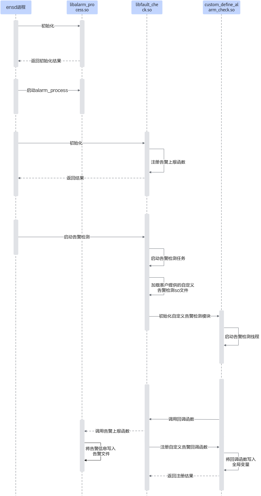

**告警上报流程<a name="section8303172751111"></a>**

- 上报到边缘管理系统的Web界面

    **图 2**  上报告警流程图<a name="fig945245321612"></a>  
    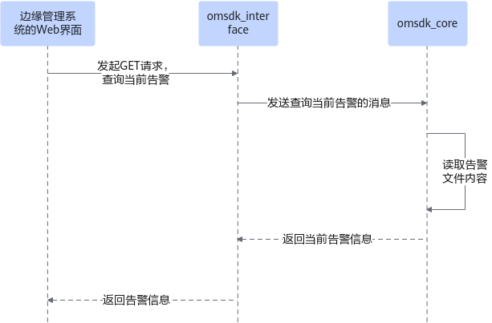

- 上报到FusionDirector

    **图 3**  上报告警流程图<a name="fig2277191602620"></a>  
    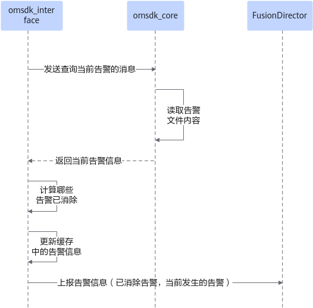

### 新增自定义告警操作说明<a name="ZH-CN_TOPIC_0000001681725797"></a>

开发者新增自定义告警的主要操作步骤如下。

1. 打开新增自定义告警开关。
2. 实现自定义告警检测初始化接口。
3. 实现自定义告警回调函数注册接口。
4. <a name="li171719913620"></a>修改告警相关配置文件。

    1. 拷贝alarm\_info\_solution\_en.json和alarm\_info\_solution\_zh.json文件，在其中写入新增的告警配置，用于前端页面展示告警信息。
    2. 拷贝all\_alarm\_for\_manager\_web.json文件，在其中写入新增的告警屏蔽规则配置，用于前端展示告警屏蔽规则。
    3. 拷贝alarm\_info\_en.json文件，在其中写入新增的告警配置，用于上报告警到FusionDirector。
    4. 拷贝all\_alarm\_for\_manager.json文件，在其中写入新增的告警屏蔽规则，用于创建告警屏蔽规则时，校验新建的告警屏蔽规则是否合法。

    > [!NOTE] 说明 
    > 用户需要按照配置文件现有的格式，新增相关的告警配置信息。

5. <a name="li13597122685615"></a>调用校验脚本validate\_alarm\_config.py，验证修改后的告警配置文件是否配置正确。
6. <a name="li47041937661"></a>将自定义告警模块编译成custom\_define\_alarm.so文件，放入“/usr/local/mindx/MindXOM/lib”路径下。用步骤[4](#li171719913620)中修改后配置文件，覆盖掉OM SDK原有的配置文件。

    > [!NOTE] 说明 
    > 如果新增的自定义告警在OM SDK预置的告警配置范围内，则不用执行步骤[4](#li171719913620)、步骤[5](#li13597122685615)以及步骤[6](#li47041937661)中覆盖对应配置文件的操作。

### 开发示例<a name="ZH-CN_TOPIC_0000001681845833"></a>

本章节将详细介绍如何新增自定义告警，以新增告警ID为001A0000的自定义告警为例，指导用户进行二次开发。

**文件说明<a name="section207272057132414"></a>**

开发示例中涉及到的文件路径为“_\{project\_dir\}_/src/app/add\_customized\_alarm”，目录结构如下：

```text
├── alarm_info_en.json                        // 后端告警信息配置文件，用于上报告警到FusionDirector
├── alarm_info_solution_en.json               // 前端告警信息配置文件，用于页面展示
├── alarm_info_solution_zh.json               // 前端告警信息配置文件，用于页面展示
├── all_alarm_for_manager.json                // 后端告警屏蔽规则配置文件，用于检验创建的登录规则是否合法
├── all_alarm_for_manager_web.json            // 前端告警屏蔽规则配置文件，用于页面展示
├── build_customized_alarm.sh                 // 编译脚本
├── validate_alarm_config.py                  // 配置文件校验脚本
├── CMakeLists.txt                             // CMake配置文件
├── customized_alarm_check.c                  // 自定义告警实现源文件
└── customized_alarm_check.h                  // 自定义告警实现头文件
```

**配置文件说明<a name="section1381412872615"></a>**

自定义告警涉及到的配置文件如[文件说明](#section207272057132414)所示，配置文件的相关字段说明如下。

- alarm\_info\_en.json、alarm\_info\_solution\_en.json和alarm\_info\_solution\_zh.json等配置文件格式一致，此处以alarm\_info\_en.json为例进行介绍。

    ```json
    {
        "MAJOR_VERSION": "2",      # 主版本
        "MINOR_VERSION": "8",      # 次版本
        "AUX_VERSION": "0",        # 辅助版本
        "EventSuggestion": [     # 告警信息列表
            {
            "id": "00000000",      # 告警ID
            "name": "Drive Overtemperature",   # 告警名称
            "dealSuggestion": "1. Check whether a TEC alarm is generated. @#AB2. Check whether the ambient temperature of the device exceeds 60°C.@#AB3. Restart the system. Then check whether the alarm is cleared.@#AB4. Contact Vendor technical support.",     # 处理建议
            "detailedInformation": "The component temperature exceeds the threshold.",      # 详细信息
            "reason": " The ambient temperature is excessively high.",        # 产生原因
            "impact": " The system reliability may be affected."              # 影响
            }
        ]
    }
    ```

- all\_alarm\_for\_manager.json和all\_alarm\_for\_manager\_web.json字段和格式相同，区别在all\_alarm\_for\_manager\_web.json的唯一标识字段定义为innerid。

    ```json
    {
        "LANG": {
            "MAJOR_VERSION": "2",               # 主版本
            "MINOR_VERSION": "8",               # 次版本
            "AUX_VERSION": "0",                 # 辅助版本
            "EventSuggestion": {                # 告警屏蔽规则信息
                "item": [                         # 告警屏蔽规则列表
                    {
                    "@innerid": "a000000000",     # 唯一标识，all_alarm_for_manager_web.json的唯一标识字段为innerid
                    "id": "00000000",             # 告警ID
                    "level": "2",                 # 告警级别
                    "AlarmInstance": "M.2"        # 告警主体
                    }
                ]
            }
        }
    }
    ```

**操作步骤<a name="section162308275580"></a>**

1. 打开新增自定义告警功能开关。

    将project.conf文件的\_NeedCustomizedAlarmCheck字段取值改为yes（默认值为“no”）。

2. 在customized\_alarm\_check.h中定义告警初始化接口、回调函数注册接口以及相关结构体。

    > [!NOTE] 说明 
    >- 告警消息由两部分拼接组成，分别是消息头（FAULT\_MSG\_HEAD\_STRU，定义了消息长度、消息来源、告警数量）和消息体（FAULT\_ITEM\_STRU类型的数组，每个FAULT\_ITEM\_STRU表示一条告警）。FAULT\_MSG\_HEAD\_STRU和FAULT\_ITEM\_STRU必须按照下面样例里的结构定义，否则OM SDK解析告警信息将会失败。
    >- 消息头FAULT\_MSG\_HEAD\_STRU里的cmd字段必须设置为2，表明是自定义告警，如果设置为其他值，可能导致自定义告警功能失效或影响OM SDK已支持的告警。
    >- 消息头FAULT\_ITEM\_STRU里的fault\_id和sub\_fault\_id字段的取值范围为0\~49，如果超过49，会导致告警上报失败；相同fault\_id的告警类型不能超过50。
    >- 下面示例中的CUSTOMIZED\_ALARM\_CHECK\_CALLBACK\_PFN表示OM SDK提供的回调函数，必须按照示例中的函数定义来定义，否则注册OM SDK的回调函数将失败，告警信息将上报失败。
    >- OM SDK启动时，将调用自定义告警检测组件提供的初始化接口drv\_fault\_check\_init和回调函数注册接口drv\_fault\_check\_register\_callback。请完全按照示例中的接口定义来定义这两个接口，否则会导致自定义告警检测组件启动失败。

    ```c
    #ifndef CUSTOMIZED_ALARM_CHECK_H
    #define CUSTOMIZED_ALARM_CHECK_H
    
    #define ALARM_INFO_MAX_SIZE 64 * 1024
    
    
    typedef int (*CUSTOMIZED_ALARM_CHECK_CALLBACK_PFN)(unsigned char *data, unsigned int data_len);
    
    typedef struct {
        unsigned int data_len;       // 报文长度
        unsigned int cmd;            // 赋值时，必须设置为2，表明是自定义告警，如果设置为其他值可能导致自定义告警功能失效或影响OM SDK已支持的告警
        unsigned int item_num;       // 告警个数
    } FAULT_MSG_HEAD_STRU;
    
    typedef struct {
        unsigned short fault_id;     // 告警id
        unsigned short sub_fault_id; // 子告警id
        unsigned short fault_level;  // 告警级别
        unsigned short reserved;     // 4字节对齐
        time_t raise_time_stamp;     // 告警时间戳（元年到告警产生的秒数）
        char fault_name[64];         // 告警名称
        char resource[32];           // 告警实体
    } FAULT_ITEM_STRU;
    
    
    int drv_fault_check_init();
    void *customized_alarm_check(void *para);
    unsigned char *generate_customized_alarm();
    int drv_fault_check_register_callback(CUSTOMIZED_ALARM_CHECK_CALLBACK_PFN pfnRx);
    
    #endif
    ```

3. 在customized\_alarm\_check.c中实现自定义告警初始化接口和回调函数注册接口。

    > [!NOTE] 说明 
    > 用户实现自定义告警检测初始化接口时，最好是通过新建线程实现，此处以打桩构造告警为例。

    ```c
    /*
     * Copyright (c) Huawei Technologies Co., Ltd. 2023. All rights reserved.
     */
    
    #include "unistd.h"
    #include "stdlib.h"
    #include "string.h"
    #include <time.h>
    #include "pthread.h"
    #include "customized_alarm_check.h"
    
    
    CUSTOMIZED_ALARM_CHECK_CALLBACK_PFN g_customized_alarm_check_rx_pfn = NULL;
    
    // 告警检测函数，此处是打桩构造自定义告警
    void* customized_alarm_check(void *para)
    {
        int ret;
        unsigned char *alarmBuff = NULL;
        unsigned int alarmSize = 0;
        sleep(5);
        // 打桩构造告警
        do {
            alarmSize = sizeof(FAULT_MSG_HEAD_STRU) + sizeof(FAULT_ITEM_STRU);
            alarmBuff = generate_customized_alarm();
            if (alarmBuff == NULL) {
                continue;
            }
            FAULT_MSG_HEAD_STRU *msg_head = (FAULT_MSG_HEAD_STRU *)alarmBuff;
            msg_head->data_len = alarmSize;
            msg_head->item_num = 1;
            msg_head->cmd = 2;
            if(g_customized_alarm_check_rx_pfn(alarmBuff, alarmSize) != 0) {
                free(alarmBuff);
                continue;
            }
            sleep(30);
            free(alarmBuff);
        } while (1);
    
        return ((void *)0);
    }
    
    // 生成告警信息
    unsigned char *generate_customized_alarm()
    {
        unsigned int head_size = sizeof(FAULT_MSG_HEAD_STRU);
        unsigned int body_size = sizeof(FAULT_ITEM_STRU);
    
        if (head_size + body_size > ALARM_INFO_MAX_SIZE) {
            return NULL;
        }
        unsigned char *alarmBuff = (unsigned char *)malloc(head_size + body_size);
        if (alarmBuff == NULL) {
            return NULL;
        }
        (void)memset_s(alarmBuff, sizeof(head_size + body_size), 0, sizeof(head_size + body_size));
    
        FAULT_ITEM_STRU *item = (FAULT_ITEM_STRU *)(alarmBuff + head_size);
        item->fault_id = 26;                 // 告警id
        item->fault_level = 1;               // 告警级别 FAULT_LEVEL_ENUM :紧急告警  严重告警 轻微告警
        item->raise_time_stamp = time(NULL); // 告警时间戳（元年到告警产生的秒数）
        (void)strncpy_s(item->fault_name, 64, "TEST_ERROR", strlen("TEST_ERROR")); // 告警名称
        (void)strncpy_s(item->resource, 32, "TEST", strlen("TEST"));               // 告警实体
    
        return alarmBuff;
    }
    
    // 自定义告警初始化，为避免初始化过程耗时过长，新建线程启动
    int drv_fault_check_init()
    {
        int ret = 0;
        unsigned long customized_alarm_check_thread = 0;
        ret = pthread_create(&customized_alarm_check_thread, NULL, customized_alarm_check, NULL);
        return ret;
    }
    
    // 注册回调函数，将回调函数保存在全局变量中
    int drv_fault_check_register_callback(CUSTOMIZED_ALARM_CHECK_CALLBACK_PFN pfnRx)
    {
        g_customized_alarm_check_rx_pfn = pfnRx;
        return 0;
    }
    ```

4. 将OM SDK中的告警配置文件拷贝到“_\{project\_dir\}_/src/app/add\_customized\_alarm”路径下，并在此基础上新增自定义告警信息。相应的配置文件路径如下：
    - alarm\_info\_en.json：config/alarm\_info\_en.json
    - alarm\_info\_solution\_zh.json：software/nginx/html/manager/config/alarm\_info\_solution\_zh.json
    - alarm\_info\_solution\_en.json：software/nginx/html/manager/config/alarm\_info\_solution\_en.json
    - all\_alarm\_for\_manager.json：software/ibma/config/all\_alarm\_for\_manager.json
    - all\_alarm\_for\_manager\_web.json：software/nginx/html/manager/config/all\_alarm\_for\_manager.json

        > [!NOTE] 说明   
        > OM SDK软件包中的告警屏蔽规则配置文件都叫all\_alarm\_for\_manager.json，为了区分，因此将前端使用的告警屏蔽规则配置文件命名为all\_alarm\_for\_manager\_web.json。

5. 修改配置文件。此处以新增告警ID为001A0000为例，在对应配置文件中新增的告警信息。以下仅为配置示例，只做参考，不能直接复制使用。

    > [!NOTE] 说明  
    > 告警ID是由fault\_id左移十六位再加上sub\_fault\_id后，转为16进制得到的，如果转换后的数字不足八位，则补齐八位。以告警ID001A0000为例，fault\_id等于26，sub\_fault\_id等于0，26左移十六位后得到110100000000000000000，加上sub\_fault\_id后等于110100000000000000000，再将其转为16进制，等到数值1A0000，由于其不足八位，补齐八位得到告警ID为001A0000。

    1. 在alarm\_info\_en.json中新增自定义告警信息。

        ```json
        {
            "MAJOR_VERSION": "2",
            "MINOR_VERSION": "8",
            "AUX_VERSION": "0",
            "EventSuggestion": [
                {
                "id": "00000000",
                "name": "Drive Overtemperature",
                "dealSuggestion": "1. Check whether a TEC alarm is generated. @#AB2. Check whether the ambient temperature of the device exceeds 60°C.@#AB3. Restart the system. Then check whether the alarm is cleared.@#AB4. Contact Vendor technical support.",
                "detailedInformation": "The component temperature exceeds the threshold.",
                "reason": " The ambient temperature is excessively high.",
                "impact": " The system reliability may be affected."
                },
                {
                "id": "00000001",
                "name": "Drive Service Life Prewarning",
                "dealSuggestion": "1. Restart the system. Then check whether the alarm is cleared. @#AB2. Back up data and replace the drive. Then check whether the alarm is cleared. @#AB3. Contact Vendor technical support.",
                "detailedInformation": "The drive is severely worn.",
                "reason": " The hard drive has bad blocks.",
                "impact": "Data may be lost."
                },
        ...
        # 以上为配置文件原本的告警信息，新增的告警信息如下
                {
                "id": "001A0000",
                "name": "Test customized alarm",
                "dealSuggestion": "do nothing",
                "detailedInformation": "Test customized alarm.",
                "reason": "Test customized alarm.",
                "impact": "no impact."
                }
            ]
        }
        ```

    2. 在alarm\_info\_solution\_zh.json和alarm\_info\_solution\_en.json中新增自定义告警信息，两者只是中英文的区别。

        ```json
        {
            "MAJOR_VERSION": "2",
            "MINOR_VERSION": "8",
            "AUX_VERSION": "0",
            "EventSuggestion": [
                {
                "id": "00000000",
                "name": "硬盘温度过高",
                "dealSuggestion": "1、检查是否存在TEC告警。@#AB2、使用测温工具检测设备周围环境是否超过60度。@#AB3、重启智能小站，查看告警是否消失。@#AB4、联系供应商技术支持",
                "detailedInformation": "硬盘温度超过门限。",
                "reason": "环境温度过高。",
                "impact": "可能影响系统运行的可靠性。"
                },
                {
                "id": "00000001",
                "name": "硬盘寿命到期预警",
                "dealSuggestion": "1、重启智能小站，查看告警是否消失。@#AB2、备份数据后更换硬盘，查看告警是否消失。@#AB3、联系供应商技术支持。",
                "detailedInformation": "硬盘磨损严重。",
                "reason": "硬盘坏块。",
                "impact": "可能导致数据丢失。"
                },
        ...
        # 以上为配置文件原本的告警信息，新增的告警信息如下
                {
                "id": "001A0000",
                "name": "测试自定义告警",
                "dealSuggestion": "什么都不用做。",
                "detailedInformation": "什么都不用做。",
                "reason": "测试自定义告警",
                "impact": "没有影响。"
            }
          ]
        }
        ```

    3. 在all\_alarm\_for\_manager.json中新增告警屏蔽规则。

        ```json
        {
            "LANG": {
                "MAJOR_VERSION": "2",
                "MINOR_VERSION": "8",
                "AUX_VERSION": "0",
                "EventSuggestion": {
                    "item": [
                    {
                    "@innerid": "a000000000",
                    "id": "00000000",
                    "level": "2",
                    "AlarmInstance": "M.2"
                    },
                    {
                    "@innerid": "a000000001",
                    "id": "00000001",
                    "level": "2",
                    "AlarmInstance": "M.2"
                    },
        ...
        # 以上为配置文件原本的告警信息，新增的告警信息如下
                    {
                    "@innerid": "x000000000",
                    "id": "001A0000",
                    "level": "1",
                    "AlarmInstance": "TEST"
                    }
                    ]
                }
            }
        }
        ```

    4. 在all\_alarm\_for\_manager\_web.json中新增告警屏蔽规则。

        ```json
        {
            "MAJOR_VERSION": "2",
            "MINOR_VERSION": "8",
            "AUX_VERSION": "0",
            "EventSuggestion": [
                {
                    "innerid": "a000000000",
                    "id": "00000000",
                    "level": "2",
                    "AlarmInstance": "M.2"
                },
                {
                    "innerid": "a000000001",
                    "id": "00000001",
                    "level": "2",
                    "AlarmInstance": "M.2"
                },
        ...
        # 以上为配置文件原本的告警信息，新增的告警信息如下
                {
                    "innerid": "x000000000",
                    "id": "001A0000",
                    "level": "1",
                    "AlarmInstance": "TEST"
                }
            ]
        }
        ```

    > [!NOTE] 说明  
    > 如果用户新增的自定义告警，在OM SDK预留的告警配置项中，则不需要在相应的告警配置文件中新增告警信息，预留的告警信息请参见[表1 OM SDK预留的告警信息](./appendix.md#om-sdk预留的告警配置table)。

6. 校验配置文件是否配置正确。

    > [!NOTE] 说明  
    > validate\_alarm\_config.py脚本会校验告警屏蔽配置文件（all\_alarm\_for\_manager.json和all\_alarm\_for\_manager\_web.json）和告警信息配置文件（alarm\_info\_en.json、alarm\_info\_solution\_en.json、alarm\_info\_solution\_zh.json）。对于告警屏蔽配置文件，校验内容包括是否存在重复的@innerid、是否存在重复的innerid、是否存在重复的id+AlarmInstance组合、配置文件格式是否正确以及字段是否有缺失或不在要求的范围内；对于告警信息配置文件，校验内容包括是否存在重复的ID、配置文件格式是否正确以及字段是否有缺失或不在要求的范围内。

    1. 执行以下命令，进入配置文件所在路径。

        ```bash
        cd {project_dir}/src/app/add_customized_alarm
        ```

    2. 执行以下命令，校验配置文件。

        ```bash
        python3 validate_alarm_config.py ./
        ```

        validate\_alarm\_config.py脚本参考示例如下：

        ```python
        import json
        import os
        import sys
        
        ALARM_INFO_CONFIG = ("alarm_info_en.json", "alarm_info_solution_en.json", "alarm_info_solution_zh.json")
        ALARM_INFO_FIELDS = {"id", "name", "dealSuggestion", "detailedInformation", "reason", "impact"}
        ALARM_SHIELD_FIELDS = {"@innerid", "id", "level", "AlarmInstance"}
        ALARM_SHIELD_WEB_FIELDS = {"innerid", "id", "level", "AlarmInstance"}
        
        
        class Result:
            def __init__(self, result: bool, err_msg: str = ""):
                self._result = result
                self._err_msg = err_msg
        
            def __bool__(self):
                return self._result
        
            @property
            def error(self) -> str:
                return self._err_msg
        
        
        def check_alarm_id(filename: str, alarm_id: str):
            if len(alarm_id) != 8:
                raise Exception(f"{filename}: alarm id length wrong, should be 8")
        
            try:
                int(alarm_id, base=16)
            except Exception as err:
                raise Exception(f"{filename}: alarm id is invalid, reason: {err}")
        
        
        def check_alarm_field_range(alarms: list, filename: str, filed_range: set):
            for alarm in alarms:
                if not isinstance(alarm, dict):
                    raise Exception(f"{filename}: alarm info type is wrong, should be map")
        
                if len(alarm.keys()) != len(filed_range):
                    raise Exception(f"{filename}: alarm info miss some fields")
        
                if not set(alarm.keys()).issubset(filed_range):
                    raise Exception(f"{filename}: alarm info fields is not in range of {filed_range}")
        
                check_alarm_id(filename, alarm.get("id"))
        
        
        def check_alarm_info_config(content: dict, filename: str) -> Result:
            """
            检查告警信息配置文件是否配置正确，检测项包含：告警id是否重复、告警信息格式是否正确以及字段是否缺失或不在要求的字段范围内
            :param filename: 告警配置文件名
            :param content: 配置文件内容
            :return:检测结果
            """
            alarms = content.get("EventSuggestion")
            if not alarms:
                return Result(False, f"{filename}: EventSuggestion is null")
        
            if not isinstance(alarms, list):
                return Result(False, f"{filename}: EventSuggestion type is wrong, should be list")
        
            try:
                check_alarm_field_range(alarms, filename, ALARM_INFO_FIELDS)
            except Exception as err:
                return Result(False, f'{err}')
        
            ids = [alarm.get("id") for alarm in alarms]
            if len(set(ids)) != len(alarms):
                return Result(False, f"{filename}: have same id, please check")
        
            return Result(True)
        
        
        def check_alarm_shield(inner_id: str, alarm_shields: list, filename: str, filed_range: set) -> Result:
            try:
                check_alarm_field_range(alarm_shields, filename, filed_range)
            except Exception as err:
                return Result(False, f'{err}')
        
            ids = [alarm_shield.get(inner_id) for alarm_shield in alarm_shields]
            if len(set(ids)) != len(alarm_shields):
                return Result(False, f"{filename}: have same {inner_id}, please check")
        
            unique_keys = [f"{alarm_shield.get('id')}-{alarm_shield.get('AlarmInstance')}" for alarm_shield in alarm_shields]
            if len(set(unique_keys)) != len(alarm_shields):
                return Result(False, f"{filename}: have same unique_key(id-AlarmInstance), please check")
        
            return Result(True)
        
        
        def check_alarm_shield_config(content: dict, filename: str) -> Result:
            """
            检查告警屏蔽配置文件是否正确，检查内容包括是否存在重复的inerid、是否存在重复的告警id+主体、告警屏蔽配置格式是否正确以及字段是否缺失和字段不在要求的字段范围内
            :param content:配置文件内容
            :param filename:配置文件名
            :return:检测结果
            """
            lang = content.get("LANG")
            if not isinstance(lang, dict):
                return Result(False, f"{filename}: LANG type is wrong, should be map")
        
            event_suggestion = lang.get("EventSuggestion")
            if not event_suggestion:
                return Result(False, f"{filename}: EventSuggestion is null")
        
            if not isinstance(event_suggestion, dict):
                return Result(False, f"{filename}: EventSuggestion type is wrong, should be map")
        
            alarm_shields = event_suggestion.get("item")
            if not alarm_shields:
                return Result(False, f"{filename}: item is null")
            if not isinstance(alarm_shields, list):
                return Result(False, f"{filename}: item type is wrong, should be list")
        
            return check_alarm_shield("@innerid", alarm_shields, filename, ALARM_SHIELD_FIELDS)
        
        
        def check_alarm_shield_web_config(content: dict, filename: str) -> Result:
            """
            检查前端告警屏蔽配置文件是否正确，检查内容包括是否存在重复的inerid、是否存在重复的告警id+主体、告警屏蔽配置格式是否正确以及字段是否缺失和字段不在要求的字段范围内
            :param content:配置文件内容
            :param filename:配置文件名
            :return:检测结果
            """
            alarm_shields = content.get("EventSuggestion")
            if not alarm_shields:
                return Result(False, f"{filename}: EventSuggestion is null")
        
            if not isinstance(alarm_shields, list):
                return Result(False, f"{filename}: EventSuggestion type is wrong, should be list")
        
            return check_alarm_shield("innerid", alarm_shields, filename, ALARM_SHIELD_WEB_FIELDS)
        
        
        def check(config_file_dir: str):
            """
            检查告警配置文件配置内容是否正确
            :param config_file_dir: 告警相关配置文件路径
            :return: None
            """
            for filename in os.listdir(config_file_dir):
                if not filename.endswith("json"):
                    continue
                try:
                    with open(os.path.join(config_file_dir, filename)) as stream:
                        document = json.load(stream)
                except Exception as err:
                    print(f"read file content of {filename} failed, reason: {err}")
                    return
        
                if filename in ALARM_INFO_CONFIG:
                    ret = check_alarm_info_config(document, filename)
                    if not ret:
                        print(f"check file {filename} failed, reason:{ret.error}")
                        return
                elif filename == "all_alarm_for_manager.json":
                    ret = check_alarm_shield_config(document, filename)
                    if not ret:
                        print(f"check file {filename} failed, reason:{ret.error}")
                        return
                elif filename == "all_alarm_for_manager_web.json":
                    ret = check_alarm_shield_web_config(document, filename)
                    if not ret:
                        print(f"check file {filename} failed, reason:{ret.error}")
                        return
                else:
                    raise AssertionError(f"Unknown file: {filename}")
        
            print(f"The collection of configurations in {config_file_dir} is correct. ")
        
        
        if __name__ == "__main__":
            if len(sys.argv) == 2:
                check(sys.argv[1])
            else:
                print("The input argument should be the directory of the configuration files")
        
        ```

7. 在CMakeLists.txt中编写构建方式。

    > [!NOTE] 说明 
    > 生成的二进制文件名称必须是libcustomized\_alarm.so，否则可能导致OM SDK启动自定义告警组件失败。

    ```cmake
    #设置CMake的最低版本
    cmake_minimum_required(VERSION 3.16)
    
    #交叉编译选项
    if (CROSSCOMPILE_ENABLED)
        set(CMAKE_SYSTEM_NAME Linux)
        set(CMAKE_SYSTEM_PROCESSOR aarch64)
        set(target_arch aarch64-linux-gnu)
        set(CMAKE_C_COMPILER /usr/bin/aarch64-linux-gnu-gcc)
        set(CMAKE_CXX_COMPILER /usr/bin/aarch64-linux-gnu-g++)
        set(CMAKE_LIBRARY_ARCHITECTURE ${target_arch} CACHE STRING "" FORCE)
        set(CMAKE_FIND_ROOT_PATH_MODE_PROGRAM NEVER)
        set(CMAKE_FIND_ROOT_PATH_MODE_LIBRARY ONLY)
        set(CMAKE_FIND_ROOT_PATH_MODE_INCLUDE ONLY)
        set(CMAKE_FIND_ROOT_PATH_MODE_PACKAGE ONLY)
    endif()
    
    #添加构建的项目名称
    project(customized_alarm)
    #将源文件生成名为libcustomized_alarm.so链接文件 STATIC:静态链接 SHARED:动态链接
    add_library(customized_alarm SHARED customized_alarm_check.c customized_alarm_check.h)
    ```

8. 在build\_customized\_alarm.sh脚本中实现构建逻辑。

    ```shell
    #!/bin/bash
    
    CUR_DIR=$(dirname "$(readlink -f "$0")")
    
    function build_customized_alarm()
    {
        echo "build customized alarm ..."
        if [ ! -d "${CUR_DIR}/build" ];then
            mkdir -p "${CUR_DIR}/build"
        else
            rm -rf "${CUR_DIR}/build"/*
        fi
    
        cd "${CUR_DIR}/build"
        cmake -DCROSSCOMPILE_ENABLED=ON ..
        make
        echo "build customized alarm success"
        return 0
    }
    
    build_customized_alarm
    RESULT=$?
    exit "${RESULT}"
    ```

9. 在“_\{project\_dir\}_/build/build.sh”中增加自定义构建脚本调用。

    ```shell
    # 添加自定义告警检测
    if [[ "${_NeedCustomizedAlarmCheck}" == "yes" ]]; then
        if ! bash "${TOP_DIR}/src/app/add_customized_alarm/build_customized_alarm.sh";then
            return 1
        fi
    
        cp -rf ${TOP_DIR}/src/app/add_customized_alarm/build/libcustomized_alarm.so ${OMSDK_TAR_PATH}/lib/
        # 覆盖OM SDK软件包中告警相关的配置文件
        cp -rf ${TOP_DIR}/src/app/add_customized_alarm/alarm_info_en.json ${OMSDK_TAR_PATH}/config/alarm_info_en.json
        cp -rf ${TOP_DIR}/src/app/add_customized_alarm/all_alarm_for_manager.json ${OMSDK_TAR_PATH}/software/ibma/config/all_alarm_for_manager.json
        cp -rf ${TOP_DIR}/src/app/add_customized_alarm/all_alarm_for_manager_web.json ${OMSDK_TAR_PATH}/software/nginx/html/manager/config/all_alarm_for_manager.json
        cp -rf ${TOP_DIR}/src/app/add_customized_alarm/alarm_info_solution_en.json ${OMSDK_TAR_PATH}/software/nginx/html/manager/config/alarm_info_solution_en.json
        cp -rf ${TOP_DIR}/src/app/add_customized_alarm/alarm_info_solution_zh.json ${OMSDK_TAR_PATH}/software/nginx/html/manager/config/alarm_info_solution_zh.json
    fi
    ```

## 动态加载组件<a name="ZH-CN_TOPIC_0000001674940993"></a>

### 配置文件说明<a name="ZH-CN_TOPIC_0000001674942081"></a>

用户可以通过对配置文件（routesConfig.json）的修改来控制边缘管理系统Web界面上管理和设置功能模块的动态显示，比如可以通过配置使得告警信息模块不在Web界面显示。

**配置文件<a name="section14652953249"></a>**

配置文件路径为“_\{project\_dir\}_/src/app/set\_customized\_web\_nav”，代码目录结构如下所示。

```text
{project_dir}/src/app/set_customized_web_nav
├──build_customized_web_nav.sh                # 配置脚本
└──routes_config_checker.py                   # 配置文件校验代码
├──routesConfig.json                          # 配置文件
```

routesConfig.json文件内容格式如下，该配置文件参数为固定参数，不支持用户删除或者增加，否则可能导致动态加载组件失败。具体的参数说明见[表1 参数说明](#参数说明table)。

```json
{
    "manager": {
        "network": true,
        "time": true,
        "registration": true,
        "disk": true,
        "alarm": true,
        "journal": true,
        "update": true,
        "reload": true,
        "information": true,
        "extendModule": true
    },
    "setting": {
        "safety": true
    }
}
```

**表 1**  参数说明<a id="参数说明table"></a>

|参数名|参数说明|
|--|--|
|manager.network|含义：Web界面导航栏是否显示“网络配置”页签<br>类型：bool<br>取值：<li>true：显示该模块</li><li>false：不显示该模块</li>|
|manager.time|含义：Web界面导航栏是否显示“时间配置”页签<br>类型：bool<br>取值：<li>true：显示该模块</li><li>false：不显示该模块</li>|
|manager.registration|含义：Web界面导航栏是否显示“网管注册”页签<br>类型：bool<br>取值：<li>true：显示该模块</li><li>false：不显示该模块</li>|
|manager.disk|含义：小站Web界面导航栏是否显示“存储配置”页签<br>类型：bool<br>取值：<li>true：显示该模块</li><li>false：不显示该模块</li>|
|manager.alarm|含义：Web界面导航栏是否显示“告警信息”页签<br>类型：bool<br>取值：<li>true：显示该模块</li><li>false：不显示该模块</li>|
|manager.journal|含义：小站Web界面导航栏是否显示“日志收集”页签<br>类型：bool<br>取值：<li>true：显示该模块</li><li>false：不显示该模块</li>|
|manager.update|含义：小站Web界面导航栏是否显示“固件升级”页签<br>类型：bool<br>取值：<li>true：显示该模块</li><li>false：不显示该模块</li>|
|manager.reload|含义：小站Web界面导航栏是否显示“复位控制”页签<br>类型：bool<br>取值：<li>true：显示该模块</li><li>false：不显示该模块</li>|
|manager.information|含义：Web界面导航栏是否显示“系统信息”页签<br>类型：bool<br>取值：<li>true：显示该模块</li><li>false：不显示该模块</li>|
|manager.extendModule|含义：Web界面导航栏是否显示“扩展模组”页签<br>类型：bool<br>取值：<li>true：显示该模块</li><li>false：不显示该模块</li>|
|setting.safety|含义：Web界面导航栏是否显示“安全策略”页签<br>类型：bool<br>取值：<li>true：显示该模块<li>false：不显示该模块<br> > [!NOTE] 说明 <br>安全策略可以动态选择是否显示，若显示则安全策略的所有功能将一起显示，若不显示，则安全策略的所有功能将一起隐藏。|

### 开发示例<a name="ZH-CN_TOPIC_0000001674542125"></a>

本章节将指导用户进行动态加载组件的功能开发，操作步骤如下。

**操作步骤<a name="section57061332618"></a>**

1. 打开动态加载组件功能开关。

    将配置文件project.conf的“\_NeedCustomizedWebNav”字段改为“yes”。project.conf文件路径为“<i>{project_dir}</i>/config/project\_cfg/project.conf”。

2. 准备动态加载组件配置文件routesConfig.json，并将其存放在“_\{project\_dir\}_/src/app/set\_customized\_web\_nav”路径下。
3. 在“_\{project\_dir\}_/src/app/set\_customized\_web\_nav”目录下，实现配置脚本build\_customized\_web\_nav.sh，参考示例如下。

    ```shell
    #!/bin/bash
    CONFIG_FILENAME="routesConfig.json"
    CHECKER_FILENAME="routes_config_checker.py"
    WEB_MANAGER_PATH=""
    OS_NAME=$(< "/etc/os-release" grep "^NAME=" | awk -F "=" '{print $2}' | tr -d '"')
    CURR_PATH=""
    function check_config_file() {
      python3 -u "${CURR_PATH}/${CHECKER_FILENAME}" "${CURR_PATH}"
      local ret=$?
      if [[ "${ret}" -ne 0 ]]; then
          echo "Check ${CONFIG_FILENAME} failed."
          return 1
      fi
      return 0
    }
    
    function copy_config_file() {
      if [[ ! -d "${WEB_MANAGER_PATH}/config" ]]; then
        mkdir -p "${WEB_MANAGER_PATH}/config"
      fi
    
      if ! cp "${CURR_PATH}/${CONFIG_FILENAME}" "${WEB_MANAGER_PATH}/config/${CONFIG_FILENAME}"; then
          echo "Copy ${CONFIG_FILENAME} failed, please check"
          return 1
      fi
    
      if [[ "${OS_NAME}" = "Ubuntu" ]]; then
        chown -R nobody:nogroup "${WEB_MANAGER_PATH}"
      else
        chown -R nobody:nobody "${WEB_MANAGER_PATH}"
      fi
    
      return 0
    }
    
    function main() {
      WEB_MANAGER_PATH="$1/platform/omsdk/software/nginx/html/manager"
      CURR_PATH="$1/src/app/set_customized_web_nav"
      if ! check_config_file; then
        echo "Check ${CONFIG_FILENAME} failed."
        return 1
      fi
    
      if ! copy_config_file; then
        echo "Copy ${CONFIG_FILENAME} failed."
        return 1
      fi
      return 0
    }
    
    echo  -e "\n####################### begin to build customized web nav #####################################\n"
    main "$@"
    RESULT=$?
    exit "${RESULT}"
    ```

4. 在“_\{project\_dir\}_/src/app/set\_customized\_web\_nav”目录下，实现配置脚本build\_customized\_web\_nav.sh里用到的校验代码routes\_config\_checker.py，参考示例如下。

    ```python
    import json
    import os.path
    import sys
    
    JSON_FILE = "routesConfig.json"
    def check_json(curr_path):
        with open(os.path.join(curr_path, JSON_FILE), 'r') as fr:
            routes_config = json.loads(fr.read())
            config_fields = {
                "manager": ("network", "time", "registration", "disk", "alarm", "journal", "update", "reload", "information", "extendModule"),
                "setting": ("safety",)
            }
    
            for key in config_fields.keys():
                if key not in routes_config.keys():
                    print("Check %s failed, because [%s] not in %s" % (JSON_FILE, key, JSON_FILE))
                    return False
    
                for sub_key in config_fields[key]:
                    if sub_key not in routes_config[key]:
                        print("Check %s failed, because [%s] not in %s" % (JSON_FILE, sub_key, key))
                        return False
    
                    if not isinstance(routes_config[key][sub_key], bool):
                        print("Check %s failed, because the type of [%s] is invalid" % (JSON_FILE, sub_key))
                        return False
    
            return True
    
    
    if __name__ == "__main__":
        curr_path = sys.argv[1]
        if check_json(curr_path):
            sys.exit(0)
        else:
            sys.exit(1)
    ```

5. 在“_\{project\_dir\}_/build/build.sh”中，实现调用扩展\_NeedCustomizedWebNav开关的编译脚本。

    ```shell
    # TOP_DIR={project_dir}
    # 动态加载组件
    # build_customized_web_nav.sh具体实现可参考对应章节实现
    if [ "${_NeedCustomizedWebNav}" == "yes" ];then
        bash "${TOP_DIR}/src/app/set_customized_web_nav/build_customized_web_nav.sh" "${TOP_DIR}"
        ret=$?
        if [ "$ret" != "0" ];then
            return 1
        fi
    fi
    ```

### 使用示例<a name="ZH-CN_TOPIC_0000001626976694"></a>

默认情况下，边缘管理系统的Web界面的管理功能模块包括网络配置、时间配置、网管注册、存储配置、告警信息、日志收集、固件升级、复位控制和系统信息，如[图1](#fig1538525124413)所示；设置功能模块只有安全策略，如[图2](#fig11140735463)所示。

**图 1**  管理功能模块<a id="fig1538525124413"></a>  
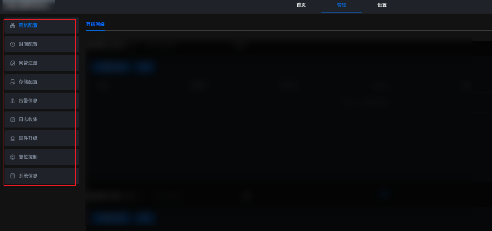

**图 2**  设置功能模块<a id="fig11140735463"></a>  
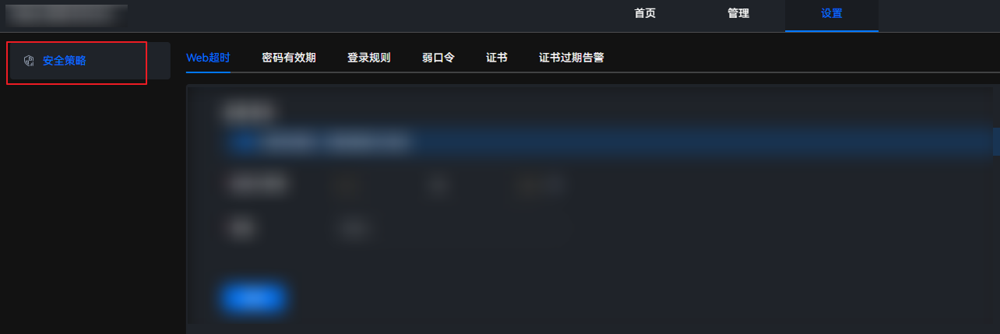

通过自定义加载组件，并对routesConfig.json进行配置后，边缘管理系统的Web界面将不显示“时间配置”、“告警信息”和“复位控制”，如[图3](#fig17321410144911)所示。

**图 3**  配置后显示图<a id="fig17321410144911"></a>  
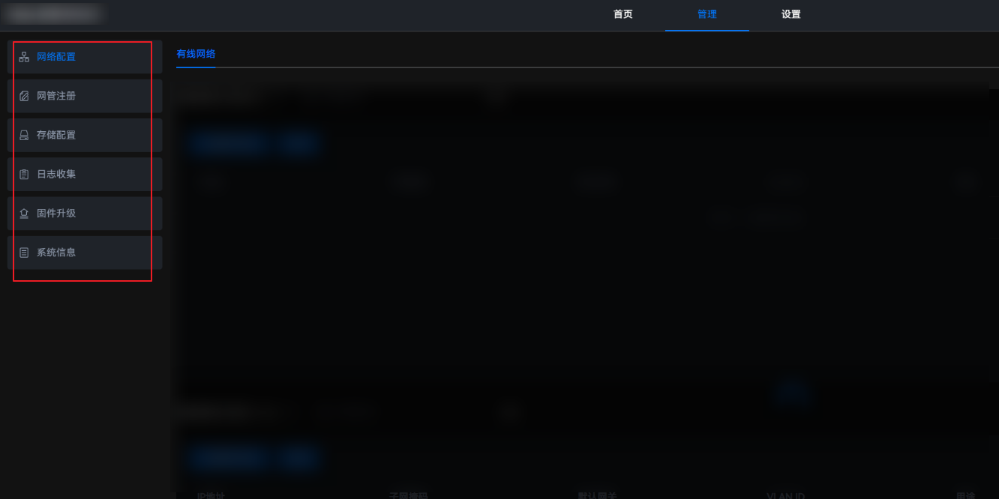

routesConfig.json的配置示例如下。

```json
{
    "manager": {
        "network": true,
        "time": false,                         # 不显示时间配置模块
        "registration": true,
        "disk": true,
        "alarm": false,                       # 不显示告警信息模块
        "journal": true,
        "update": true,
        "reload": false,                      # 不显示复位控制模块
        "information": true,
        "extendModule": true
    },
    "setting": {
        "safety": true
    }
}
```

## 模组开发<a name="ZH-CN_TOPIC_0000001578449892"></a>

### 介绍<a name="ZH-CN_TOPIC_0000001578449912"></a>

OM SDK把设备管理部分抽象为DEVM模块，支持二次开发过程中自定义模组，从而实现对拓展设备的管理。OM SDK按照华为Atlas 500 A2 智能小站产品的开发逻辑，指导用户进行模组开发，如下图所示，浅色模块需要开发者自行开发或提供。

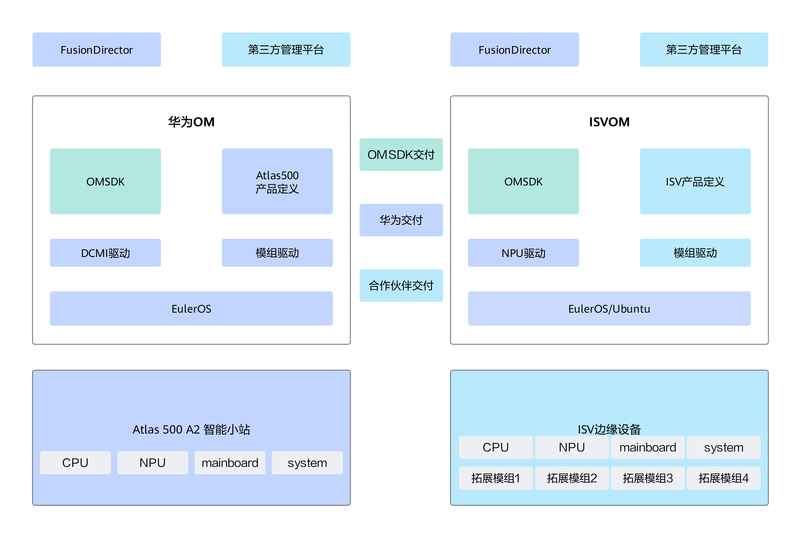

**操作介绍<a name="section1994618992516"></a>**

开发一个自定义模组需要的大致步骤有：

1. 新建一个模组规格配置文件，定义出拓展模组的模组名、ID、属性表等关键信息（详细说明见[配置文件介绍](#配置文件介绍)）。
2. 向已有的产品规格配置文件中添加拓展设备的定义（详细说明见[配置文件介绍](#配置文件介绍)）。
3. 开发拓展模组的驱动。需要实现一组由函数组成的接口，从而支持DEVM对其进行管理。其中get\_attribute、set\_attribute接口需要按照模组规格配置中的定义去实现属性的设置和读取。

### 规格配置文件定义<a name="ZH-CN_TOPIC_0000001577530684"></a>

**配置文件介绍<a id="配置文件介绍"></a>**

OM SDK中的DEVM通过模组和设备两个层级的架构对设备管理进行建模。一个边缘产品包含多个模组，一个模组支持管理多个设备。例如A500 A2 智能小站作为一个边缘产品，包含了CPU、NPU、mainboard等多个模组。

开发者通过定义配置文件中的产品和模组信息，从而适配模组驱动的开发。一组配置文件由一个产品规格配置文件以及若干个模组规格配置文件组成。

- 产品规格配置文件：产品规格配置文件定义了产品中所有的设备，对每个设备要定义设备名称并指定所属的模组。样例请参见附录[产品规格配置文件样例](./appendix.md#产品规格配置文件样例)。
- 模组规格配置文件：一个模组对应一个以“module\_”开头的配置文件，开发者需要定义其动态链接库文件的路径以及模组支持的属性等信息。样例请参见附录[模组规格配置文件样例](./appendix.md#模组规格配置文件样例)。

**关键字段说明<a id="关键字段说明section"></a>**

产品规格配置文件和模组规格配置文件中的关键字段说明请参见下表。

**表 1**  产品参数说明

|参数|可选或必选|说明|
|--|--|--|
|name|必选|产品名称。|
|modules|必选|产品模组字典。|
|module_name|必选|模组名称，需要确保不与已有模组名重复即可。|
|devices|必选|设备列表。设备名称需要满足由字母、数字、空格、减号或下划线组成，支持长度为1~127个字符。|

**表 2**  模组参数说明

|参数|必选或可选|说明|
|--|--|--|
|name|必选|模组名称，需要确保不与已有模组名称重复。|
|id|必选|模组ID，需要确保不与已有模组ID重复。|
|category|必选|模组类别，分为以下两种：<li>internal：内置模组</li><li>addition：拓展模组</li>二次开发的模组都属于拓展模组，都要写addition类别。|
|driver|必选|模组驱动（动态链接库）的路径。当前驱动的默认安装路径为/usr/local/lib，假设自定义模组的驱动文件名为libxxx\.so，则路径应填写/usr/local/lib/libxxx.so。|
|dynamic|必选|用来区分设备是否支持动态插拔属性，"true"代表支持动态插拔，"false"代表不支持动态插拔。|
|attributes|必选|模组支持的属性表，为key-value结构，key为属性名，value仍是一个表，里面各字段配置属性关键信息。详细介绍请参见[表3](#模组属性参数说明table)。|

**表 3**  模组属性参数说明<a id="模组属性参数说明table"></a>

|参数|必选或可选|说明|
|--|--|--|
|id|必选|属性ID，正整数，保证不与同级属性ID重复即可。|
|type|必选|数据类型，支持以下类型：<li>string </li><li>int</li><li>long long</li><li>float</li><li>bool</li><li>json|
|accessMode|必选|访问模式。<li>Read：只读</li><li>ReadWrite：读写</li><li>Write：只写</li><li>ReadHide：只读，在Web界面上不会明文展示该属性值</li><li>WriteHide：只写，在Web界面上不会明文修改该属性值</li><li>ReadWriteHide：读写，在Web界面不会明文展示和修改该属性值</li> > [!NOTE] 说明 <li>建议涉及到敏感数据的属性使用带有Hide的访问模式。</li><li>type为bool的属性，不能设置为带有Hide的访问模式。</li>|
|description|可选|属性说明。|

### 接口参考<a name="ZH-CN_TOPIC_0000001628849869"></a>

OM SDK定义了一组固定的驱动接口支持拓展模组的开发；开发者需要在拓展模组的驱动中实现这组接口。

#### dev\_load<a name="ZH-CN_TOPIC_0000001577530704"></a>

**接口声明<a name="section1742424335819"></a>**

**int dev\_load\(\)**

**参数介绍<a name="section099575503"></a>**

无

**功能说明<a name="section2562175225918"></a>**

用于加载驱动，分配模组所需资源，实现模组初始化。

#### dev\_unload<a name="ZH-CN_TOPIC_0000001628610477"></a>

**接口声明<a name="section1742424335819"></a>**

**int dev\_unload\(\)**

**参数介绍<a name="section099575503"></a>**

无

**功能说明<a name="section2562175225918"></a>**

用于卸载驱动，释放模组所占资源。

#### dev\_open<a name="ZH-CN_TOPIC_0000001628849885"></a>

**接口声明<a name="section1742424335819"></a>**

**int dev\_open(char \*name, int \*fd\)**

**参数介绍<a name="section099575503"></a>**

**表 1**  参数说明

|参数名|类型|说明|
|--|--|--|
|name|char *|用于传递设备名的字符数组|
|fd|int *|设备文件描述符（File Descriptor）指针|

**功能说明<a name="section2562175225918"></a>**

用于打开设备，根据传入的设备名分配设备文件描述符；并将其保存于指针所指地址中，后续设备操作使用“fd”值作为设备唯一标识符。

#### dev\_close<a name="ZH-CN_TOPIC_0000001578449904"></a>

**接口声明<a name="section1742424335819"></a>**

**int dev\_close(int fd\)**

**参数介绍<a name="section099575503"></a>**

**表 1**  参数说明

|参数名|类型|说明|
|--|--|--|
|fd|int|设备文件描述符|

**功能说明<a name="section2562175225918"></a>**

用于关闭设备，根据“fd”值删除对应的设备信息。

#### get\_attribute<a name="ZH-CN_TOPIC_0000001628490497"></a>

**接口声明<a name="section1742424335819"></a>**

**int get\_attribute(int fd, unsigned int buffSize, unsigned char \*buff\)**

**参数介绍<a name="section099575503"></a>**

**表 1**  参数说明

|参数名|类型|说明|
|--|--|--|
|fd|int|设备文件描述符|
|buffSize|unsigned int|缓存数组空间大小|
|buff|unsigned char*|用来传递数据的缓存|

**功能说明<a name="section2562175225918"></a>**

获取属性接口，根据传入“fd”值确定唯一设备，通过TLV编码的buff解析获取属性ID和对应属性值。

TLV是一种可变格式：Type表示属性ID、Length表示属性长度、Value表示属性值。其中Type和Length的长度固定为4字节，Value的长度根据属性类别的不同，长度可变；具体解析方式如下图所示。

**图 1**  TLV解析图<a name="fig1467318222143"></a>  
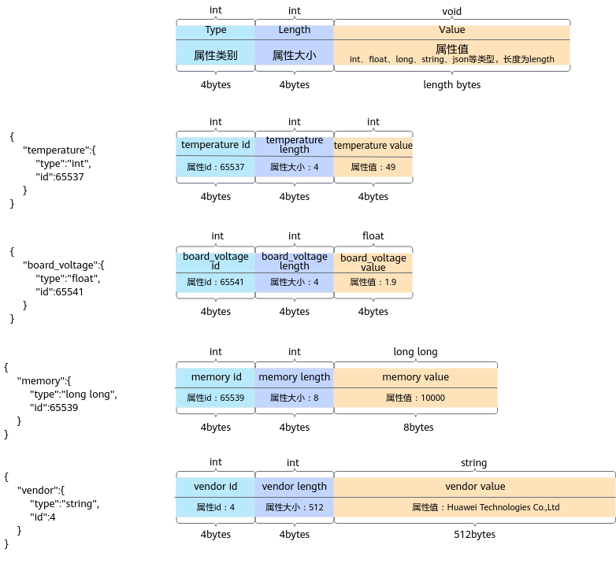

JSON类型的属性存在多个子属性，JSON属性的Value大小为所有子属性的TLV格式编码的大小；Value属性部分需要再次进行TLV解析，使用偏移量的方式，循环进行JSON子属性的TLV解析，直到Value部分解析完成。具体解析方式如下图所示。

**图 2**  JSON属性的二重TLV解析<a name="fig1868911580442"></a>  
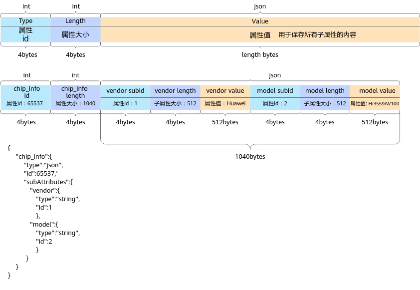

#### set\_attribute<a name="ZH-CN_TOPIC_0000001628729901"></a>

**接口声明<a name="section1742424335819"></a>**

**int set\_attribute(int fd, unsigned int buffSize, unsigned char \*buff\)**

**参数介绍<a name="section099575503"></a>**

**表 1**  参数说明

|参数名|类型|说明|
|--|--|--|
|fd|int|设备文件描述符|
|buffSize|unsigned int|缓存数组空间大小|
|buff|unsigned char*|用来传递数据的缓存|

**功能说明<a name="section2562175225918"></a>**

设置属性接口，根据传入“fd”值确定唯一设备，通过TLV编码的buff解析获取属性id并设置对应属性值。

#### （可选）dev\_read<a name="ZH-CN_TOPIC_0000001578489820"></a>

**接口声明<a name="section1742424335819"></a>**

**int dev\_read(int fd, unsigned int buffSize, unsigned char \*buff\)**

**参数介绍<a name="section099575503"></a>**

**表 1**  参数说明

|参数名|类型|说明|
|--|--|--|
|fd|int|设备文件描述符|
|buffSize|unsigned int|缓存数组空间大小|
|buff|unsigned char*|用来传递数据的缓存|

**功能说明<a name="section2562175225918"></a>**

预留设备读写接口，开发者可根据需求进行功能开发。

#### （可选）dev\_write<a name="ZH-CN_TOPIC_0000001577810508"></a>

**接口声明<a name="section1742424335819"></a>**

**int dev\_write(int fd, unsigned int buffSize, unsigned char \*buff\)**

**参数介绍<a name="section099575503"></a>**

**表 1**  参数说明

|参数名|类型|说明|
|--|--|--|
|fd|int|设备文件描述符|
|buffSize|unsigned int|缓存数组空间大小|
|buff|unsigned  char*|用来传递数据的缓存|

**功能说明<a name="section2562175225918"></a>**

预留设备读写接口，开发者可根据需求进行功能开发。

#### （可选）dev\_get\_device\_list<a name="ZH-CN_TOPIC_0000001628849893"></a>

**接口声明<a name="section1742424335819"></a>**

**int dev\_get\_device\_list(int type, unsigned int buffSize, unsigned char \*buff, unsigned int device\_name\_len\)**

**参数介绍<a name="section099575503"></a>**

**表 1**  参数说明

|参数名|类型|说明|
|--|--|--|
|type|int|设备文件描述符|
|buff|unsigned char*|用来传递数据的缓存|
|buffSize|unsigned int|缓存数组空间大小|
|device_name_len|unsigned int|单个设备名所占数组空间|

**功能说明<a name="section2562175225918"></a>**

动态获取指定类型模组的设备列表，把多个设备名写入一段连续的数组中，通过首地址偏移量划分不同设备名，“buffSize/device\_name\_len”值为缓存中最大允许写入的设备数量。（只有模组的dynamic字段设置为“true”的时候需要实现此接口，否则静态设备由产品规格配置文件定义无需实现此接口。）

**buff解析<a name="section687191412411"></a>**

按照指定的“device\_name\_len”参数长度，通过首地址偏移的方式，将设备名保存在buff的指定内存段中，具体实现如下图所示。确保设备名的长度不大于指定“device\_name\_len”的最大长度；确保buff的空间大于保存该模组的所有设备信息所用空间。

**图 1**  buff解析图<a name="fig19130645647"></a>  
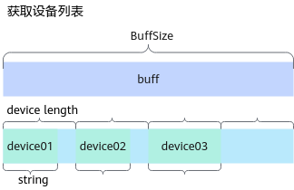

### 开发示例<a name="ZH-CN_TOPIC_0000001578489832"></a>

本章节指导开发者根据add\_extend\_driver\_adapter工程示例适配OM SDK的接口。在实际操作本章节前，开发人员应已经仔细阅读模组开发章节，熟悉产品规格、模组规格、接口功能等信息。

**操作步骤<a name="section20665140307"></a>**

1. 进入工程源码“_\{project\_dir\}_/src/app/add\_extend\_driver\_adapter”路径下。

    add\_extend\_driver\_adapter的目录结构如下所示。

    ```text
    ├── build_extend_driver_adapter.sh     // 驱动构建脚本
    ├── validate_module_def.py             // 配置文件校验脚本
    ├── CMakeLists.txt                     // CMake构建文件
    ├── demo_module.c                      // 模组适配源文件
    └── demo_module.h                      // 模组适配头文件
    ```

2. 在规格配置文件中定义模组和设备。
    1. 从om-sdk.tar.gz中“software/ibma/config/devm\_configs”下拷贝所有已有配置文件到“<i>{project_dir}</i>/config/module\_def”目录下。
    2. 在“_\{project\_dir\}_/config/module\_def”目录下新建模组规格配置文件module\_demo.json，根据[关键字段说明](#关键字段说明section)章节定义出关键字段。
    3. （可选）在“_\{project\_dir\}_/config/module\_def”路径下，打开product\_specification.json文件，在文件的设备列表中添加属于拓展模组的设备定义。（如果模组的设备属于动态插拔类型则无需在配置文件中静态定义）。
    4. 使用配置文件检查脚本validate\_module\_def.py对拓展后的配置文件集进行检查，验证产品规格配置文件和模组规格配置文件的正确性。

        ```bash
        cd src/app/add_extend_driver_adapter
        python3 validate_module_def.py ../../../config/module_def
        ```

        validate\_module\_def.py脚本内容如下：

        ```python
        import json
        import os
        import sys
        
        
        PRODUCT_NAME = 'product_specification.json'
        MAX_ATTRIBUTE_LEVEL = 2
        MAX_ATTRIBUTE_NUMBER = 50
        MODULE_CATEGORY = ('internal', 'extend', 'addition')
        ATTRIBUTE_VALUE_TYPE = ('bool', 'float', 'int', 'json', 'long long', 'string')
        ATTRIBUTE_ACCESS_MODE = ('Read', 'Write', 'ReadWrite','ReadHide', 'WriteHide', 'ReadWriteHide')
        
        
        def check(config_file_dir: str):
            """
            :param config_file_dir:
            :return: None
            Check the correctness of all the configuration files in the directory
            """
            for filename in os.listdir(config_file_dir):
                if not filename.endswith('json'):
                    continue
        
                with open(os.path.join(config_file_dir, filename)) as stream:
                    document = json.load(stream)
        
                if filename == PRODUCT_NAME:
                    check_product(document)
                elif filename.startswith('module'):
                    check_module(document)
                else:
                    raise AssertionError(f'Unknown file: "{filename}"')
        
            print(f'The collection of configurations in {config_file_dir} is correct. ')
        
        
        def check_product(doc: dict) -> int:
            """
            :param doc: product specification
            :return: total number of device
            """
            assert isinstance(doc, dict), 'product specification file structure error: outermost layer should be a map'
            modules = doc.get('modules')
            if modules:
                assert isinstance(modules, dict), 'modules should be a map'
                for module, module_spec in modules.items():
                    assert isinstance(module, str), 'key in modules should be a string'
                    assert isinstance(module_spec, dict), 'value in modules should be a dict'
        
                    devices = module_spec.get('devices')
                    if devices is None:
                        raise AssertionError(f'devices not exist in module {module}')
                    else:
                        assert isinstance(devices, list), 'devices in module spec should be a list'
                        for device in devices:
                            assert isinstance(device, str), 'device should be a string'
                return len(modules)
            else:
                raise AssertionError('no modules found in product specification')
        
        
        def check_module(doc: dict) -> str:
            """
            :param doc: module specification
            :return: module name
            """
            assert isinstance(doc, dict), 'module specification file structure error: outermost layer should be a map'
        
            module_name = doc.get('name')
            assert module_name is not None, f'no name in {doc}'
            assert isinstance(module_name, str), 'module name should be a string'
        
            _id = doc.get('id')
            assert _id is not None, f'no id in module {module_name}'
            assert isinstance(_id, int), 'module id should be an integer'
        
            category = doc.get('category')
            if category:
                assert isinstance(category, str), 'module category should be a string'
                assert category in MODULE_CATEGORY, f'invalid category: {category}'
            else:
                raise AssertionError(f'no category found in module {module_name}')
        
            driver = doc.get('driver')
            assert driver is not None, f'no driver found in module {module_name}'
            assert isinstance(driver, str), 'module driver should be a string'
        
            dynamic = doc.get('dynamic')
            assert dynamic is not None, f'no dynamic found in module {module_name}'
            assert isinstance(dynamic, bool), 'dynamic should be a boolean value'
        
            attributes = doc.get('attributes')
            if attributes:
                check_attributes(attributes)
            else:
                raise AssertionError(f'no attributes found in module {module_name}')
        
            return module_name
        
        
        def check_attributes(attributes: dict, level=1):
            """
            :param attributes: a map whose keys are attribute names and values are attribute specifications
            :param level: the level of recursive subAttribute
            :return: None
            """
            assert isinstance(attributes, dict), 'module specification file structure error: attributes should be a map'
            assert len(attributes) <= MAX_ATTRIBUTE_NUMBER, f'number of attributes exceeds limit ({MAX_ATTRIBUTE_NUMBER})'
            assert level <= MAX_ATTRIBUTE_LEVEL, 'recursive subAttributes level exceeds limit'
        
            for attr_name, doc in attributes.items():
                _id = doc.get('id')
                assert _id is not None, f'no id in attribute {attr_name}'
                assert isinstance(_id, int), 'attribute id should be an integer'
        
                value_type = doc.get('type')
                if value_type:
                    assert isinstance(value_type, str), 'attribute value type should be a string'
                    assert value_type in ATTRIBUTE_VALUE_TYPE, f'invalid value type {value_type}'
                else:
                    raise AssertionError(f'no type in attribute {attr_name}')
        
                access_mode = doc.get('accessMode')
                if access_mode:
                    assert isinstance(access_mode, str), 'attribute access mode should be a string'
                    assert access_mode in ATTRIBUTE_ACCESS_MODE, f'invalid access mode {access_mode}'
                else:
                    raise AssertionError(f'no accessMode in attribute {attr_name}')
        
                attributes = doc.get('subAttributes')
                if attributes:
                    check_attributes(attributes, level=level + 1)
        
        
        if __name__ == '__main__':
            if len(sys.argv) == 2:
                check(sys.argv[1])
            else:
                print('The input argument should be the directory of the configuration files')
        
        ```

        检查内容包括：

        - 配置文件结构是否正确。
        - 关键字段是否有缺失。
        - 枚举类型字段是否属于正确类型的一种。
        - 安全性检查。

3. 在demo\_module.h定义对外接口以及接口关键字段。

    ```c
    #ifndef __DEMO_MODULE_H__
    #define __DEMO_MODULE_H__
    
    #define DEVICE_MAP_MAX_LEN 2  /* 保存模组设备的最大个数 */
    #define DEVICE_INFO_MAX_LEN 64 /* 保存模组信息的最大长度 */
    #define TLV_HEADER_LENGTH 8
    
    /* 定义属性ID类型 0：基础通用属性 1：模组特有属性 */
    #define BASE_CLASS_ID 0x00
    #define MODULE_CLASS_ID 0x01
    
    /* 定义模组管理的属性 */
    typedef enum demo_attribute_id {
        NAME = ((BASE_CLASS_ID) << 16) + 1,          /* 名称 string */
        CLASS = ((BASE_CLASS_ID) << 16) + 2,         /* 类型 string */
        PRESENT = ((MODULE_CLASS_ID) << 16) + 1,     /* 状态 int */
        TEMPERATURE = ((MODULE_CLASS_ID) << 16) + 2, /* 温度 float */
        VOLTAGE = ((MODULE_CLASS_ID) << 16) + 3,     /* 电压 float */
        SWITCH = ((MODULE_CLASS_ID) << 16) + 4,      /* 开关 bool */
        MEMORY = ((MODULE_CLASS_ID) << 16) + 5,      /* 内存 long long */
        VERSION = ((MODULE_CLASS_ID) << 16) + 6,     /* 版本 string */
        SIGNAL_INFO = ((MODULE_CLASS_ID) << 16) + 7 /* 信号信息 json */
    } DEMO_ATTRIBUTE_ID;
    
    /* 定义json属性中的子属性ID */
    typedef enum sub_attribute_id {
        SUB_ATTRIBUTE1 = 1,
        SUB_ATTRIBUTE2 = 2
    } SUB_ATTRIBUTE_ID;
    
    /* 定义模拟json属性的结构体 */
    typedef struct demo_signal_info {
        char signal_type[DEVICE_INFO_MAX_LEN]; /* 类型 string */
        char signal_strength[DEVICE_INFO_MAX_LEN]; /* 强度 string */
    } DEMO_SIGNAL_INFO;
    
    /* 定义保存的设备 */
    typedef struct demo_device_map {
        char name[DEVICE_INFO_MAX_LEN];
        int fd;
    } DEMO_DEVICE_MAP;
    
    /* 定义设备各属性，用于模拟设备属性的获取和设置 */
    typedef struct device {
        char name[DEVICE_INFO_MAX_LEN];
        char device_class[DEVICE_INFO_MAX_LEN];
        int present;
        float temperature;
        float voltage;
        int device_switch;
        long long memory;
        char version[DEVICE_INFO_MAX_LEN];
        DEMO_SIGNAL_INFO* signal_info;
    } DEVICE;
    
    /* 定义保存的模组列表 */
    typedef struct demo_device_ctl {
        DEMO_DEVICE_MAP device_map[DEVICE_MAP_MAX_LEN];
    } DEMO_DEVICE_CTRL;
    
    /* 定义TLV解析结构体 */
    typedef struct attr_tlv_struct {
        int type;
        int len;
        char value[0];
    } ATTR_TLV;
    
    /* 定义驱动提供的对外接口 */
    int dev_load();
    int dev_unload();
    int dev_open(char *name, int *fd);
    int dev_close(int fd);
    int get_attribute(int fd, unsigned int buffSize, unsigned char *buff);
    int set_attribute(int fd, unsigned int buffSize, unsigned char *buff);
    int dev_read(int fd, unsigned int buffSize, unsigned char *buff);
    int dev_write(int fd, unsigned int buffSize, unsigned char *buff);
    int dev_get_device_list(int type, unsigned int buffSize, unsigned char *buff, unsigned int device_name_len);
    
    #endif
    ```

4. 在demo\_module.c中实现接口以及接口关键字段。

    ```c
    #include <stdio.h>
    #include <stdlib.h>
    #include <string.h>
    
    #include <dlfcn.h>
    #include <pthread.h>
    #include <unistd.h>
    
    #include "demo_module.h"
    
    #ifdef __cplusplus
    #if __cplusplus
    extern "C" {
    #endif
    #endif
    
    /* 结构体指针g_demo_ctrl保存模组设备信息 */
    static DEMO_DEVICE_CTRL *g_demo_ctrl = NULL;
    
    /* 定义支持的设备名 */
    char* g_devices_name[DEVICE_MAP_MAX_LEN] = {
        "extend_device01",
        "extend_device02"
    };
    
    /* 定义支持的设备, 用于模拟模组各属性类型的获取与设置 */
    DEMO_SIGNAL_INFO signal1 = {"4g", "strong"};
    DEMO_SIGNAL_INFO signal2 = {"5g", "weak"};
    DEVICE device1 = {"extend_name", "extend_class", 1, 52, 1.0, 0, 51200000, "extend 1.0", &signal1};
    DEVICE device2 = {"extend_name", "extend_class", 1, 52, 1.0, 1, 51200000, "extend 1.0", &signal2};
    DEVICE* g_devices[DEVICE_MAP_MAX_LEN] = {&device1, &device2};
    
    /* 驱动适配资源加载以及模组初始化接口 */
    int dev_load()
    {
        /* 申请用于保存模组设备信息的内存资源 */
        g_demo_ctrl = malloc(sizeof(DEMO_DEVICE_CTRL));
        if (g_demo_ctrl == NULL) {
            return -1;
        }
    
        /* 初始化模组设备信息，生成区分设备的不同fd值以及 */
        for (int index = 0; index < DEVICE_MAP_MAX_LEN; index++) {
            g_demo_ctrl->device_map[index].fd = index;
            int ret = memcpy_s(g_demo_ctrl->device_map[index].name, DEVICE_INFO_MAX_LEN,
                               g_devices_name[index], DEVICE_INFO_MAX_LEN);
            if (ret != 0) {
                return -1;
            }
        }
        return 0;
    }
    
    /* 驱动适配资源释放接口 */
    int dev_unload()
    {
        /* 释放保存模组设备信息的指针并置空 */
        if (g_demo_ctrl != NULL) {
            free(g_demo_ctrl);
        }
        g_demo_ctrl = NULL;
        return 0;
    }
    
    /* 驱动适配设备打开接口，根据输入的设备名name，返回得到设备标识符fd */
    int dev_open(char *name, int *fd)
    {
        /* 判断是否初始化加载模组,以及输入参数是否为空指针 */
        if (g_demo_ctrl == NULL || name == NULL || fd == NULL) {
            return -1;
        }
        /* 遍历模组设备列表，查询是否已存在device_name的设备信息，若存在返回对应fd值 */
        for (int index = 0; index < DEVICE_MAP_MAX_LEN; index++) {
            if (strcmp(g_demo_ctrl->device_map[index].name, name) == 0) {
                *fd = g_demo_ctrl->device_map[index].fd;
                return 0;
            }
        }
        return -1;
    }
    
    /* 驱动适配设备关闭接口，根据输入的fd设备标识符关闭对应设备 */
    int dev_close(int fd)
    {
        if (g_demo_ctrl == NULL) {
            return -1;
        }
        /* 遍历模组设备列表，查询fd对应设备信息并置为初始值 */
        for (int index = 0; index < DEVICE_MAP_MAX_LEN; index++) {
            if (g_demo_ctrl->device_map[index].fd == fd) {
                memset_s(g_demo_ctrl->device_map[index].name, DEVICE_INFO_MAX_LEN, 0, DEVICE_INFO_MAX_LEN);
            }
        }
        return 0;
    }
    
    /* json类型数据获取封装接口，将TLV编码解析的value进行TLV解析完成json属性获取 */
    static int get_json_attribute(int buffSize, char *buff, DEVICE* device)
    {
        int pos = 0;
        while (pos < buffSize) {
            ATTR_TLV *sub_item = (ATTR_TLV *)(buff + pos);
            /* 判断TLV解析是否会内存越界，若解析错误则返回错误码 */
            if (pos + TLV_HEADER_LENGTH + sub_item->len > buffSize) {
                return -1;
            }
            switch (sub_item->type) {
                case SUB_ATTRIBUTE1: {
                    memcpy_s((char *)sub_item->value, DEVICE_INFO_MAX_LEN,
                             device->signal_info->signal_type, DEVICE_INFO_MAX_LEN);
                    break;
                }
                case SUB_ATTRIBUTE2: {
                    memcpy_s((char *)sub_item->value, DEVICE_INFO_MAX_LEN,
                             device->signal_info->signal_strength, DEVICE_INFO_MAX_LEN);
                    break;
                }
                default:
                    /* 若输入的模组子属性不支持设置，返回错误码 */
                    return -1;
            }
            pos += TLV_HEADER_LENGTH + sub_item->len;
        }
        return 0;
    }
    
    /* 驱动适配属性获取接口，将模组属性保存到TLV编码解析的buff中 */
    int get_attribute(int fd, unsigned int buffSize, unsigned char *buff)
    {
        DEVICE* device = NULL;
        /* 根据fd确定模组唯一设备,确认后对该模组设备属性获取 */
        for (int index = 0; index < DEVICE_MAP_MAX_LEN; index++) {
            if (g_demo_ctrl->device_map[index].fd == fd) {
                device = g_devices[fd];
                break;
            }
        }
        if (device == NULL) {
            /* 若存在该设备，则根据TLV解析获取该设备属性，若不存在该设备，返回错误码 */
            return -1;
        }
    
        /* 将输入的获取到模组属性的内存进行TLV转换进行解析 */
        ATTR_TLV *demo_attr = (ATTR_TLV *)buff;
    
        /* 使用switch case方法确定需要获取的模组属性，并将对应模组属性保存在buff内存段中 */
        switch (demo_attr->type) {
            /* case中模组属性ID与模组配置json文件保持一致 */
            case NAME:
                /* 模拟string类型属性的获取方式，实际开发中：需将实际接口获取的属性值保存在TLV解析的value中 */
                memcpy_s(demo_attr->value, demo_attr->len, device->name, DEVICE_INFO_MAX_LEN);
                break;
            case CLASS:
                /* 模拟string类型属性的获取方式，实际开发中：需将实际接口获取的属性值保存在TLV解析的value中 */
                memcpy_s(demo_attr->value, demo_attr->len, device->device_class, DEVICE_INFO_MAX_LEN);
                break;
            /* case中的全局变量仅是模拟不同类型的属性获取方式，实际适配开发中需修改为实际的模组属性接口 */
            case PRESENT:
                /* 模拟int类型属性的获取方式，实际开发中：需将实际接口获取的属性值保存在TLV解析的value中 */
                *(int *)demo_attr->value = device->present;
                break;
            case TEMPERATURE:
                /* 模拟float类型属性的获取方式，实际开发中：需将实际接口获取的属性值保存在TLV解析的value中 */
                *(float *)demo_attr->value = device->temperature;
                break;
            case VOLTAGE:
                /* 模拟float类型属性的获取方式，实际开发中：需将实际接口获取的属性值保存在TLV解析的value中 */
                *(float *)demo_attr->value = device->voltage;
                break;
            case SWITCH:
                /* 模拟bool类型属性的获取方式，实际开发中：需将实际接口获取的属性值保存在TLV解析的value中 */
                *demo_attr->value = device->device_switch;
                break;
            case MEMORY:
                /* 模拟long long类型属性的获取方式，实际开发中：需将实际接口获取的属性值保存在TLV解析的value中 */
                *(long long *)demo_attr->value = device->memory;
                break;
            case VERSION:
                /* 模拟string类型属性的获取方式，实际开发中：需将实际接口获取的属性值保存在TLV解析的value中 */
                memcpy_s(demo_attr->value, demo_attr->len, device->version, DEVICE_INFO_MAX_LEN);
                break;
            case SIGNAL_INFO:
                /* json类型的属性需要对buff再次进行TLV解析，使用偏移量的方式确定子属性的获取 */
                return get_json_attribute(demo_attr->len, (char *)demo_attr->value, device);
            default:
                /* 若输入的模组属性不支持获取，返回错误码 */
                return -1;
        }
        return 0;
    }
    
    /* json类型数据设置封装接口，将TLV编码解析的value进行TLV解析完成json属性设置 */
    static int set_json_attribute(int buffSize, char *buff, DEVICE* device)
    {
        int pos = 0;
        while (pos < buffSize) {
            ATTR_TLV *sub_item = (ATTR_TLV *)(buff + pos);
            /* 判断TLV解析是否会内存越界，若解析错误则返回错误码 */
            if (pos + TLV_HEADER_LENGTH + sub_item->len > buffSize) {
                return -1;
            }
            switch (sub_item->type) {
                case SUB_ATTRIBUTE1:
                    memcpy_s(device->signal_info->signal_type, DEVICE_INFO_MAX_LEN,
                             (char *)sub_item->value, DEVICE_INFO_MAX_LEN);
                    break;
                case SUB_ATTRIBUTE2:
                    memcpy_s(device->signal_info->signal_strength, DEVICE_INFO_MAX_LEN,
                             (char *)sub_item->value, DEVICE_INFO_MAX_LEN);
                    break;
                default:
                    /* 若输入的模组子属性不支持设置，返回错误码 */
                    return -1;
            }
            pos += TLV_HEADER_LENGTH + sub_item->len;
        }
        return 0;
    }
    
    /* 驱动适配属性设置接口，将TLV编码解析的buff中的属性值进行设置 */
    int set_attribute(int fd, unsigned int buffSize, unsigned char *buff)
    {
        DEVICE* device = NULL;
        /* 根据fd确定模组唯一设备,确认后对该模组设备属性获取 */
        for (int index = 0; index < DEVICE_MAP_MAX_LEN; index++) {
            if (g_demo_ctrl->device_map[index].fd == fd) {
                device = g_devices[fd];
                break;
            }
        }
        if (device == NULL) {
            /* 若存在该设备，则根据TLV解析获取该设备属性，若不存在该设备，返回错误码 */
            return -1;
        }
    
        /* 将输入的获取到模组属性的内存进行TLV转换进行解析 */
        ATTR_TLV *demo_attr = (ATTR_TLV *)buff;
    
        /* 使用switch case方法确定需要设置的模组属性，并将buff内存段中对应的属性值保存在模组中 */
        switch (demo_attr->type) {
            /* case中模组属性ID与模组配置json文件保持一致 */
            case PRESENT:
                /* 模拟int类型属性的设置方式，实际开发中：需将保存在TLV解析的value值传入实际接口设置属性值 */
                device->present = *(int *)demo_attr->value;
                break;
            case TEMPERATURE:
                /* 模拟float类型属性的设置方式，实际开发中：需将保存在TLV解析的value值传入实际接口设置属性值 */
                device->temperature = *(float *)demo_attr->value;
                break;
            case VOLTAGE:
                /* 模拟float类型属性的设置方式，实际开发中：需将保存在TLV解析的value值传入实际接口设置属性值 */
                device->voltage = *(float *)demo_attr->value;
                break;
            case SWITCH:
                /* 模拟bool类型属性的设置方式，实际开发中：需将保存在TLV解析的value值传入实际接口设置属性值 */
                device->device_switch = *(int *)demo_attr->value;
                break;
            case MEMORY:
                /* 模拟long long类型属性的设置方式，实际开发中：需将保存在TLV解析的value值传入实际接口设置属性值 */
                device->memory = *(long long *)demo_attr->value;
                break;
            case VERSION:
                /* 模拟string类型属性的设置方式，实际开发中：需将保存在TLV解析的value值传入实际接口设置属性值 */
                memcpy_s(device->version, DEVICE_INFO_MAX_LEN, (char *)demo_attr->value, DEVICE_INFO_MAX_LEN);
                break;
            case SIGNAL_INFO:
                /* json类型的属性需要对buff再次进行TLV解析，使用偏移量的方式进行子属性的设置 */
                return set_json_attribute(demo_attr->len, (char *)demo_attr->value, device);
            default:
                /* 若输入的模组子属性不支持设置，返回错误码 */
                return -1;
        }
        return 0;
    }
    
    /* 驱动适配预留读接口，暂不设计开发使用 */
    int dev_read(int fd, unsigned int buffSize, unsigned char *buff)
    {
        return 0;
    }
    
    /* 驱动适配预留写接口，暂不设计开发使用 */
    int dev_write(int fd, unsigned int buffSize, unsigned char *buff)
    {
        return 0;
    }
    
    /* 可热插拔设备的模组接口，用于获取指定设备类型的设备列表。当模组信息会实时变化的情况下，使用此接口刷新模组设备信息 */
    int dev_get_device_list(int type, unsigned int buffSize, unsigned char *buff, unsigned int device_name_len)
    {
        if (g_demo_ctrl == NULL) {
            return -1;
        }
        int pos = 0;
        int ret;
        /* 根据不同的模组设备类型，使用首地址偏移的方式将模组设备信息保存在buff中 */
        ret = memcpy_s((char *)(buff + pos), device_name_len, "extend_device01", device_name_len);
        if (ret != 0) {
            return -1;
        }
        pos += device_name_len;
        ret = memcpy_s((char *)(buff + pos), device_name_len, "extend_device02", device_name_len);
        if (ret != 0) {
            return -1;
        }
        return 0;
    }
    
    #ifdef __cplusplus
    #if __cplusplus
    }
    #endif
    #endif
    ```

5. 编译构建动态库so。
    1. 在“add\_extend\_driver\_adapter”路径的CMakeLists.txt文件中编写构建方式，示例如下。

        ```text
        #设置CMake的最低版本
        cmake_minimum_required(VERSION 3.16)
        
        #交叉编译选项
        if (CROSSCOMPILE_ENABLED)
            set(CMAKE_SYSTEM_NAME Linux)
            set(CMAKE_SYSTEM_PROCESSOR aarch64)
            set(target_arch aarch64-linux-gnu)
            set(CMAKE_C_COMPILER /usr/bin/aarch64-linux-gnu-gcc)
            set(CMAKE_CXX_COMPILER /usr/bin/aarch64-linux-gnu-g++)
            set(CMAKE_LIBRARY_ARCHITECTURE ${target_arch} CACHE STRING "" FORCE)
            set(CMAKE_FIND_ROOT_PATH_MODE_PROGRAM NEVER)
            set(CMAKE_FIND_ROOT_PATH_MODE_LIBRARY ONLY)
            set(CMAKE_FIND_ROOT_PATH_MODE_INCLUDE ONLY)
            set(CMAKE_FIND_ROOT_PATH_MODE_PACKAGE ONLY)
        endif()
        #添加构建的项目名称
        project(libdemo_adapter)
        
        set(TOP_DIR ${CMAKE_CURRENT_SOURCE_DIR}/../../..)
        
        #在目录中查找所有源文件
        aux_source_directory(. SRC_LIST)
        
        #将源文件生成名为libdemo_adapter.so链接文件 STATIC:静态链接 SHARED:动态链接
        add_library(demo_adapter SHARED ${SRC_LIST})
        ```

    2. 构建.so文件。
        1. 在“add\_extend\_driver\_adapter”工程下的build\_extend\_driver\_adapter.sh中编写构建脚本，代码编写示例如下。

            ```shell
            #!/bin/bash
            
            CUR_DIR=$(dirname "$(readlink -f "$0")")
            
            function main()
            {
                echo "build demo adapter lib..."
                if [ ! -d "${CUR_DIR}/build" ];then
                    mkdir -p "${CUR_DIR}/build"
                else
                    rm -rf "${CUR_DIR}/build"/*
                fi
                cd "${CUR_DIR}/build"
                # 注意x86编译环境需要安装Arm64编译工具后，开启该选项
                cmake -DCROSSCOMPILE_ENABLED=ON ..
                make
                echo "build demo adapter lib success"
                return 0
            }
            main
            RESULT=$?
            exit "${RESULT}"
            ```

        2. 将“_\{project\_dir\}_/config/project\_cfg/project.conf”的“\_NeedAdditionalDriver”设置为“yes”。

6. 编译新增模组文件。在<i>{project_dir}</i>/build/build.sh中，实现调用扩展模组的编译脚本。

    ```shell
    # 添加扩展模组驱动
    # TOP_DIR={project_dir}
    # OMSDK_TAR_PATH={project_dir}/platform/omsdk
    if [[ "${_NeedAdditionalDriver}" == "yes" ]]; then
        if ! bash "${TOP_DIR}"/src/app/add_extend_driver_adapter/build_extend_driver_adapter.sh;then
            return 1
        fi
        cp -rf "${TOP_DIR}"/src/app/add_extend_driver_adapter/build/libdemo_adapter.so "${OMSDK_TAR_PATH}"/lib/
        # copy additional configurations
        cp -rf "${TOP_DIR}"/config/module_def/*.json "${OMSDK_TAR_PATH}"/software/ibma/config/devm_configs/
    fi
    ```

### 使用指导<a name="ZH-CN_TOPIC_0000001608401620"></a>

扩展模组配置成功后，可在边缘管理系统的Web界面进行查看和编辑。

1. 登录边缘管理系统的Web界面。
2. 在主菜单中选择“管理 \> 扩展模组”，进入“扩展模组”界面，查看扩展的模组、模组的设备和设备的属性，包括属性名、属性类型和属性值等信息。

    **图 1**  扩展模组<a name="fig159681655193519"></a>  
    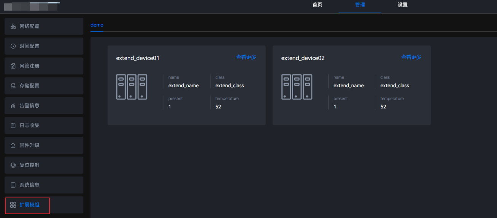

3. 单击可修改设备的属性。

    **图 2**  修改属性值<a name="fig8965912183814"></a>  
    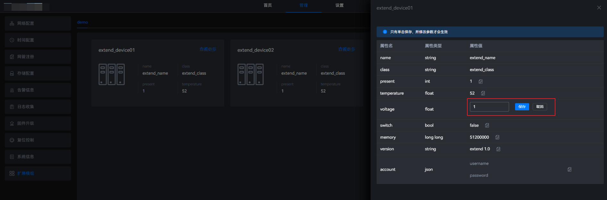

4. 单击“保存”，保存已修改的设备属性。

## 配置外部设备<a name="ZH-CN_TOPIC_0000001634728636"></a>

### 配置文件说明<a name="ZH-CN_TOPIC_0000001695759105"></a>

ISV用户可以根据不同的底板对配置文件（device\_config.json）的进行相应修改，从而实现边缘管理系统可以识别该外部设备，并可以展示外部设备信息。同时支持对外部设备存储进行分区创建、删除、挂载与解挂等操作。

**配置文件<a name="section11959516193615"></a>**

配置文件路径为“_\{project\_dir\}_/src/app/add\_extend\_device”，代码目录结构如下所示。

```text
├── device_config.json                 // 外设配置文件
└── validate_device_config.py          // 外设配置校验脚本
```

device\_config.json配置模板（参照Atlas 500 A2 智能小站配置）如下，该配置文件的结构不支持调整，否则可能导致边缘管理系统启动失败。可以增删改单个设备的配置与启动设备的主分区号，多余的设备配置或匹配不到设备的配置会被忽略。具体参数见表参数说明。

```json
{
    "primary_partitions": [
        1,
        2,
        3,
        4,
        5
    ],
    "usb_hub_id": "0bda:5411",
    "extend_info": {
        "u-disk": [   # 外设类别名
            {
            "platform": "a5080000.hiusbc1",
            "location": "usb2",
            "name": "u-disk2"
            }, # 单个设备配置
            {
            "platform": "a5100000.hiusbc2",
            "location": "usb1",
            "name": "u-disk1"
            },
            {
            "platform": "a5180000.hiusbc3",
            "location": "usb0",
            "name": "u-disk0"
            }
        ],
        "eMMC": [
            {
            "platform": "82000000.sdhci0",
            "location": "eMMC1",
            "name": "eMMC"
            },
            {
            "platform": "82010000.sdhci1",
            "location": "SDIO1",
            "name": "SD-card"
            }
        ],
        "DISK": [
            {
            "platform": "a6000000.sata",
            "device": "0:0:0:0",
            "location": "PCIE-0",
            "name": "disk m.2"
            },
            {
            "platform": "a6000000.sata",
            "device": "1:0:0:0",
            "location": "PCIE-1",
            "name": "disk0"
            },
            {
            "platform": "a6000000.sata",
            "device": "2:0:0:0",
            "location": "PCIE-2",
            "name": "disk1"
            }
        ],
        "ethnet": [
            {
            "platform": "a7100000.xge0",
            "location": "PORT1",
            "name": "eth0"
            },
            {
            "platform": "a7200000.xge1",
            "location": "PORT2",
            "name": "eth1"
            }
        ]
    }
}
```

**表 1**  参数说明

|参数名|参数说明|
|--|--|
|primary_partitions|含义：启动盘的系统主分区<br>类型：列表</br>取值：默认1~5；最多配置16个分区<br>说明：配置该参数后，通过查询磁盘分区集合信息、查询磁盘详细信息、删除磁盘分区等接口均查不到配置列表中的分区，可避免误删。</br>|
|usb_hub_id|含义：USB HUB的厂商ID和产品ID<br>类型：字符串</br>取值：以0bda:5411为例，0bda是USB HUB的厂商ID，5411是USB HUB的产品ID，用于USB HUB异常检测<br>说明：可执行lsusb命令获取，若配置错误，可能导致不停触发USB HUB异常告警。</br>|
|extend_info|含义：外设扩展与匹配信息<br>类型：字典</br>取值：u-disk、eMMC、DISK、ethnet<br>说明：字典的键表示设备类型，字典的值为设备的外设配置信息列表。</br>|
|platform|含义：设备在/sys/devices/platform中的子目录名<br>类型：字符串</br>说明：边缘管理系统根据此参数的值查找系统中是否存在对应的设备。|
|device|含义：/sys/block/*设备名*/device链接指向的目录名<br>类型：字符串</br>说明：类似DISK类型的外部设备，当platform名字一样时则无法区分出不同的DISK。此时，需要将对应设备的/sys/block/*设备名*/device链接指向的目录名配置到device参数，以供边缘管理系统查找对应设备。|
|location|含义：页面展示的位置信息<br>类型：字符串</br>取值：建议按照物理位置配置location的取值，例如USB设备取值为usb1<br>说明：不同设备的该项配置不能重复，需要保证location取值的唯一性。</br>|
|name|含义：FusionDirector展示用的设备名<br>类型：字符串</br>取值：支持大小写字母，数字、其他字符（-_.）和空格；建议按照物理类型和物理位置编号取值，例如USB设备取值为usb1<br>说明：若配置不符合取值要求，可能导致外部设备信息查询失败。</br>|

**配置说明<a name="section343416331583"></a>**

在Linux系统中，/sys/devices/platform目录下存储了系统中所有的平台信息。设备的详细信息可通过该目录下的子目录进行查询。每个子目录的名称代表了一个平台设备的名称，以Atlas 500 A2 智能小站为例：

- 子目录名称包含hiusb的表示USB设备
- 子目录名称包含sdhci表示eMMC存储设备
- 子目录名称为a6000000.sata表示sata盘
- 子目录名称包含xge的表示网卡设备

以上除了sata类型的存储盘，均能通过platform下的子目录名称关联出对应的物理设备，例如a5080000.hiusbc1关联了位置为usb2的插口，如[图1](#fig347265517342)所示，82010000.sdhci1关联了位置为SD卡插口。sata类型的需要根据盘的具体路径信息关联对应设备，即/sys/block/存储设备盘符名/device目录（软连接）指向的目录名，0:0:0:0表示M.2，1:0:0:0表示disk0，2:0:0:0表示disk1。

**图 1**  USB插口位置<a id="fig347265517342"></a>  


**扩展存储告警<a name="section82143611272"></a>**

OM SDK支持扩展存储设备的部分告警，包含硬盘温度过高、硬盘寿命到期预警、硬盘不在位、硬盘访问阻塞以及USB Hub异常。如果开发者期望使用OM SDK提供的扩展存储告警检测功能，需要配置device\_config.json文件，存储设备的取值为u-disk、eMMC、DISK；硬盘（DISK）相关的location和device字段取值范围为<b>（location=PCIE-0，device=0:0:0:0）、（location=PCIE-1，device=1:0:0:0）</b>和<b>（location=PCIE-2，device=2:0:0:0）</b>，分别表示M.2，DISK0和DISK1。如果开发者期望新增扩展存储的其他告警，可以参考[自定义告警](#自定义告警)章节进行操作。

### 开发示例<a name="ZH-CN_TOPIC_0000001647598700"></a>

本章节指导开发者修改默认外部设备配置。

**操作步骤<a name="section9998204710296"></a>**

1. 将om-sdk.tar.gz中的配置模板“software/ibma/lib/Linux/config/device\_config.json”拷贝到“_\{project\_dir\}_/src/app/add\_extend\_device”目录下。
2. 按照实际需求，修改device\_config.json配置文件。

    ```json
    {
      "primary_partitions": [
        1,
        2,
        3,
        4,
        5
      ],
      "usb_hub_id": "0bda:5411",
      "extend_info": {
        "u-disk": [
          {
            "platform": "a5080000.hiusbc1",
            "location": "usb2",
            "name": "u-disk2"
          }, 
          {
            "platform": "a5100000.hiusbc2",
            "location": "usb1",
            "name": "u-disk1"
          },
          {
            "platform": "a5180000.hiusbc3",
            "location": "usb0",
            "name": "u-disk0"
          }
        ],
        "eMMC": [
          {
            "platform": "82000000.sdhci0",
            "location": "eMMC1",
            "name": "eMMC"
          },
          {
            "platform": "82010000.sdhci1",
            "location": "SDIO1",
            "name": "SD-card"
          }
        ],
        "DISK": [
          {
            "platform": "a6000000.sata",
            "device": "0:0:0:0",
            "location": "PCIE-0",
            "name": "disk m.2"
          },
          {
            "platform": "a6000000.sata",
            "device": "1:0:0:0",
            "location": "PCIE-1",
            "name": "disk0"
          },
          {
            "platform": "a6000000.sata",
            "device": "2:0:0:0",
            "location": "PCIE-2",
            "name": "disk1"
          }
        ],
        "ethnet": [
          {
            "platform": "a7100000.xge0",
            "location": "PORT1",
            "name": "eth0"
          },
          {
            "platform": "a7200000.xge1",
            "location": "PORT2",
            "name": "eth1"
          }
        ]
      }
    }
    ```

3. 使用配置文件检查脚本validate\_device\_config.py对修改后的配置文件进行检查，验证配置文件的是否正确。

    ```bash
    cd src/app/add_extend_device
    python3 vaidate_device_config.py
    ```

    validate\_device\_config.py脚本内容参考如下：

    ```python
    import json
    import re
    from pathlib import Path
    CFG_FILE = Path(__file__).parent.joinpath("device_config.json")
    MAX_SIZE_BYTES = 1 * 1024 * 1024
    MAX_PARTITION_NUM = 16
    DEV_CLS = "eMMC", "u-disk", "ethnet", "DISK"
    NAME_PATTERN = r"^[a-zA-Z0-9\-\_\s\.]{2,64}$"
    
    
    def validate():
        assert CFG_FILE.stat().st_size < MAX_SIZE_BYTES, f"size of config should less than {MAX_SIZE_BYTES} bytes."
        cfg = json.loads(CFG_FILE.read_text())
        assert isinstance(cfg, dict), "config must be json format."
        validate_primary_partitions(cfg)
        validate_extend_info(cfg)
    
    
    def validate_primary_partitions(cfg: dict):
        parts = cfg.get("primary_partitions")
        assert isinstance(parts, list), "primary_partitions must be a list."
        assert 1 <= len(parts) <= MAX_PARTITION_NUM, f"number of partitions should be in range [1, {MAX_PARTITION_NUM}]."
        for part in parts:
            assert isinstance(part, int), f"partition number {part} is not of int type."
    
    
    def validate_extend_info(cfg: dict):
        extend_info = cfg.get("extend_info")
        assert isinstance(extend_info, dict), "extend_info must be a dict."
        locations = set()
        for cls, devices in extend_info.items():
            assert cls in DEV_CLS, f"class of {cls} not supported."
            assert isinstance(devices, list), f"the value of {cls} must be a list."
            for index, device in enumerate(devices):
                assert isinstance(device, dict), f"{cls}.{index} is not a dict."
    
                platform = device.get("platform")
                assert isinstance(platform, str) and platform, f"{cls}.{index}.{platform} is not a valid string."
    
                location = device.get("location")
                assert isinstance(location, str) and location, f"{cls}.{index}.{location} is not a valid string."
                assert location not in locations, f"location of {location}  is duplicated."
                locations.add(location)
    
                name = device.get("name")
                find_iter = re.fullmatch(NAME_PATTERN, name)
                assert all((
                    isinstance(name, str),
                    2 <= len(name) <= 64,
                    find_iter and find_iter.group(0) == name
                )), rf"{cls}.{index}.{name} is invalid, just support 'A-Za-z0-9\-\_\.' and length in range [2, 64]"
    
    
    if __name__ == '__main__':
        validate()
        print("validate device config success.")
    ```

4. 在“_\{project\_dir\}_/build/build.sh”中，实现拷贝配置文件的代码。

    ```bash
    cp -rf "${TOP_DIR}"/src/app/add_extend_device/device_config.json "${OMSDK_TAR_PATH}"/software/ibma/lib/Linux/config/device_config.json
    ```

## RESTful接口开发<a name="ZH-CN_TOPIC_0000001628849837"></a>

### 接口介绍<a name="ZH-CN_TOPIC_0000001577810556"></a>

OM SDK除了提供默认的RESTful接口以外，还支持用户在OM SDK的基础上进行二次开发。开发者可参见[RESTful接口](../secondary_development/api/RESTful_api.md)章节查看和使用默认接口。支持新增RESTful接口，扩展已有功能。OM SDK提供了扩展接口的配置文件，并实现了通过读取扩展接口配置文件内容，将新增的Flask蓝图注册到Flask APP中。

注册蓝图的流程如[图1](#fig2844162122813)所示，通过向Flask启动模组导入扩展接口配置文件中的蓝图函数路径后，在注册蓝图模组中实现已有蓝图和扩展蓝图的注册。

**图 1** OM SDK注册蓝图流程<a id="fig2844162122813"></a>  
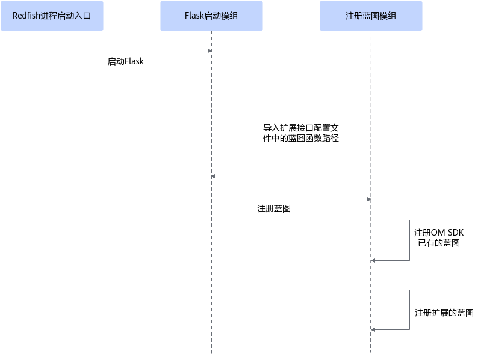

### 配置文件介绍<a name="ZH-CN_TOPIC_0000001577530732"></a>

OM SDK工程提供扩展接口的配置文件，该文件为“/software/RedfishServer/restful\_extend\_interfaces.py”。配置文件中提供的“EXTEND\_RESTFUL\_REGISTER\_FUNCTIONS\_PATH”字段用于存放注册新增蓝图函数的路径。

开发者新增RESTful接口时，需要新建restful\_extend\_interfaces.py配置文件，在配置文件中新增“EXTEND\_RESTFUL\_REGISTER\_FUNCTIONS\_PATH”字段，将新增蓝图函数的路径写入该字段。编译时，覆盖OM SDK原有的restful\_extend\_interfaces.py即可。

```python
# Copyright (c) Huawei Technologies Co., Ltd. 2023-2023. All rights reserved.

# 注册扩展的蓝图的函数路径
EXTEND_RESTFUL_REGISTER_FUNCTIONS_PATH = ""
```

### 新增RESTful接口操作说明<a name="ZH-CN_TOPIC_0000001628849857"></a>

开发者新增RESTful接口的主要操作步骤如下。

1. 打开新增RESTful接口功能开关。
2. 新增接口。
3. 注册蓝图函数。
4. 准备配置文件。
5. 编译。替换原有的OM SDK配置文件restful\_extend\_interfaces.py，并将新增接口相关代码打包。

**图 1**  操作流程图<a name="fig6792122815523"></a>  
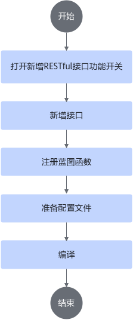

### RESTful接口开发示例<a name="ZH-CN_TOPIC_0000001578449856"></a>

本章节将详细介绍如何新增RESTful接口，并指导用户进行二次开发。

**文件说明<a name="section127164374614"></a>**

开发示例中涉及到的文件路径为“_\{project\_dir\}_/src/app/add\_extend\_restful\_interface”，文件目录结构如下：

```text
├── build_extend_restful_interface.sh          // 构建脚本
├── register_new_blueprint.py                 // 注册蓝图函数脚本
├── security_blueprint.py                    // 定义扩展的蓝图脚本
├── restful_extend_interfaces.py             // 扩展RESTful接口配置文件
└── security_service.py                     // 接口实现脚本
```

**操作步骤<a name="section727775462620"></a>**

1. 打开新增云边协同接口功能开关。

    将project.conf文件的“\_NeedAddExtendFusionDirectorInterface”字段取值改为“yes”（默认值为“no”）。

2. 新增自定义接口。
    1. 在security\_blueprint.py中，定义新增的脚本。

        ```python
        from flask import Blueprint
        from flask import request
        from add_extend_restful_interface.security_service import service_required
        https_security_service_bp = Blueprint("SecurityService", __name__,
                                              url_prefix="/redfish/v1/Systems/SecurityService")
        https_security_service_bp.add_url_rule("/DigitalWarranty", view_func=service_required, methods=["GET"])
        
        
        @https_security_service_bp.before_request
        def set_endpoint_executing_log():
            """请求进入前先记录一条日志"""
            if request.method != "GET":
                pass
        ```

    2. 在security\_service.py中，实现接口。

        ```python
        from flask import request
        
        
        def get_life_time():
            return {"status": 200, "data": 100}
        
        
        def service_required():
            """
            服务年限/服务起始时间/出产日期查询
            :return: 响应字典 资源模板或错误消息
            """
            input_err_info = "Get DigitalWarranty info failed."
            try:
                # 获取资源模板
                ret_dict = get_life_time()
            except Exception as err:
                ret_dict = {"status": 400, "data": input_err_info}
                return ret_dict, "GeneralError"
        
            return ret_dict, "Success"
        ```

3. 在register\_new\_blueprint.py中实现注册蓝图函数。

    ```python
    from flask import Flask
    from add_extend_restful_interface.security_blueprint import https_security_service_bp
    
    
    def register_new_blueprint(app: Flask):
        """
        功能描述：注册蓝图
        app: Flask实例
        """
        # 注册新增的接口蓝图
        app.register_blueprint(https_security_service_bp)
    ```

4. 在配置文件restful\_extend\_interfaces.py中写入注册蓝图函数的路径。

    ```python
    # 注册扩展的蓝图的函数路径
    EXTEND_RESTFUL_REGISTER_FUNCTIONS_PATH = "register_new_blueprint.register_new_blueprint"
    ```

5. 编译。
    1. 在build\_extend\_restful\_interface.sh中实现编译的代码。

        ```shell
        #!/bin/bash
        SCRIPT_NAME=$(basename "$0")
        CUR_DIR=$(dirname "$(readlink -f "$0")")
        TOP_DIR="${CUR_DIR}"/../../..
        OUTPUT_PACKAGE_DIR="${TOP_DIR}"/platform/omsdk
        # 添加restful接口函数
        function add_new_restful_interface()
        {
            local redfish_server_dir="${OUTPUT_PACKAGE_DIR}"/software/RedfishServer
            # 创建新增接口目录
            [ ! -d "${redfish_server_dir}/add_extend_restful_interface" ] && mkdir "${redfish_server_dir}"/add_extend_restful_interface
            # OM SDK工程已有注册蓝图的模块，名为register_blueprint.py，请勿取相同名字覆盖掉OM SDK的注册蓝图模块
            cp -rf "${CUR_DIR}"/register_new_blueprint.py "${redfish_server_dir}"/
            # 扩展接口配置模块须覆盖OM SDK中的restful_extend_interfaces.py 配置文件中的字段名为固定值
            cp -rf "${CUR_DIR}"/restful_extend_interfaces.py "${redfish_server_dir}"/
            cp -rf "${CUR_DIR}"/security_blueprint.py "${redfish_server_dir}"/add_extend_restful_interface
            cp -rf "${CUR_DIR}"/security_service.py "${redfish_server_dir}"/add_extend_restful_interface
        }
        add_new_restful_interface
        ```

    2. 在<i>“\{project\_dir\}</i>/build/build.sh”中，实现调用扩展RESTful接口的编译脚本。

        ```shell
        # 添加扩展restful接口
        # build_extend_restful_interface.sh具体实现可参考对应章节实现
        # CUR_DIR={project_dir}/build
        if [[ "${_NeedAddExtendRestfulInterface}" == "yes" ]]; then
            if ! bash "${CUR_DIR}/../src/app/add_extend_restful_interface/build_extend_restful_interface.sh";then
                return 1
            fi
        fi
        ```

## 云边协同接口开发<a name="ZH-CN_TOPIC_0000001628490473"></a>

### 接口介绍<a name="ZH-CN_TOPIC_0000001578489804"></a>

OM SDK支持与FusionDirector进行数据通信。OM SDK除了提供默认的云边协同接口以外，还支持用户在OM SDK的基础上进行二次开发，新增云边协同接口，扩展已有的功能。开发者可参见[云边协同接口](../secondary_development/api/collaboration_api.md)章节查看和使用默认接口。

新增的云边协同接口的注册和消息处理流程如[图1](#fig164551117477)所示，该图中的字典存储了消息与处理函数映射关系。云边协同消息通过消息分发模块到达消息与Handler映射关系模块，通过该模块向接口配置文件导入扩展字典路径，实现已有的云边协同接口和新加的云边协同接口统一管理。

**图 1**  云边协同接口处理流程<a id="fig164551117477"></a>  
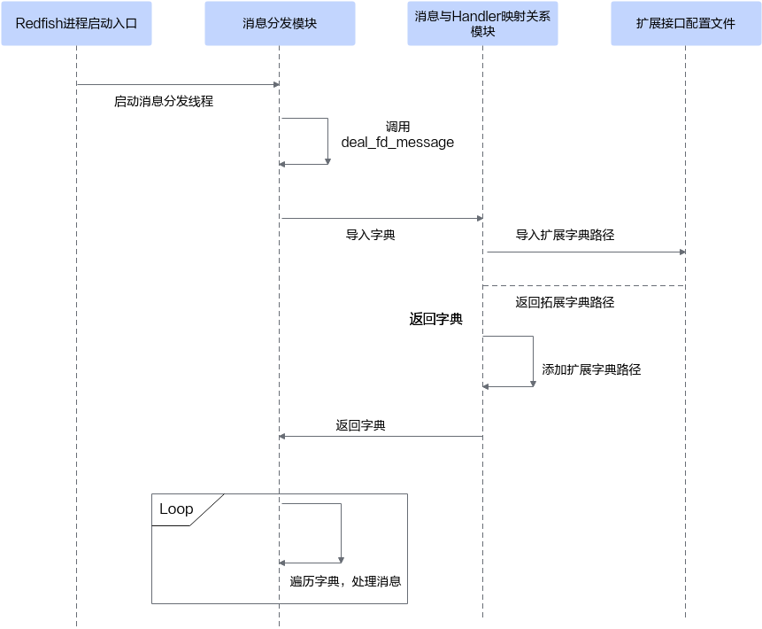

### 配置文件介绍<a name="ZH-CN_TOPIC_0000001628490521"></a>

OM SDK工程提供了扩展接口的配置文件“/software/RedfishServer/fd\_extend\_interfaces.py”，其中“EXTEND\_FD\_TOPIC\_HANDLER\_MAPPING\_PATH”字段用于存放扩展的云边协同Topic与处理函数映射关系字典的路径；提供了云边协同能力项配置文件default\_capability.json。如需新增能力项，可在配置文件上新增能力项，并将原有OM SDK配置文件进行覆盖。

### 云边协同接口操作说明<a name="ZH-CN_TOPIC_0000001628610501"></a>

开发者新增云边协同接口的主要操作步骤如下。

1. 打开新增云边协同接口功能开关。
2. 新增接口。
3. 定义消息与新增接口的字典。即定义消息与接口的映射关系。
4. 准备配置文件。
5. 新增能力项。创建能力项配置文件，包含OM SDK已有能力项内容，将新增接口添加到能力项配置文件中。
6. 编译。将新增代码编译打包。

**图 1**  操作流程图<a name="fig1087818141546"></a>  
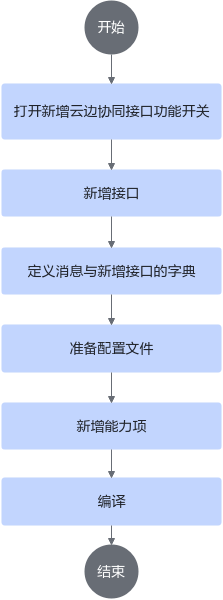

### 云边协同接口开发示例<a name="ZH-CN_TOPIC_0000001628849897"></a>

本章节将详细介绍如何新增云边协同接口，并指导用户进行二次开发。

**文件说明<a name="section1315302374915"></a>**

开发示例中涉及到的文件路径为“_\{project\_dir\}_/src/app/add\_extend\_fusion\_director\_interface”，具体的文件目录结构如下：

```text
├── build_extend_fusion_director_interface.sh         // 构建脚本
├── new_constants.py                                  // 定义云边协同topic与处理函数映射关系的配置文件
├── default_capability.json                           // 能力项配置文件
├── fd_extend_interfaces.py                           // 扩展云边协同接口配置文件
└── msg_handlers.py                                   // 云边协同接口实现脚本
└── topic.py                                          // 云边协同topic定义脚本
```

**操作步骤<a name="section1423361819518"></a>**

1. 打开新增云边协同接口功能开关。

    将project.conf的“\_NeedAddExtendFusionDirectorInterface”字段取值改为“yes”（默认值为“no”）。

2. 在topic.py中定义扩展的topic。

    ```python
    class NewTopic:
        # dflc生命周期信息写入
        SUB_CONFIG_DFLC = "$hw/edge/v1/hardware/operate/config_dflc"
    ```

3. 在msg\_handlers.py中新增自定义接口。

    ```python
    class NewFDMessageHandler:
        @staticmethod
        def config_netmanager_dflc(payload):
            pass
    
        @staticmethod
        def handle_msg_config_dflc(msg):
            NewFDMessageHandler.config_netmanager_dflc(msg.content)
    ```

4. 在new\_constants.py中定义消息与接口的映射关系。

    ```python
    from add_extend_fusion_director_interface.topic import NewTopic
    from add_extend_fusion_director_interface.msg_handlers import NewFDMessageHandler
    MSG_HANDLING_MAPPING = {
        NewTopic.SUB_CONFIG_DFLC: NewFDMessageHandler.handle_msg_config_dflc,
    }
    ```

5. 新增映射关系的存放路径。

    在配置文件fd\_extend\_interfaces.py中的“EXTEND\_FD\_TOPIC\_HANDLER\_MAPPING\_PATH”字段中写入映射关系的存放路径。

    ```python
    # 新增的云边协同Topic与处理函数映射关系路径
    EXTEND_FD_TOPIC_HANDLER_MAPPING_PATH = "add_extend_fusion_director_interface." \
                                           "new_constants.MSG_HANDLING_MAPPING"
    ```

6. 在能力项配置文件default\_capability.json中添加新增能力项，FusionDirector才能下发对应消息，且需要FusionDirector进行适配，开发者可将om-sdk.tar.gz中能力项配置文件“/config/default\_capability.json”拷贝到自己构建的工程“\{project\_dir\}/src/app/add\_extend\_fusion\_director\_interface”里，以此为基础增加扩展的能力项配置，下面digital\_warranty就是扩展的能力项。

    ```json
    {
        "esp_enable": true,
        "product_capability": [
            "profile",
            "Assettag",
            "restart",
            "firmware_install",
            "info_collect",
            "rearm",
            "hostname_config",
            "ntp_server_config",
            "partition_config",
            "static_host_config",
            "name_server_config",
            "nfs_config",
            "net_manager_config",
            "password_config",
            "password_validity_config",
            "configuration_restore",
            "digital_warranty", 
            "cert_mgmt",
            "lte_config",
            "access_control",
            "session_timeout_config",
            "cert_alarm_time_config",
            "security_load_config"
        ]
    }
    ```

7. 在构建脚本build\_extend\_fusion\_director\_interface.sh中实现编译打包的代码。

    ```shell
    #!/bin/bash
    SCRIPT_NAME=$(basename "$0")
    CUR_DIR=$(dirname "$(readlink -f "$0")")
    TOP_DIR="${CUR_DIR}"/../../..
    OUTPUT_PACKAGE_DIR="${TOP_DIR}"/platform/omsdk
    function add_extend_fd_interfaces()
    {
        local redfish_server_dir="${OUTPUT_PACKAGE_DIR}"/software/RedfishServer
        [ ! -d "${redfish_server_dir}/add_extend_fusion_director_interface" ] && mkdir "${redfish_server_dir}"/add_extend_fusion_director_interface
        cp -rf "${CUR_DIR}"/*.py "${redfish_server_dir}"/add_extend_fusion_director_interface
        # 扩展接口配置模块须覆盖OM SDK中的fd_extend_interfaces.py,配置文件中的字段名为固定值
        cp -rf "${CUR_DIR}"/fd_extend_interfaces.py "${redfish_server_dir}"/
        # 能力项配置文件打包
        cp -rf "${CUR_DIR}"/default_capability.json "${OUTPUT_PACKAGE_DIR}"/config/default_capability.json
        cp -rf "${CUR_DIR}"/default_capability.json "${redfish_server_dir}"/config/
    }
    add_extend_fd_interfaces
    ```

8. 在“_\{project\_dir\}_/build/build.sh”中实现调用新增云边协同接口的编译脚本的代码。

    ```shell
    #  添加扩展 fusion director 接口
    # build_extend_fusion_director_interface.sh具体实现可参考对应章节实现
    # TOP_DIR={project_dir}
    if [[ "${_NeedAddExtendFusionDirectorInterface}" == "yes" ]]; then
        if ! bash "${TOP_DIR}/src/app/add_extend_fusion_director_interface/build_extend_fusion_director_interface.sh";then
            return 1
        fi
    fi
    ```

> [!NOTE] 说明 
> 
> 配置文件里的关键字段说明如下。
>- restful\_extend\_interfaces.py中的EXTEND\_RESTFUL\_REGISTER\_FUNCTIONS\_PATH：用于扩展RESTful接口注册函数路径。
>- fd\_extend\_interfaces.py中的EXTEND\_FD\_TOPIC\_HANDLER\_MAPPING\_PATH：用于扩展云边协同接口注册函数路径。

# 构建软件包<a id="ZH-CN_TOPIC_0000001585768952"></a>

## 软件包规格<a name="ZH-CN_TOPIC_0000001635728833"></a>

本章以边缘管理系统软件包名称om-sdk.tar.gz为例，介绍如何构建自定义软件包。

OM SDK支持用户按照相应的规格，为进行过二次开发的软件构建安装包；同时OM SDK为自身安装包和其他自定义固件提供了通用的升级通道，支持开发者按照本章节指导构建通用升级包。OM SDK构建的软件包会包含以下文件信息。

**表 1**  文件信息

<a name="table155208184548"></a>
<table><thead align="left"><tr id="row14520121855410"><th class="cellrowborder" valign="top" width="49.96%" id="mcps1.2.3.1.1"><p id="p17520018135410"><a name="p17520018135410"></a><a name="p17520018135410"></a>文件名称</p>
</th>
<th class="cellrowborder" valign="top" width="50.03999999999999%" id="mcps1.2.3.1.2"><p id="p052021835413"><a name="p052021835413"></a><a name="p052021835413"></a>文件说明</p>
</th>
</tr>
</thead>
<tbody><tr id="row19520181885415"><td class="cellrowborder" valign="top" width="49.96%" headers="mcps1.2.3.1.1 "><p id="p17520618115412"><a name="p17520618115412"></a><a name="p17520618115412"></a>omsdk.tar.gz</p>
</td>
<td class="cellrowborder" valign="top" width="50.03999999999999%" headers="mcps1.2.3.1.2 "><p id="p71605256551"><a name="p71605256551"></a><a name="p71605256551"></a>软件包名称。用户可以自定义升级包名称，但是格式必须为tar.gz。</p>
</td>
</tr>
<tr id="row4521201875413"><td class="cellrowborder" valign="top" width="49.96%" headers="mcps1.2.3.1.1 "><p id="p7521151814549"><a name="p7521151814549"></a><a name="p7521151814549"></a>vercfg.xml</p>
</td>
<td class="cellrowborder" valign="top" width="50.03999999999999%" headers="mcps1.2.3.1.2 "><p id="p1371717412261"><a name="p1371717412261"></a><a name="p1371717412261"></a>软件包完整性校验文件。</p>
</td>
</tr>
<tr id="row14353171842810"><td class="cellrowborder" valign="top" width="49.96%" headers="mcps1.2.3.1.1 "><p id="p2521618205410"><a name="p2521618205410"></a><a name="p2521618205410"></a>version.xml</p>
</td>
<td class="cellrowborder" valign="top" width="50.03999999999999%" headers="mcps1.2.3.1.2 "><p id="p1852111895417"><a name="p1852111895417"></a><a name="p1852111895417"></a>版本信息配置文件。</p>
</td>
</tbody>
</table>

用户需要自行准备相关文件且文件名称需要与[表2 边缘管理系统软件包中文件](#边缘管理系统软件包中文件table)中文件名称保持一致。

**表 2** 边缘管理系统软件包中文件<a id="边缘管理系统软件包中文件table"></a>

<a name="table4198153224213"></a>
<table><thead align="left"><tr id="row181985329426"><th class="cellrowborder" valign="top" width="49.96%" id="mcps1.2.3.1.1"><p id="p8198153216427"><a name="p8198153216427"></a><a name="p8198153216427"></a>文件名称</p>
</th>
<th class="cellrowborder" valign="top" width="50.03999999999999%" id="mcps1.2.3.1.2"><p id="p8198153218424"><a name="p8198153218424"></a><a name="p8198153218424"></a>文件说明</p>
</th>
</tr>
</thead>
<tbody><tr id="row12198113211426"><td class="cellrowborder" valign="top" width="49.96%" headers="mcps1.2.3.1.1 "><p id="p61981632144214"><a name="p61981632144214"></a><a name="p61981632144214"></a>bin</p>
</td>
<td class="cellrowborder" rowspan="6" valign="top" width="50.03999999999999%" headers="mcps1.2.3.1.2 "><p id="p5889131417442"><a name="p5889131417442"></a><a name="p5889131417442"></a><span id="ph528912115416"><a name="ph528912115416"></a><a name="ph528912115416"></a>边缘管理系统</span>软件运行与使用的必要文件</p>
</td>
</tr>
<tr id="row1719819329428"><td class="cellrowborder" valign="top" headers="mcps1.2.3.1.1 "><p id="p4198173274217"><a name="p4198173274217"></a><a name="p4198173274217"></a>config</p>
</td>
</tr>
<tr id="row15199153217428"><td class="cellrowborder" valign="top" headers="mcps1.2.3.1.1 "><p id="p719953224219"><a name="p719953224219"></a><a name="p719953224219"></a>lib</p>
</td>
</tr>
<tr id="row1199123284214"><td class="cellrowborder" valign="top" headers="mcps1.2.3.1.1 "><p id="p719916324426"><a name="p719916324426"></a><a name="p719916324426"></a>scripts</p>
</td>
</tr>
<tr id="row2577215174310"><td class="cellrowborder" valign="top" headers="mcps1.2.3.1.1 "><p id="p257716159434"><a name="p257716159434"></a><a name="p257716159434"></a>software</p>
</td>
</tr>
<tr id="row660433317436"><td class="cellrowborder" valign="top" headers="mcps1.2.3.1.1 "><p id="p1605533144318"><a name="p1605533144318"></a><a name="p1605533144318"></a>tools</p>
</td>
</tr>
<tr id="row975822917439"><td class="cellrowborder" valign="top" width="49.96%" headers="mcps1.2.3.1.1 "><p id="p4758192910436"><a name="p4758192910436"></a><a name="p4758192910436"></a>install.sh</p>
</td>
<td class="cellrowborder" valign="top" width="50.03999999999999%" headers="mcps1.2.3.1.2 "><p id="p775815292433"><a name="p775815292433"></a><a name="p775815292433"></a><span id="ph9311221135420"><a name="ph9311221135420"></a><a name="ph9311221135420"></a>边缘管理系统</span>安装脚本</p>
</td>
</tr>
<tr id="row15281725204313"><td class="cellrowborder" valign="top" width="49.96%" headers="mcps1.2.3.1.1 "><p id="p72814258438"><a name="p72814258438"></a><a name="p72814258438"></a>uninstall.sh</p>
</td>
<td class="cellrowborder" valign="top" width="50.03999999999999%" headers="mcps1.2.3.1.2 "><p id="p4202113811440"><a name="p4202113811440"></a><a name="p4202113811440"></a><span id="ph16748152665410"><a name="ph16748152665410"></a><a name="ph16748152665410"></a>边缘管理系统</span>卸载脚本</p>
</td>
</tr>
<tr id="row95441821114310"><td class="cellrowborder" valign="top" width="49.96%" headers="mcps1.2.3.1.1 "><p id="p1554411219438"><a name="p1554411219438"></a><a name="p1554411219438"></a>upgrade.sh</p>
</td>
<td class="cellrowborder" valign="top" width="50.03999999999999%" headers="mcps1.2.3.1.2 "><p id="p2148114410446"><a name="p2148114410446"></a><a name="p2148114410446"></a><span id="ph108351729175410"><a name="ph108351729175410"></a><a name="ph108351729175410"></a>边缘管理系统</span>升级脚本</p>
</td>
</tr>
<tr id="row17770527442"><td class="cellrowborder" valign="top" width="49.96%" headers="mcps1.2.3.1.1 "><p id="p2770182174420"><a name="p2770182174420"></a><a name="p2770182174420"></a>version.xml</p>
</td>
<td class="cellrowborder" valign="top" width="50.03999999999999%" headers="mcps1.2.3.1.2 "><p id="p177701216445"><a name="p177701216445"></a><a name="p177701216445"></a>版本信息配置文件</p>
</td>
</tr>
</tbody>
</table>

**关键文件说明<a name="section23851757318"></a>**

- vercfg.xml文件示例如下。

    ```xml
    <?xml version="1.0" encoding="utf-8"?>
    <Package>
        <File>
            <FilePath>version.xml</FilePath>
            <SHAValue>a28ed14f3bf81b7274ce090efd28dd2bf5313fd8e48809e4cdef27186d6ba654</SHAValue>
        </File>
        <File>
            <FilePath>omsdk.tar.gz</FilePath>
            <SHAValue>5a51030d5e7aead7e4c47408f9af11b4ff59bde0fc801b1290977b0e28322a04</SHAValue>
        </File>
    </Package>
    ```

    **表 3**  参数说明

    |参数名称|说明|
    |--|--|
    |FilePath|表示升级包中文件名，需要带文件格式后缀，取值为version.xml和sdk-upgrade.tar.gz。|
    |SHAValue|表示FilePath字段对应文件的sha256值，可通过**sha256sum**命令获取。|

- version.xml文件示例如下：

    ```xml
    <?xml version="1.0" encoding="utf-8"?>
    <FirmwarePackage version="V1">
    <!--Upgrade packages description-->
        <Package>
            <FileName>omsdk.zip</FileName>
            <OutterName>MindXOM</OutterName>
           <Version>SDK-omsdk 1.0</Version>             
            <FileType>Firmware</FileType>
           <Module>SDK-omsdk</Module>                 
            <Vendor>Huawei Technologies Co., Ltd</Vendor>
            <MaxUpgradeTime>3600</MaxUpgradeTime>
            <!--UpgradeTimeout:unit second-->
            <ActiveMode>ResetOS</ActiveMode>
            <MaxActivetime>600</MaxActivetime>
            <SupportModel>Atlas 200I A2</SupportModel>
            <ProcessorArchitecture>ARM</ProcessorArchitecture>
            <UpgradeAgent>OM</UpgradeAgent>
        </Package>
    </FirmwarePackage>
    ```

    **表 4**  参数说明

    <a name="table183271157125111"></a>
    <table><thead align="left"><tr id="row18327195712511"><th class="cellrowborder" valign="top" width="50%" id="mcps1.2.3.1.1"><p id="p163118105217"><a name="p163118105217"></a><a name="p163118105217"></a>参数名称</p>
    </th>
    <th class="cellrowborder" valign="top" width="50%" id="mcps1.2.3.1.2"><p id="p16327195712517"><a name="p16327195712517"></a><a name="p16327195712517"></a>说明</p>
    </th>
    </tr>
    </thead>
    <tbody><tr id="row832765710517"><td class="cellrowborder" valign="top" width="50%" headers="mcps1.2.3.1.1 "><p id="p1832717575510"><a name="p1832717575510"></a><a name="p1832717575510"></a>Version</p>
    </td>
    <td class="cellrowborder" valign="top" width="50%" headers="mcps1.2.3.1.2 "><p id="p1432712577510"><a name="p1432712577510"></a><a name="p1432712577510"></a>软件包版本，可在构建软件包时进行配置</p>
    </td>
    </tr>
    <tr id="row932775718516"><td class="cellrowborder" valign="top" width="50%" headers="mcps1.2.3.1.1 "><p id="p132718576515"><a name="p132718576515"></a><a name="p132718576515"></a>Module</p>
    </td>
    <td class="cellrowborder" valign="top" width="50%" headers="mcps1.2.3.1.2 "><p id="p1932795755112"><a name="p1932795755112"></a><a name="p1932795755112"></a>软件包的固件类型，可在构建软件包时进行配置</p>
    </td>
    </tr>
    <tr id="row1932785718517"><td class="cellrowborder" valign="top" width="50%" headers="mcps1.2.3.1.1 "><p id="p3327957105119"><a name="p3327957105119"></a><a name="p3327957105119"></a>Vendor</p>
    </td>
    <td class="cellrowborder" valign="top" width="50%" headers="mcps1.2.3.1.2 "><p id="p123271657115115"><a name="p123271657115115"></a><a name="p123271657115115"></a>厂商信息，可在构建软件包时进行配置</p>
    </td>
    </tr>
    <tr id="row532710571516"><td class="cellrowborder" valign="top" width="50%" headers="mcps1.2.3.1.1 "><p id="p116671374313"><a name="p116671374313"></a><a name="p116671374313"></a>FileName</p>
    </td>
    <td class="cellrowborder" valign="top" width="50%" headers="mcps1.2.3.1.2 "><p id="p332895745114"><a name="p332895745114"></a><a name="p332895745114"></a>软件包名称，可在构建软件包时进行配置</p>
    </td>
    </tr>
    <tr id="row2328105713512"><td class="cellrowborder" valign="top" width="50%" headers="mcps1.2.3.1.1 "><p id="p153281957115115"><a name="p153281957115115"></a><a name="p153281957115115"></a>OutterName</p>
    </td>
    <td class="cellrowborder" rowspan="8" valign="top" width="50%" headers="mcps1.2.3.1.2 "><p id="p10328185711514"><a name="p10328185711514"></a><a name="p10328185711514"></a><span id="ph1335062845811"><a name="ph1335062845811"></a><a name="ph1335062845811"></a>边缘管理系统</span>软件正常运行的必要配置，不可配置与修改</p>
    </td>
    </tr>
    <tr id="row91737109439"><td class="cellrowborder" valign="top" headers="mcps1.2.3.1.1 "><p id="p181741310154319"><a name="p181741310154319"></a><a name="p181741310154319"></a>FileType</p>
    </td>
    </tr>
    <tr id="row4880162813439"><td class="cellrowborder" valign="top" headers="mcps1.2.3.1.1 "><p id="p14880162814439"><a name="p14880162814439"></a><a name="p14880162814439"></a>MaxUpgradeTime</p>
    </td>
    </tr>
    <tr id="row137314244434"><td class="cellrowborder" valign="top" headers="mcps1.2.3.1.1 "><p id="p14373824144315"><a name="p14373824144315"></a><a name="p14373824144315"></a>ActiveMode</p>
    </td>
    </tr>
    <tr id="row8811151419435"><td class="cellrowborder" valign="top" headers="mcps1.2.3.1.1 "><p id="p1481191411430"><a name="p1481191411430"></a><a name="p1481191411430"></a>MaxActivetime</p>
    </td>
    </tr>
    <tr id="row11435017441"><td class="cellrowborder" valign="top" headers="mcps1.2.3.1.1 "><p id="p414310114420"><a name="p414310114420"></a><a name="p414310114420"></a>SupportModel</p>
    </td>
    </tr>
    <tr id="row1899152019435"><td class="cellrowborder" valign="top" headers="mcps1.2.3.1.1 "><p id="p1789982014438"><a name="p1789982014438"></a><a name="p1789982014438"></a>ProcessorArchitecture</p>
    </td>
    </tr>
    <tr id="row151101522204417"><td class="cellrowborder" valign="top" headers="mcps1.2.3.1.1 "><p id="p7110122264416"><a name="p7110122264416"></a><a name="p7110122264416"></a>UpgradeAgent</p>
    </td>
    </tr>
    </tbody>
    </table>

## （可选）自定义前端编译<a name="ZH-CN_TOPIC_0000001641105060"></a>

OM SDK提供的边缘管理系统前端开源代码，支持开发者在前端开源代码上新增或者修改Web界面的功能。若开发者在前端开源代码上新增或修改了功能，需要参考本章节重新编译，并构建软件包。

**前提条件<a name="section11659345101916"></a>**

- 在进行自定义前端编译之前，请确保环境已安装14.21.3版本的node.js和6.14.18版本的npm，并已配好npm的源，否则编译可能会出现异常或用时过长。
- 已获取omsdk-web.zip前端开源代码。

**操作步骤<a name="section157941561218"></a>**

1. 打开自定义前端编译功能开关。

    将配置文件project.conf的“**\_NeedBuildCustomizedWeb**”字段改为“yes”。文件路径为“_\{project\_dir\}_/config/project\_cfg/project.conf”。

2. 将omsdk-web.zip前端开源包放在“_\{project\_dir\}_/src/app/build\_customized\_web\_project”路径下。

    > [!NOTE] 说明  
    > 前端开源软件包名称必须以“omsdk-web”开头，且以“.zip”结尾。

3. 在“_\{project\_dir\}_/src/app/build\_customized\_web\_project”目录下，实现编译脚本build\_customized\_web\_project.sh，参考示例如下。

    ```shell
    #!/bin/bash
    CURR_DIR=$(dirname "$(readlink -f "$0")")
    WEB_MANAGER_DIR=""
    function build_web()
    {
      cd "${CURR_DIR}"
      local web_zip="$(find "omsdk-web"*.zip -maxdepth 1 -type f)"
      local web_zip_basename="$(basename "${web_zip}" ".zip")"
      unzip -q -o "${web_zip_basename}.zip" -d "${CURR_DIR}"
      cd "${web_zip_basename}"
      npm install --ignore-scripts
      if (($? != 0)); then
        echo "[ERROR] npm install failed."
        return 1
      fi
      npm run build
      if (($? != 0)); then
        echo "[ERROR] npm run build failed."
        return 1
      fi
      cp -r dist/* "${WEB_MANAGER_DIR}/"
      return 0
    }
    function main()
    {
      set -ex
      echo "##################### start to prepare web package ############################"
      if [ "$1" == "" || "$1" == "/" || "$1" == "~" ]; then
        echo "[ERROR] param is invalid."
        return 1
      fi
      WEB_MANAGER_DIR="$1"
      build_web
      if (($? != 0)); then
        echo "[ERROR] prepare web package failed."
        return 1
      fi
      echo "#################### prepare web package successfully ##########################"
    }
    main "$@"
    ```

4. 在“_\{project\_dir\}_/build/build.sh”中，实现调用扩展“\_NeedBuildCustomizedWeb”开关的编译脚本。以下代码在build.sh文件中，需放在“\_NeedCustomizedWebNav”和“\_NeedCustomizedWebAssets”功能代码之前。

    ```shell
    # 自定义前端编译功能
    # build_customized_web_project.sh 具体实现可参考对应章节实现，本段代码需放在“_NeedCustomizedWebNav”和“_NeedCustomizedWebAssets”功能代码之前
    # TOP_DIR={project_dir}
    if [ "${_NeedBuildCustomizedWeb}" == "yes" ];then
         bash "${TOP_DIR}/src/app/build_customized_web_project/build_customized_web_project.sh" "${OMSDK_TAR_PATH}/software/nginx/html/manager"
         ret=$?
        if [ "$ret" != "0" ];then
            return 1
         fi
    fi
    ```

**使用示例<a name="section16415152023916"></a>**

开发者新增的前端功能，在经过编译且部署到环境上后，可在边缘管理系统的Web界面看到自定义开发的功能，如[图1](#fig8512184518429)所示。

**图 1**  新增功能<a id="fig8512184518429"></a>  
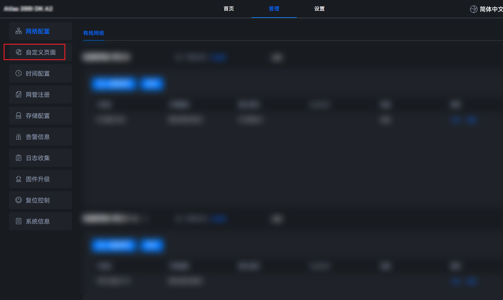

## 新增自定义签名<a name="ZH-CN_TOPIC_0000001635848277"></a>

为了实现构建的软件包的安全性和完整性校验，开发者需要按照本章节指导，实现软件包的自定义签名。

本章节将介绍如何新增自定义签名的操作步骤，具体代码需要由开发者实现。

开发示例中涉及到的文件路径为“\{project\_dir\}/src/app/add\_custom\_define\_cms\_verify”，文件目录结构如下。

```text
├── verify_cms_file.py                 // 实现签名工具的代码
└── build_signature.sh                 // 生成cms签名文件与crl吊销列表的脚本
└── replace_cms_verify.sh                 // 替换签名工具的脚本
```

**操作步骤<a name="section104221451229"></a>**

以下步骤中涉及到的代码样例仅作参考，无具体功能，不能直接使用。开发者需要根据操作步骤指导实现相关代码。

1. 拷贝文件{omsdk 根目录}/software/ibma/common/verify\_cms\_file.py拷贝到当前目录，修改verify\_cms\_file函数，自定义验签逻辑。

    ```py
    def verify_cms_file(libverify_so_path, cms_path, crl_path, tar_path):
        # libverify_so_path 无实际作用
        # cms_path 签名文件的绝对路径
        # crl_path 吊销列表的绝对路径
        # tar_path 待校验文件的绝对路径
        # 自定义验签逻辑，True验证通过，False不通过。
        return True
    ```

2. 在build\_signature.sh实现生成软件包的cms签名文件与crl吊销列表的代码。

    ```sh
    #!/bin/bash
    function signature() {
        # 生成cms签名文件
        echo "build  cms file success"
    
        # 生成crl吊销列表文件
        echo "build crl file success"
    }
    signature
    ```

3. 在replace\_cms\_verify.sh将OM SDK软件包自带的验签代码替换为自定义验签名代码。

    ```shell
    #!/bin/bash
    CUR_DIR=$(dirname "$(readlink -f "$0")")
    OMSDK_TAR_PATH="${CUR_DIR}/../../../platform/omsdk" # 构建工程OM SDK软件包的解压目录
    function replace_cms_verify() {
        cp -f "${CUR_DIR}/verify_cms_file.py" "${OMSDK_TAR_PATH}/software/ibma/common/verify_cms_file.py"
        cp -f "${CUR_DIR}/verify_cms_file.py" "${OMSDK_TAR_PATH}/nginx/python/common/verify_cms_file.py"
        cp -f "${CUR_DIR}/verify_cms_file.py" "${OMSDK_TAR_PATH}/software/RedfishServer/common/verify_cms_file.py"
    }
    replace_cms_verify
    ```

4. 在“product\_dir/build/build.sh“中实现调用自定义签名的编译脚本。

    ```shell
    # 添加自定义签名工具
    # replace_cms_verify.sh具体实现可参考对应章节实现
    # PRODUCT_SCRIPT_PATH="{product_dir}/src/app"
    bash "${PRODUCT_SCRIPT_PATH}/add_custom_define_cms_verify/replace_cms_verify.sh"
    ```

## 配置版本信息<a name="ZH-CN_TOPIC_0000001585609172"></a>

为了实现软件管理，建议开发者在正式构建软件包前，配置软件包版本等相关信息，便于在后期做安装或者升级操作时，系统可以获取到软件的版本信息。

示例中涉及到的文件路径为“\{project\_dir\}/src/app/add\_customized\_config”，文件目录结构如下。

```text
├── module_type.py                     // omsdk软件类型配置文件
├── replace_module_type.sh             // 替换软件配置文件的脚本
```

**操作步骤<a name="section1431016308286"></a>**

1. 编辑软件配置文件**module\_type.py**，以便于进行软件包版本信息的获取。

    ```python
    # -*- coding: UTF-8 -*-
    from enum import Enum
    from typing import Set
    
    
    class ModuleType(Enum):
       
        # 默认支持OMSDK升级
        FIRMWARE = "MindXOM"
    
        # 该文件为OM SDK重要配置文件，为防止解析错误，其余地方禁止修改
        # 在此处可注册添加额外需要升级的固件类型
        # 固件类型需要与自定义升级包中的version.xml的Module字段值一致
        SDK_UPGRADE = "SDK-Upgrade"
    
        @classmethod
        def values(cls) -> Set[str]:
            return {elem.value for elem in cls}
    ```

    因配置文件依赖OM SDK必要的库文件，只允许开发者在上述示例中加粗处进行新增，其余地方禁止修改。所添加的固件类型需要与自定义升级包中的version.xml的Module字段值一致。

2. 将om-sdk.tar.gz软件包自带的签名工具（**<i>{omsdk 根目录}</i>/software/ibma/lib/Linux/upgrade/module\_type.py**）文件替换为开发者生成的签名工具（**module\_type.py**），如replace\_module\_type.sh。

    ```shell
    #!/bin/bash
    CUR_DIR=$(dirname "$(readlink -f "$0")")
    OMSDK_TAR_PATH="${CUR_DIR}/../../../platform/omsdk"  # 构建工程OM SDK软件包的解压目录
    function replace_cms_verify() {
        cp -f "${CUR_DIR}/module_type.py" "${OMSDK_TAR_PATH}/software/ibma/lib/Linux/upgrade/module_type.py"
    }
    replace_cms_verify
    ```

3. 在“project_dir/build/build.sh”中实现调用自定义签名的编译脚本。

    ```shell
    # 添加自定义omsdk软件配置
    # PRODUCT_SCRIPT_PATH={project_dir}/src/app
    bash "${PRODUCT_SCRIPT_PATH}/add_customized_config/replace_module_type.sh"
    ```

## 执行构建<a name="ZH-CN_TOPIC_0000001636008181"></a>

本章节指导用户构建自定义软件包。

**操作步骤<a name="section4572330142619"></a>**

1. 根据实际情况，修改配置文件**project.conf**，文件路径为“<i>{project_dir}</i>/config/project\_cfg/project.conf”。

    ```text
    _ProductName="Ascend-AtlasSample-omsdk"     # 修改_ProductName字段为用户的工程名
    _Version="6.0.RC2"                            # 修改version.xml中的Version字段的版本号
    _Vendor="custom-sdk"                        # 修改version.xml中的Vendor字段的厂商信息，不能为huawei
    _NeedAdditionalDriver="no"                  # 配置编译打包模组开发示例,可选配置，默认关闭
    _NeedAddExtendRestfulInterface="no"         # 新增RESTful接口，可选配置，默认关闭
    _NeedAddExtendFusionDirectorInterface="no"  # 新增云边协同接口，可选配置，默认关闭
    _NeedCustomizedWebAssets="no"               # 配置自定义图片和厂商信息开关，可选配置，默认关闭
    _NeedCustomizedWebNav="no"                  # 动态加载组件功能开关，默认关闭
    _NeedBuildCustomizedWeb="no"                # 自定义前端编译功能，默认关闭
    _NeedCustomizedAlarmCheck="no"              # 配置自定义告警检测开关，可选配置，默认关闭
    ```

2. 按照如下示例，编写构建脚本**build\.sh**，脚本路径为“_\{project\_dir_\}/build/build.sh”。

    ```shell
    #!/bin/bash
    
    CUR_DIR="$(dirname "$(readlink -f "$0")")"
    TOP_DIR="$(dirname "${CUR_DIR}")"
    PRODUCT_CFG_PATH="${TOP_DIR}/config/project_cfg/project.conf"
    PLATFORM_PATH="${TOP_DIR}/platform"
    PACKAGE_PATH="${PLATFORM_PATH}/package"
    OMSDK_TAR_PATH="${PLATFORM_PATH}/omsdk"
    PRODUCT_SCRIPT_PATH="${TOP_DIR}/src/app"
    OUTPUT_PATH="${TOP_DIR}/output"
    
    function modify_version_xmlfile()
    {
        local xml_version_file=$1
        if [ ! -f "${xml_version_file}" ];then
            echo "modify_version_xmlfile failed, ${xml_version_file} not exist"
            return 1
        fi
    
        # 修改版本信息
        sed -i "s#{Version}#${_Version}#g" "${xml_version_file}"
    
        # 修改软件包名称
        local omsdk_name="${_ProductName}_${_Version}_linux-aarch64.zip"
        sed -i "/<Package>/,/<\/Package>/ s|<FileName>.*|<FileName>${omsdk_name}</FileName>|g" "${xml_version_file}"
    
        # 修改厂商信息
        sed -i "/<Package>/,/<\/Package>/ s|<Version>.*|<Version>${_Version}</Version>|g" "${xml_version_file}"
        if [[ $(echo "${_Vendor}" | tr [:upper:] [:lower:]) == "huawei" ]]; then
            echo "manufacturer information is invalid"
            return 1
        fi
        sed -i "s|<Vendor>.*</Vendor>|<Vendor>${_Vendor}</Vendor>|g" "${xml_version_file}"
        return 0
    }
    function build_package()
    {
        if [[ -d "${OMSDK_TAR_PATH}" ]]; then
            rm -rf "${OMSDK_TAR_PATH}"
        fi
        mkdir -p "${OMSDK_TAR_PATH}"
        if [[ -d "${PACKAGE_PATH}" ]]; then
            rm -rf "${PACKAGE_PATH}"
        fi
        mkdir -p "${PACKAGE_PATH}"
        if [[ -d "${OUTPUT_PATH}" ]]; then
            rm -rf "${OUTPUT_PATH}"
        fi
        mkdir -p "${OUTPUT_PATH}"
        local omsdk_tar_path="$(find "${PLATFORM_PATH}/" -maxdepth 1 -name "om-sdk.tar.gz")"
        if ! tar -zxf "${omsdk_tar_path}" -C "${OMSDK_TAR_PATH}"; then
            return 1
        fi
    
        # 修改version.xml中的可配置字段
        if ! modify_version_xmlfile "${OMSDK_TAR_PATH}/version.xml"; then
            return 1
        fi
    
        # 添加自定义告警检测
        if [[ "${_NeedCustomizedAlarmCheck}" == "yes" ]]; then
            if ! bash "${TOP_DIR}/src/app/add_customized_alarm/build_customized_alarm.sh";then
                return 1
            fi
            cp -rf "${TOP_DIR}"/src/app/add_customized_alarm/build/libcustomized_alarm.so "${OMSDK_TAR_PATH}"/lib/
            # 覆盖OM SDK软件包中告警相关的配置文件
            cp -rf "${TOP_DIR}"/src/app/add_customized_alarm/alarm_info_en.json "${OMSDK_TAR_PATH}"/config/alarm_info_en.json
            cp -rf "${TOP_DIR}"/src/app/add_customized_alarm/all_alarm_for_manager.json "${OMSDK_TAR_PATH}"/software/ibma/config/all_alarm_for_manager.json
            cp -rf "${TOP_DIR}"/src/app/add_customized_alarm/all_alarm_for_manager_web.json "${OMSDK_TAR_PATH}"/software/nginx/html/manager/config/all_alarm_for_manager.json
            cp -rf "${TOP_DIR}"/src/app/add_customized_alarm/alarm_info_solution_en.json "${OMSDK_TAR_PATH}"/software/nginx/html/manager/config/alarm_info_solution_en.json
            cp -rf "${TOP_DIR}"/src/app/add_customized_alarm/alarm_info_solution_zh.json "${OMSDK_TAR_PATH}"/software/nginx/html/manager/config/alarm_info_solution_zh.json
        fi
    
        # 添加扩展模组驱动
        if [[ "${_NeedAdditionalDriver}" == "yes" ]]; then
            if ! bash "${TOP_DIR}"/src/app/add_extend_driver_adapter/build_extend_driver_adapter.sh;then
                return 1
            fi
            cp -rf "${TOP_DIR}"/src/app/add_extend_driver_adapter/build/libdemo_adapter.so "${OMSDK_TAR_PATH}"/lib/
            # copy additional configurations
            cp -rf "${TOP_DIR}"/config/module_def/*.json "${OMSDK_TAR_PATH}"/software/ibma/config/devm_configs/
        fi
    
        # 拷贝外设配置
        cp -rf "${TOP_DIR}"/src/app/add_extend_device/device_config.json "${OMSDK_TAR_PATH}"/software/ibma/lib/Linux/config/device_config.json
    
        # 添加扩展restful接口
        # build_extend_restful_interface.sh具体实现可参考对应章节实现
        if [[ "${_NeedAddExtendRestfulInterface}" == "yes" ]]; then
            if ! bash "${CUR_DIR}/../src/app/add_extend_restful_interface/build_extend_restful_interface.sh";then
                return 1
            fi
        fi
    
        #  添加扩展 fusion director 接口
        # build_extend_fusion_director_interface.sh具体实现可参考对应章节实现
        if [[ "${_NeedAddExtendFusionDirectorInterface}" == "yes" ]]; then
            if ! bash "${TOP_DIR}/src/app/add_extend_fusion_director_interface/build_extend_fusion_director_interface.sh";then
                return 1
            fi
        fi
    
        # 自定义前端编译功能
        # build_customized_web_project.sh 具体实现可参考对应章节实现，本段代码需放在“_NeedCustomizedWebNav”和“_NeedCustomizedWebAssets”功能代码之前
        if [ "${_NeedBuildCustomizedWeb}" == "yes" ];then
             bash "${TOP_DIR}/src/app/build_customized_web_project/build_customized_web_project.sh" "${OMSDK_TAR_PATH}/software/nginx/html/manager"
             ret=$?
            if [ "$ret" != "0" ];then
                return 1
             fi
        fi
    
        # 配置自定义图片和厂商信息
        # build_customized_web_assets.sh具体实现可参考对应章节实现
        if [ "${_NeedCustomizedWebAssets}" == "yes" ]; then
            if ! bash "${TOP_DIR}/src/app/add_customized_web_assets/build_customized_web_assets.sh" "${TOP_DIR}";then
                return 1
            fi
        fi
    
        # 动态加载组件
        # build_customized_web_nav.sh具体实现可参考对应章节实现
        if [ "${_NeedCustomizedWebNav}" == "yes" ];then
            bash "${TOP_DIR}/src/app/set_customized_web_nav/build_customized_web_nav.sh" "${TOP_DIR}"
            ret=$?
            if [ "$ret" != "0" ];then
                return 1
            fi
        fi
        # 添加自定义签名工具
        # build_cms_verify.sh、replace_cms_so.sh具体实现可参考对应章节实现
        bash "${PRODUCT_SCRIPT_PATH}/add_custom_define_cms_verify/build_cms_verify.sh"
        bash "${PRODUCT_SCRIPT_PATH}/add_custom_define_cms_verify/replace_cms_so.sh"
        # 添加自定义omsdk软件配置
        bash "${PRODUCT_SCRIPT_PATH}/add_customized_config/replace_module_type.sh"
        # 重新打包omsdk.tar.gz
        if ! tar_omsdk_package; then
            echo "package omsdk.tar.gz failed"
        fi
        # 生成vercfg.xml
        gen_vercfg_xml
        # 生成omsdk.tar.gz、vercfg.xml、version.xml的签名文件与吊销列表
        # build_signature.sh需用户自行实现，该实现仅为实例
        build_sign_file
        # 重新打包omsdk.zip
        zip_omsdk_package
        return 0
    }
    function build_sign_file()
    {
        echo "vercfg.xml.cms" > "${PACKAGE_PATH}/vercfg.xml.cms"
        echo "vercfg.xml.crl" > "${PACKAGE_PATH}/vercfg.xml.crl"
        local om_package_name="${_ProductName}_${_Version}_linux-aarch64.tar.gz"
        echo "${om_package_name}" > "${PACKAGE_PATH}/${om_package_name}.cms"
        echo "${om_package_name}" > "${PACKAGE_PATH}/${om_package_name}.crl"
        echo "version.xml.cms" > "${PACKAGE_PATH}/version.xml.cms"
        echo "version.xml.crl" > "${PACKAGE_PATH}/version.xml.crl"
    }
    function tar_omsdk_package()
    {
        local om_package_name="${_ProductName}_${_Version}_linux-aarch64.tar.gz"
        cd "${OMSDK_TAR_PATH}"
        if ! tar -czf "${om_package_name}" *; then
            return 1
        fi
        cp "${OMSDK_TAR_PATH}/${om_package_name}" "${PACKAGE_PATH}/"
        cp "${OMSDK_TAR_PATH}/version.xml" "${PACKAGE_PATH}/"
        cd "${TOP_DIR}"
        return 0
    }
    function gen_vercfg_xml()
    {
        local vercfg_xml_path="${PACKAGE_PATH}/vercfg.xml"
        touch "${vercfg_xml_path}"
        chmod 600 "${vercfg_xml_path}"
        echo -e '<?xml version="1.0" encoding="utf-8"?>\n<Package>\n</Package>' > "${vercfg_xml_path}"
        local sdk_tar_gz="$(find "${PACKAGE_PATH}" -maxdepth 1 -name "${_ProductName}_${_Version}_linux-aarch64.tar.gz")"
        sed -i "3 i \ \t<File>\n\t\t<FilePath>$(basename "${sdk_tar_gz}")</FilePath>\n\t\t<SHAValue>$(sha256sum "${sdk_tar_gz}" | awk '{print $1}')</SHAValue>\n\t</File>" "${vercfg_xml_path}"
        local version_xml_path="${PACKAGE_PATH}/version.xml"
        sed -i "3 i \ \t<File>\n\t\t<FilePath>$(basename "${version_xml_path}")</FilePath>\n\t\t<SHAValue>$(sha256sum "${version_xml_path}" | awk '{print $1}')</SHAValue>\n\t</File>" "${vercfg_xml_path}"
    }
    function zip_omsdk_package()
    {
        local sdk_zip_name="${_ProductName}_${_Version}_linux-aarch64.zip"
        cd "${PACKAGE_PATH}"
        if ! zip "${OUTPUT_PATH}/${sdk_zip_name}" *; then
            echo "zip failed"
            return 1
        fi
        echo "zip software file successfully!"
    }
    function main()
    {
        echo "**********************do build start!**********************"
        if [ ! -e "${PRODUCT_CFG_PATH}" ];then
            echo "error: ${PRODUCT_CFG_PATH}"
            return 1
        else
            source "${PRODUCT_CFG_PATH}"
        fi
        build_package
        return $?
        echo "**********************do build end!**********************"
    }
    main
    ```

3. 将om-sdk.tar.gz上传到<i>{project_dir}</i>/platform路径下。
4. 执行以下命令，进入项目build目录。

    ```bash
    cd {project_dir}/build
    ```

5. 执行以下命令，开始构建软件包。

    ```bash
    bash build.sh
    ```

    > [!NOTE] 说明  
    > 构建成功之后，在“<i>{project_dir}</i>/output”目录下生成软件包<i>{_ProductName}</i>\_<i>{_Version}</i>_linux-aarch64.zip。
