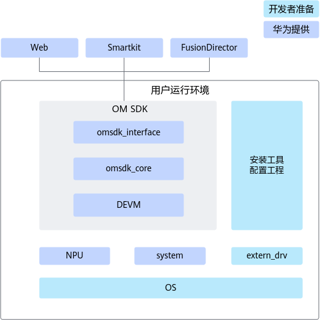
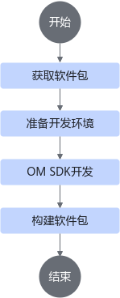

# 产品简介

## 概述

随着边缘计算的兴起，边缘设备逐渐向智能化、平台化发展。OM SDK作为开发态组件，使能第三方ISV（Independent Software Vendor，独立软件供应商）或者帮助开发者基于昇腾算力芯片快速搭建硬件管理平台，简化硬件设备的运维部署，快速构建自定义的设备运维系统。

OM SDK提供拥有基础功能的边缘管理系统开发包，开发者可以基于边缘管理系统进行二次开发。OM SDK提供更深层次的昇腾模组开发指导，帮助用户快速扩展和使能新硬件外设。面向华为开发者，主要支持华为原生的多产品适配和扩展。面向第三方开发者，主要支持私有硬件设备接入扩展开发。

**免责声明**

- 边缘管理系统开发包及样例工程（以下称为本产品）仅作为参考设计提供，不构成对第三方开发者开发的任何软件产品及服务的功能、性能、安全性、合规性等做出保证或承诺。
- 第三方开发者应全权负责基于本产品开发的任何软件的设计、开发、测试、发布及运营维护，并自行承担因使用本产品导致的任何直接或间接性的损害赔偿责任。我方不承诺未来为本产品提供版本升级、功能扩展、漏洞修复等后续服务或支持。第三方开发者已预先熟知上述风险，自愿使用本产品，并完全同意承担一切可能的风险和法律后果。

## 功能特性

OM SDK作为开发态组件，支持以下功能特性。

- 支持对设备对象的抽象管理，通过配置文件方式对设备对象进行定义。
- 支持对昇腾系列产品的管理，支持快速开发新的硬件设备。
- 支持提供本地北向接口，对设备驱动对象进行访问。
- OM SDK支持独立部署和被第三方集成的场景，管理华为提供的组件。
- OM SDK支持告警上报，日志管理等系统维护能力。

## 软件架构

作为开发态的使能组件，开发模块主要由OM SDK、驱动和用户定制部分组成。

- OM SDK由omsdk\_interface、omsdk\_core和DEVM（DeviceManager）三大部分组成。对外提供RESTful接口和云边协同接口，RESTful接口支持Web和SmartKit接入，云边协同接口支持对接FusionDirector网管；对内通过DEVM定义支持自带硬件和用户扩展硬件的驱动使能。
- 驱动包括OM SDK自带的驱动和用于扩展的驱动。自带驱动包括NPU、system等基础驱动；扩展驱动主要用于扩展新增的外部设备。
- 用户定制部分主要包括OS系统、产品名称等。OS支持openEuler  22.03和Ubuntu  22.04版本，用户可通过制卡方式替换OS；开发态提供产品配置能力。

**图 1**  软件架构图  

具体说明如下：

- omsdk\_interface：OM SDK接口层。
- omsdk\_core：OM SDK实现层。
- DEVM：适配层，DeviceManager模块，支持开发者定义模组，进行模组开发。
- NPU：神经网络处理器，主要是指昇腾AI处理器。
- system：系统资源。
- 安装工具：开发者需要准备好开发环境，包括开发过程中涉及到的工具。
- 配置工程：开发者需要就获取到的开源软件包进行基础开发，包括配置工程名称和配置产品名称。
- extern\_drv：扩展资源，主要用于扩展模组。
- OS：操作系统。

# 开发流程介绍

在进行OM SDK软件的开发时，可按如下[图1](#fig435041319391)所示操作步骤进行。

**图 1**  开发流程图  

**开发流程介绍**

**表 1**  开发流程介绍

|步骤|描述|操作参考|
|--|--|--|
|获取软件包|到华为官方网站获取开发所需的软件包。|具体操作请参见[获取软件包](./developer_guide.md#获取软件包)章节。|
|准备开发环境|确保开发环境中的开发工具或依赖存在且可以正常使用。|具体操作请参见[准备开发环境](./developer_guide.md#准备开发环境)章节。|
|OM SDK开发|开发者可以在本章节进行自定义厂商信息、自定义告警、模组开发和接口开发。|具体操作请参见[OM SDK开发](./developer_guide.md#om-sdk开发)章节。|
|构建软件包|将进行开发后的源码打包构建成新的软件包。|具体操作请参见[构建软件包](./developer_guide.md#构建软件包)章节。|
