# Web功能介绍

## 欢迎使用边缘管理系统

边缘管理系统（Edge Management System）是一款针对边缘设备的系统监测和管理的软件。

边缘管理系统的主要特点如下：

- 为您提供优质的用户体验。

    提供可视化易操作的图形界面，便于您对智能边缘设备进行交互式操作。

- 为您提供高效的管理维护。

    提供远程管理和硬件监测功能，便于您随时接入、监测并管理智能边缘设备的运行状态。

- 为您提供高安全性的系统接入。

    提供丰富的管理接口，并对所有接口采用高度安全的加密算法。

本文档为您提供在边缘管理系统中进行设备告警监测、故障定位、系统管理和数据配置的方法以及参数说明。

> [!NOTE] 说明   
> 边缘管理系统可以使用Web或命令行登录。使用Web登录的界面称为边缘管理系统的Web界面。下文中示例图片可能会与实际界面图存在差异，但是并不影响用户操作，以边缘管理系统的Web界面显示信息为准。

## 新手入门

### 基础操作

边缘管理系统的Web可执行的基本操作如[表1 基本操作](#基本操作)所示。

**表 1**  基本操作

|操作|说明|
|--|--|
|查看系统信息|选择“首页 > 查看更多”。系统信息界面显示设备的基本信息和外部设备。基本信息包括主机名，版本，操作系统，产品型号，产品序列号等。|
|修改密码|在登录边缘管理系统的Web界面后，将鼠标移至界面右上角。单击"修改密码"，可修改当前用户密码。  > [!NOTE] 说明  此版本修改Web账户的密码不会同步修改该用户后端的密码。|
|退出系统|鼠标移至界面右上角。单击注销，退出边缘管理系统的Web界面。|

### Web界面支持的分辨率

为提升用户体验，推荐使用[表1 分辨率与缩放比](#分辨率与缩放比)配置来访问Web界面。

**表 1**  分辨率与缩放比

|显示器分辨率|缩放与布局|浏览器缩放百分比|
|--|--|--|
|2048*1152|100%|100%|
|2560*1440|100%|125%|
|1920*1080|100%|90%|
|1680*1050|100%|90%|

> [!NOTE] 说明   
> “显示器分辨率”、“缩放与布局”可在Windows操作系统的“设置 \> 显示”中进行设置，“浏览器缩放百分比”可在Chrome浏览器中进行设置。

### 用户登录

**前提条件**

- 请使用Google Chrome 69及以上版本的浏览器。
- **http**为不安全协议，请使用安全协议**https**登录。

**注意事项**

- 首次登录时，为保证系统的安全性，登录成功后，系统会提示修改密码，请按照提示修改初始密码，并定期更新。
- 固件升级后首次登录时，请按“F5”刷新页面。
- 连续5次输入错误的密码（账号正确）后，系统将对此用户进行锁定。等待5分钟后，方可重新登录。如果账号错误，只会提示用户名或密码错误，不会锁定该错误账号。
- 若忘记密码，可通过恢复出厂设置重置。也可以在纳管边缘设备的FusionDirector上重置边缘管理系统界面账号密码，详细操作请参见《[FusionDirector 操作指南](https://support.huawei.com/enterprise/zh/doc/EDOC1100317179/426cffd9?idPath=23710424|251364417|251364851|252309137|23015464)》中的“管理设备 \> 管理接入设备 \> 管理边缘设备”章节的重置设备密码部分。
- 默认情况下，系统超时时间为15分钟，即在15分钟内，如果您未在Web界面执行任何操作，系统将自动登出。

**操作步骤**

下面以Windows 10操作系统的PC以及Google Chrome 81.0浏览器为例进行操作步骤描述。

1. 连接线缆，配置网络环境。

    1. 使用以太网线缆，将PC端与边缘设备的用途为“web”的网口直接连接，或者通过交换机连接。
    2. 配置PC端的网口IP地址和子网掩码，使之能访问边缘设备。

    > [!NOTE] 说明  
    > 建议将PC端网口IP地址设置为与边缘设备管理网口IP地址在同一网段内。如果不在同一网段内，确保正确配置路由使两者能够互通。

2. 打开Google Chrome浏览器，在地址栏中输入“https:\//XXX.XXX.XXX.XXX”并按“Enter”，弹出登录界面。

    > [!NOTE] 说明 
    >- XXX.XXX.XXX.XXX代表边缘管理系统的Web的访问IP地址，网口0的默认IP地址为192.168.2.111，网口1\~4的默认IP地址为192.168.3.111。
    >- 如果浏览器显示“此网站的安全证书有问题”，请单击“继续浏览此网站\(不推荐\)”。根据所使用的Google Chrome版本不同，浏览器页面显示存在差异，以实际页面显示信息为准。

    **图 1**  登录边缘管理系统  
    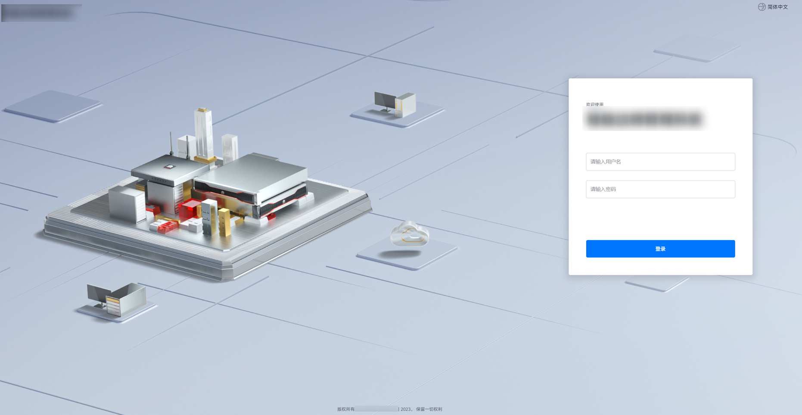

3. 选择界面语言。

    **图 2**  选择界面语言  
    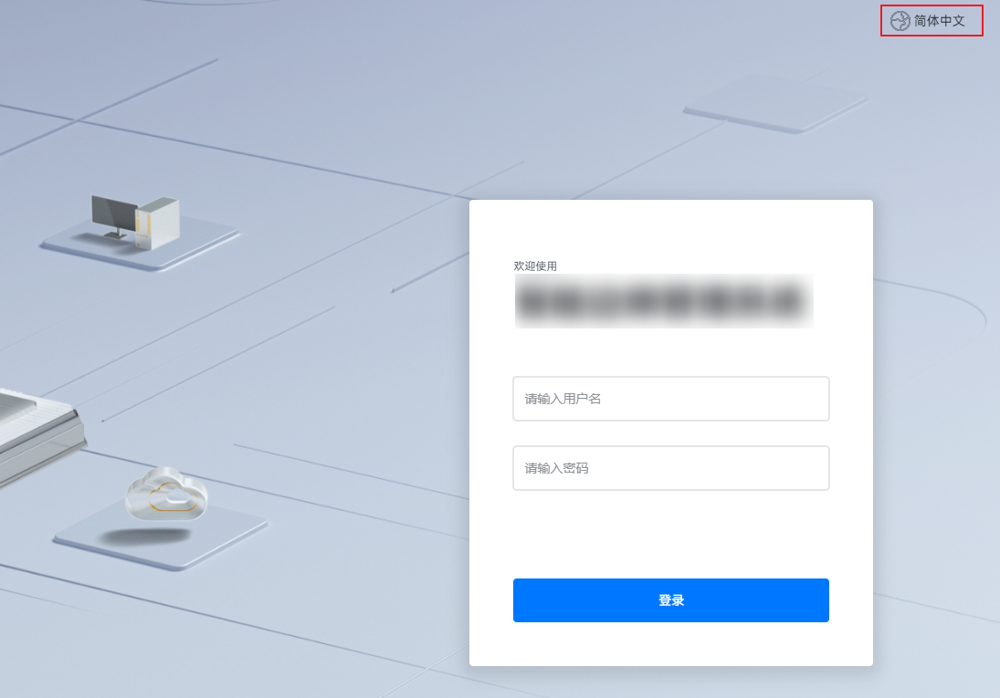

4. 输入用户名和密码。用户名和密码请参见《[Atlas硬件产品 用户清单](https://support.huawei.com/enterprise/zh/doc/EDOC1100235027)》中的“Atlas 200I A2 加速模块”。
5. 单击“登录”。

    > [!NOTE] 说明 
    >- 非首次登录：在执行步骤[5](#步骤5)后，直接进入边缘管理系统首页。
    >- 首次登录：请在执行步骤[5](#步骤5)后，继续执行步骤[6](#步骤6)-[8](#步骤8)，进入边缘管理系统首页。

6. 在弹出的修改窗口中，输入原密码、新密码、确认密码并单击“确认”，完成用户密码修改。

    **图 3**  修改用户密码  
    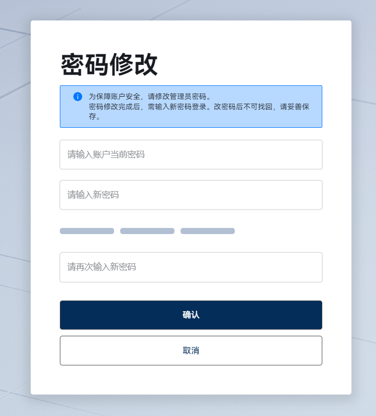

    > [!NOTE] 说明   
    > 密码复杂度要求：
    >- 长度为8～20的字符。
    >- 至少包含以下字符中的三种：
    >    - 小写字母：a～z
    >    - 大写字母：A～Z
    >    - 数字：0～9
    >    - 特殊字符：\`\~!@\#$%^&\*\(\)-\_=+\\|[\{\}\];:'",<.\>/?和空格
    >- 不能和用户名或者用户名的倒写一样。
    >- 修改密码时，不能与近5次密码相同，并且不能将密码修改为默认密码。

7. 在登录界面，再次输入用户名和新的密码。
8. 单击“登录”。

    登录成功后，进入“首页”界面。

## 首页

边缘管理系统首页展示了系统运行的状态，同时也对本管理系统的基本信息、温度、功耗、告警以及边缘设备的CPU利用率、内存利用率和NPU利用率进行了介绍。

**图 1**  首页  
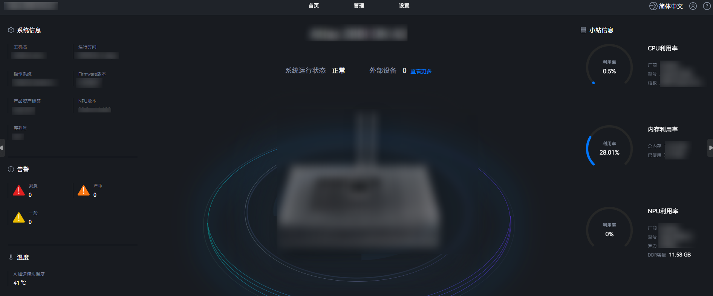

**表 1**  首页

|名称|说明|
|--|--|
|菜单|边缘管理系统的主菜单，提供管理和设置的操作入口。|
|用户名|提供修改用户密码和注销的操作入口。|
|系统信息|显示主机名、运行时间、操作系统、Firmware版本、产品资产标签、序列号和NPU版本。|
|告警|显示边缘设备目前的运行状态，状态包括紧急、严重和一般。|
|温度|显示AI加速模块温度。|
|小站信息|显示CPU利用率、内存利用率和NPU利用率。|

## 修改用户密码

**操作步骤**

1. 将鼠标移至界面右上角。
2. 单击“修改密码”，设置新的用户密码。

    **图 1**  修改用户信息  
    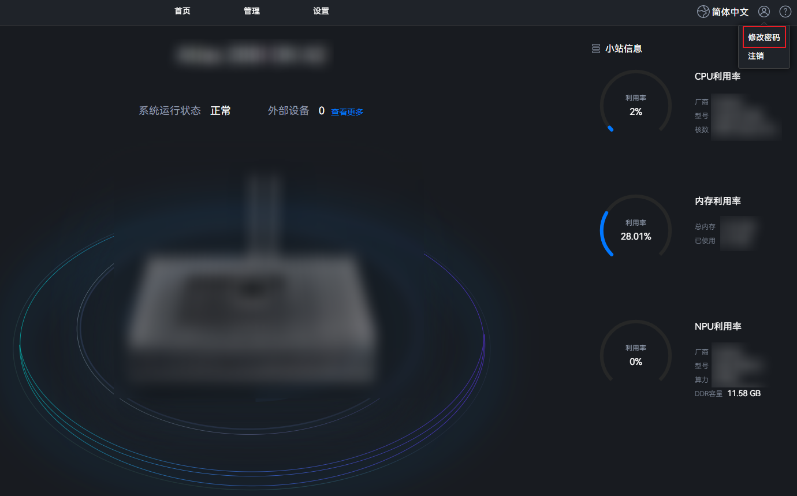

    **图 2**  修改用户密码  
    

    > [!NOTE] 说明   
    > 密码复杂度要求：
    >- 长度为8～20的字符。
    >- 至少包含以下字符中的三种：
    >     - 小写字母：a～z
    >     - 大写字母：A～Z
    >     - 数字：0～9
    >     - 特殊字符：\`\~!@\#$%^&\*\(\)-\_=+\\|[\{\}\];:'",<.\>/?和空格
    >- 不能和用户名或者用户名的倒写一样。
    >- 修改密码时，不能与近5次密码相同，并且不能将密码修改为默认密码。

3. 单击“确认”，系统退出至登录界面。

    登录界面上弹出“修改成功”提示框。

## 管理

### 网络配置

#### 有线网络

**使用场景**

在连接有线网络的情况下，新增、修改以及删除IP地址。

**注意事项**

- 进行网络配置时，请确保配置的IP地址正确，且与网络上的其它IP地址无冲突。不同网卡配置不同网段的IP地址，否则将导致网络异常。
- 进行网络配置时，如果两个网口连接在同一个局域网内，修改网络配置前，需要修改系统配置，否则可能导致同一服务器的两个网卡互相冲突。
    1. 通过SSH方式登录边缘设备后端命令行界面。
    2. 执行**vi /etc/sysctl.conf**命令，在其中添加**net.ipv4.conf.all.arp\_ignore=1**和**net.ipv4.conf.all.arp\_announce=2**配置项，执行<b>:wq</b>命令保存并退出。
    3. 执行**sysctl -p**命令更新配置。

- 成功完成网络配置时，后台Nginx服务会重启，重启完成后新配置生效，功能恢复正常。在使用SmartKit工具进行网络配置时，相邻操作间需要增加时间间隔（建议间隔10秒以上）。
- 配置网口1\~4的默认网关时，为了防止设备脱管，需要为网口0添加一个管理路由。执行**route add -net** _<管理ip\>/<子网掩码位数\>_ **gw** _<网口0的默认网关\>_ **网口0**命令进行添加。

**检测有线网络**

1. 在主菜单中选择“管理 \> 网络配置 \> 有线网络”。

    **图 1**  有线网络配置  
    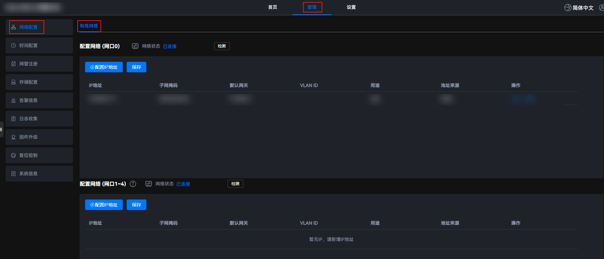

2. 选择配置网络的网口，网口0或网口1\~4。
    - 网口0对应设备硬件的。
    - 网口1\~4对应设备硬件的网口1、网口2、网口3、网口4。

3. 单击网络状态后的“检测”，检查网络的连接状态。

    **图 2**  检测网络  
    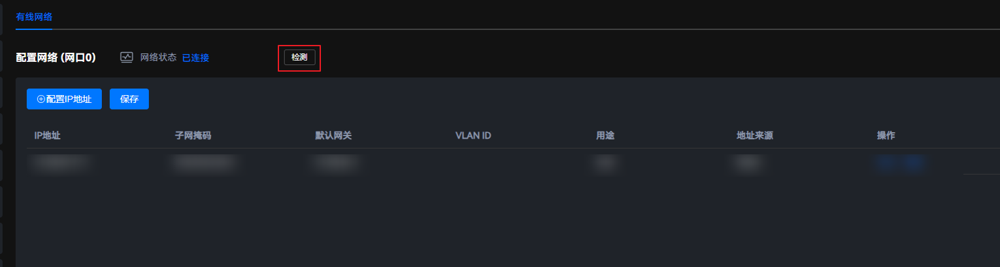

    > [!NOTE] 说明   
    > “检测网络状态”后的“已连接1000Mb/s”为系统检测后的最新网络状态。

**新增IP地址**

1. 在主菜单中选择“管理 \> 网络配置 \> 有线网络”。

    **图 3**  有线网络配置  
    

2. 选择配置网络的网口，网口0或网口1\~4。
    - 网口0对应设备硬件的。
    - 网口1\~4对应设备硬件的网口1、网口2、网口3、网口4。

3. 单击“配置IP地址”，弹出“IP地址”窗口。

    **图 4**  新增IP地址  
    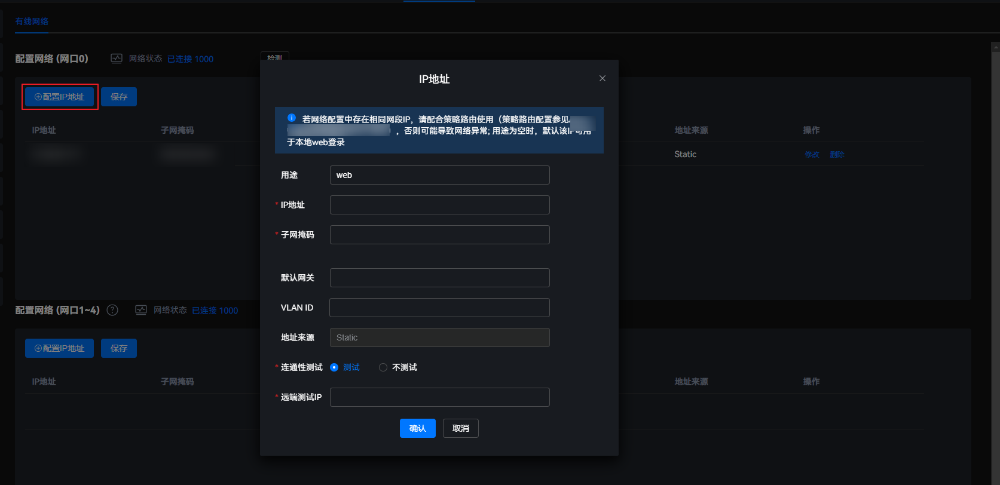

4. 参考[表1 配置IP地址参数](#配置IP地址参数table)，配置IP地址相关参数。
5. 单击“确认”，保存配置信息。
6. 单击“保存”使配置生效。

    **图 5**  保存生效  
    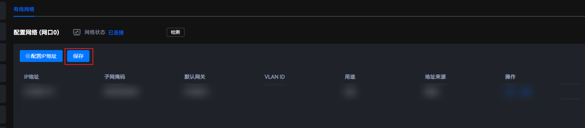

**修改IP地址**

> [!NOTICE] 须知  
> 
>- 修改地址会导致网口相关业务中断，请谨慎操作。
>- 修改IP属于高危操作，操作者需具备相应的网络知识，严格按照网络规划和操作指导书进行操作。

1. 在主菜单中选择“管理 \> 网络配置 \> 有线网络”。

    **图 6**  有线网络配置  
    

2. 选择配置网络的网口，网口0或网口1\~4。
    - 网口0对应设备硬件的。
    - 网口1\~4对应设备硬件的网口1、网口2、网口3、网口4。

3. 单击待修改IP地址后的“修改”。

    **图 7**  修改IP地址  
    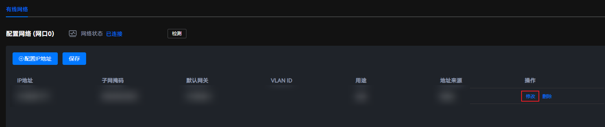

4. 在弹出的“IP地址”窗口中，参考[表1 配置IP地址参数](#配置IP地址参数table)，修改IP地址。

    **图 8**  修改IP地址  
    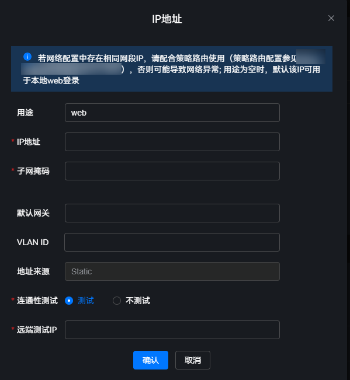

5. 单击“确认”保存修改信息。
6. 单击“保存”使配置生效。

    **图 9**  保存生效  
    

**删除IP地址**

> [!NOTE] 说明 
> 
> - 删除操作不可恢复，请谨慎操作。
> - 当网口仅存在一个IP地址时，此IP地址仅可修改，不可删除。

1. 在主菜单中选择“管理 \> 网络配置 \> 有线网络”。

    **图 10**  有线网络配置  
    

2. 选择配置网络的网口，网口0或网口1\~4。
    - 网口0对应设备硬件的。
    - 网口1\~4对应设备硬件的网口1、网口2、网口3、网口4。

3. 单击待删除IP地址后的“删除”，弹出删除提示框。

    **图 11**  删除操作  
    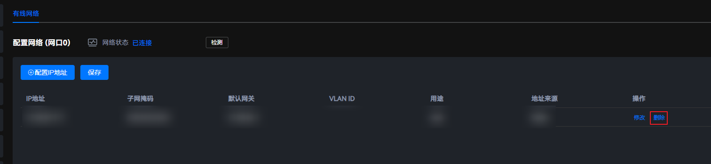

    > [!NOTE] 说明   
    > 若删除配置IP地址区域下唯一的IP地址，会提示IP地址不能为空。

4. 单击“确认”，删除该IP地址。
5. 单击“保存”使配置生效。

    **图 12**  保存生效  
    

**参数说明**

**表 1**  配置IP地址参数

|参数名称|参数说明|
|--|--|
|用途|IP地址的用途。 字符串长度为1~32个字符，支持输入英文、数字和下划线。  > [!NOTE] 说明 <li>设置为“web”的IP才能用于本地Web登录。配置或修改IP需要保证至少有一个IP的用途设置为“web”。</li><ul><li>允许配置为“web”用途的IP数量单网卡为4个，双网卡为8个；建议只配置一个IP的用途为“web”。</li><li>若只配置一个“web”用途的IP，默认该IP可用于本地Web登录。</li><li>若配置多个“web”用途的IP，按网卡顺序（网口0 > 网口1~4）选择第一个IP用于本地Web登录。</li><li>若在同一个网口上配置多个“web”用途的IP，则按照字典排序选择第一个IP用于Web界面登录（默认为升序），其他IP不能登录Web界面。</li></ul><li>不设置用途时，默认该IP的用途为空。</li>|
|IP地址|需要新增的IPv4地址，同一网口最多只能添加4个IP列表。若当前IP地址所属网段已存在于另一网卡配置中，如果继续配置，可能会出现异常。|
|子网掩码|该IP地址对应的子网掩码。|
|默认网关|该IP地址对应的默认网关，请确保默认网关全局唯一。  > [!NOTICE] 须知  新增、修改或删除网关可能导致无法连接，请谨慎操作。|
|VLAN ID|该IP地址对应的VLAN ID。  > [!NOTICE] 须知  配置VLAN ID时，可能导致网络故障。请仔细考虑网络拓扑结构、VLAN ID的分配、VLAN ID隔离策略等因素，以确保网络的安全和性能。|
|地址来源|地址来源，取值如下。<li>Static：静态IP</li><li>DHCP：动态IP</li>|
|连通性测试|表示是否对新增或修改的IP地址进行连通性测试：<li>如果选择"测试"，需要对新增或修改的IP地址进行连通性测试，即ping配置的远端测试IP，如果能够ping通，说明测试成功，新增或修改的IP地址生效；如果ping不通，说明测试失败，新增或修改的IP地址不会生效。</li><li>如果选择"不测试"，不会对新增或修改的IP地址进行连通性测试，新增或修改的IP地址直接生效。 默认需要对新增或修改的IP地址进行连通性测试，避免出现地址不可用导致设备脱管的情况，提高系统的可靠性。</li>|
|远端测试IP|用来对新增或修改的IP地址进行连通性测试的远端IP地址，当"连通性测试"参数选择"测试"时，才需要配置该参数。注意不能和"IP地址"参数的配置相同。|

### 时间配置

#### 设置系统时间

系统自动获取当前PC客户端的时间或时区，您可以选择NTP服务自动将NTP服务器的时间同步到设备，也可以选择手动校正时间然后同步到设备。

> [!NOTE] 说明   
> 目前NTP服务出厂设置即为默认关闭，在Web界面上仅支持配置IP地址和开关。打开NTP服务有安全风险，如果需要配置端口、keys等安全选项，请在后台配置。

**使用场景**

边缘设备的典型应用场景，例如智慧交通、智慧园区、智慧零售等，需要统一视频数据的时间；因此需要边缘设备支持从统一的时间服务器中同步时间。

**参数说明**

**表 1**  设置系统时间参数说明

|参数名称|参数说明|
|--|--|
|设备时间|显示设备的当前时间。|
|时区|边缘管理系统的时区。时区信息由“地区”和“时区”组成。默认值为UTC。|

**设置地区和时区**

1. 在主菜单中选择“管理 \> 时间配置 \> 设置系统时间”。

    **图 1**  设置系统时间  
    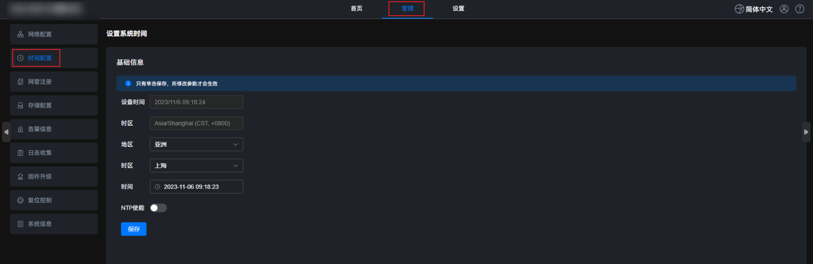

2. 在“地区”下拉列表中，选择要设置的参数。

    **图 2**  设置地区  
    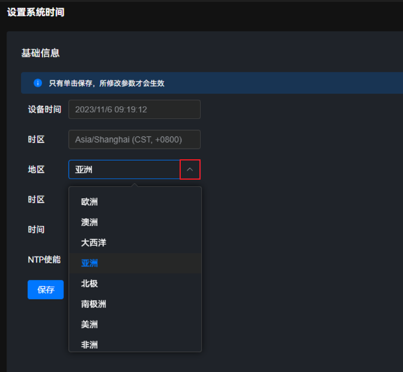

3. 在“时区”下拉列表中，选择要设置的参数。

    **图 3**  设置时区  
    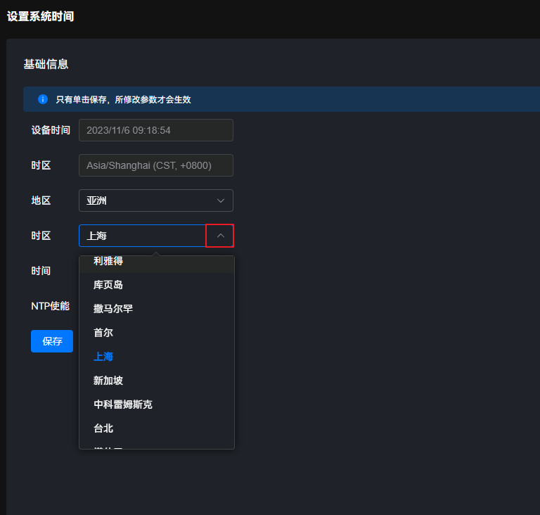

4. 单击“保存”。

    页面上方弹出“保存成功”提示框，“时区”将显示为用户设置的“地区”+“时区”信息。

    **图 4**  设置地区和时区  
    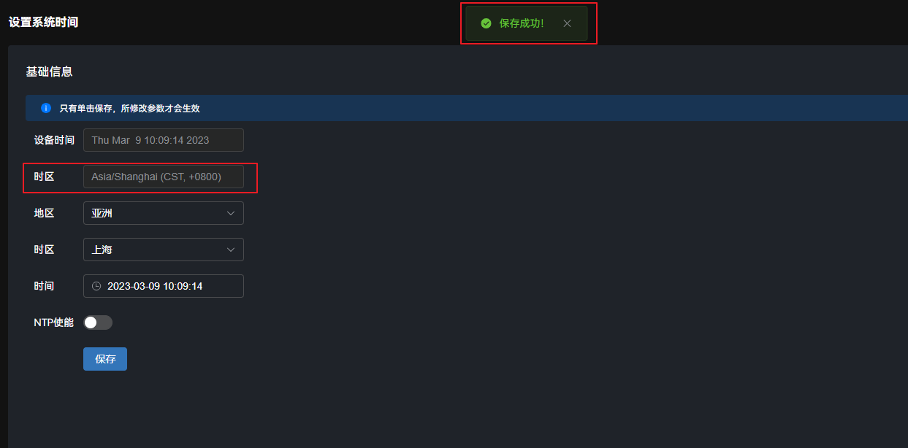

**设置系统时间**

用户可选择“手动校正时间”或“NTP自动同步时间”其中任一方式设置系统时间。

- 手动校正时间。
    1. 在主菜单中选择“管理 \> 时间配置 \> 设置系统时间”。

        **图 5**  设置系统时间  
        

    2. 单击“时间”后下拉列表框，设置所需的日期和时间。

        > [!NOTE] 说明 
        >- 系统支持设置的时间范围为2015-01-01 00:00:00到2099-12-31 23:59:59。
        >- 修改时间可能引起证书和密码过期。如果因修改时间导致证书过期，请登录后台，重启系统即可恢复。

        **图 6**  手动配置PC客户端时间  
        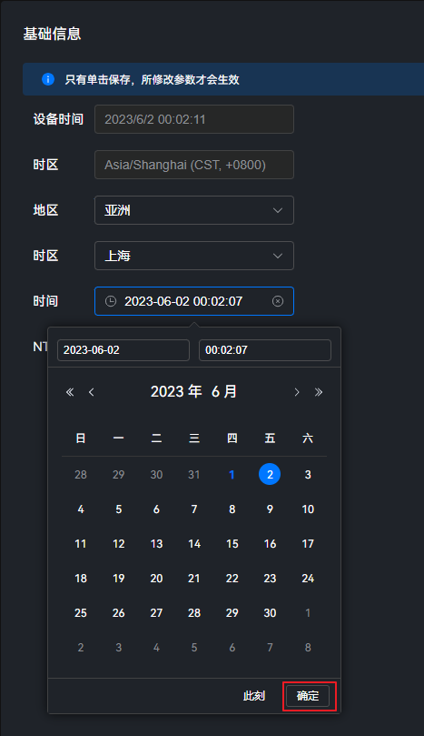

    3. 单击“确定”。
    4. 单击“保存”。

        页面上方弹出“保存成功”提示框。

        **图 7**  保存时间设置  
        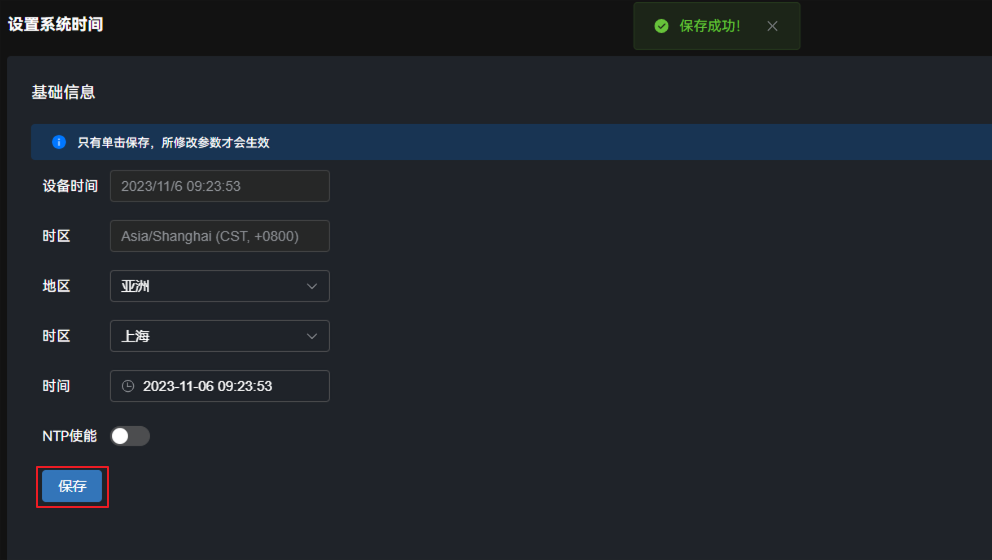

- NTP自动同步时间。
    1. 在主菜单中选择“管理 \> 时间配置 \> 设置系统时间”。

        **图 8**  设置系统时间  
        

    2. 单击，打开“NTP使能”开关。

        **图 9**  打开NTP使能  
        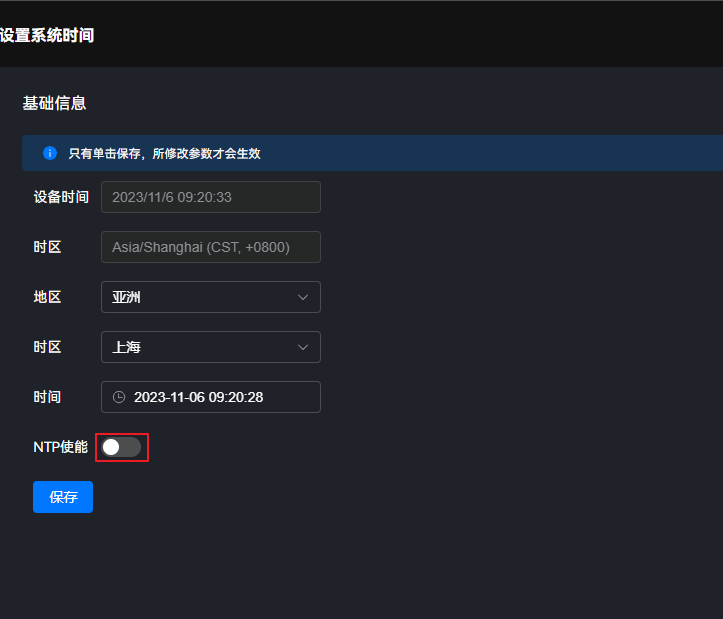

        **表 2**  NTP使能开关

       |参数名称|参数说明|
       |--|--|
       |NTP使能|使能或禁止边缘设备的NTP功能。使能NTP服务后，系统时间可从NTP服务器同步。 单击或并单击保存，可切换状态。<ul><li>表示NTP功能正在启用。</li><li>表示NTP功能已经停用。</li></ul>|

    3. 根据界面提示配置NTP服务器地址信息，配置项参考[表3 NTP服务器地址参数](#NTP服务器地址参数table)。

        **图 10**  配置NTP服务器地址  
        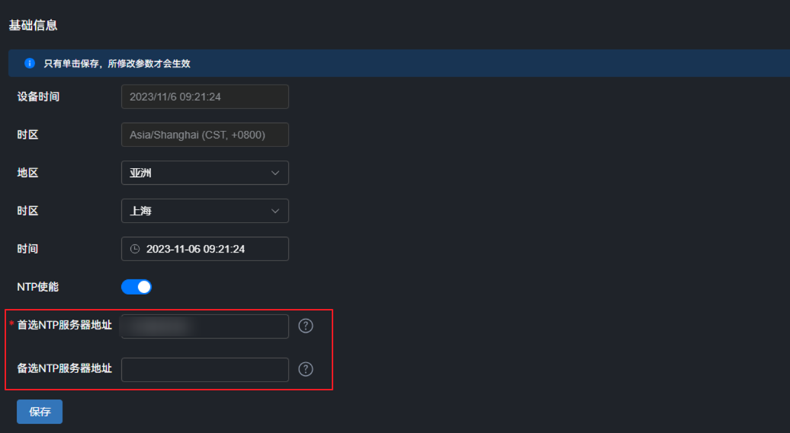

        **表 3**  NTP服务器地址参数

        |参数名称|参数说明|
        |--|--|
        |首选NTP服务器地址|优先选择的NTP服务器的地址。 取值范围：IPv4地址|
        |备用NTP服务器地址|第二选择的NTP服务器的地址。 取值范围：IPv4地址|

    4. 单击“保存”。

        页面上方弹出“保存成功”提示框，此时设备时间显示为NTP服务器的时间。

        **图 11**  保存NTP使能配置  
        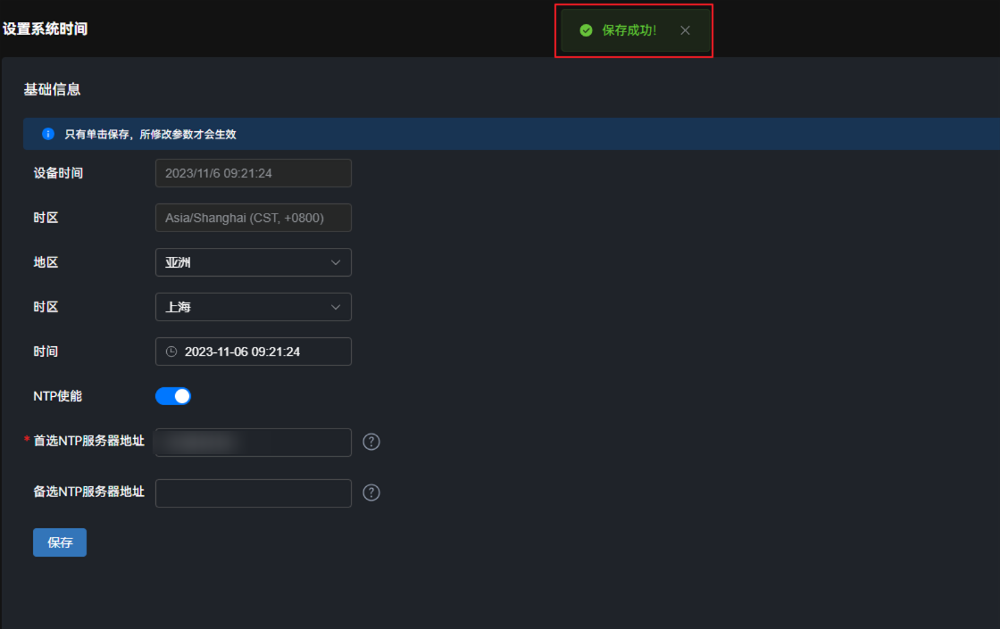

        > [!NOTE] 说明   
        > 如果边缘设备下挂端侧设备，根据用户组网场景，端侧设备也可通过配置同步到网络NTP Server的时间。  
        >前置条件：边缘设备其中一个网卡的IP可以连通NTP Server。
        >- Atlas 200I A2 IP：<i>a200I\_ip1</i>（连通NTP Server的IP）
        >- 与端侧同网段的IP：_a200I\_ip2_
        >- 端侧设备IP：_device\_ip_  
        >具体配置如下：
        >1. 配置端侧设备IP。
        >     - 场景1：端侧设备IP和边缘设备连接的NTP Server的IP在同一网段。  
        >        端侧设备默认路由同边缘设备的配置一致，只需要在ntp的配置中指向NTP Server的IP即可。
        >     - 场景2：端侧设备IP和边缘设备连接的NTP Server的IP在不同网段，但与边缘设备其他网卡IP在同一网段。  
        >        端侧配置路由指向小站的同网段IP：**route add -net 0.0.0.0 gw  <i>a200I\_ip2</i>**
        >2. NTP Server中配置反向路由：**route add -host  _device\_ip_  gw  <i>a200I\_ip1</i>**

### 网管注册

**使用场景**

边缘管理系统支持以下几种网管模式：

- 点对点Web管理

    用来单独管理一台边缘设备，系统默认采用该模式。如果希望批量管理边缘设备，需要将网管模式切换为“FusionDirector管理”，以便纳入中心管理系统FusionDirector统一管理。

- FusionDirector管理

    FusionDirector是用来对服务器和华为边缘设备进行统一运维管理的软件，提供对边缘设备的纳管、设备配置、固件升级等全生命周期的管理能力，有效帮助运维人员提高运维效率、降低运维成本。关于FusionDirector的详细介绍请参见《[FusionDirector 操作指南](https://support.huawei.com/enterprise/zh/doc/EDOC1100317179/426cffd9?idPath=23710424|251364417|251364851|252309137|23015464)》。

    通过将网管模式切换为“FusionDirector管理”，使边缘设备与FusionDirector对接，实现FusionDirector对批量边缘设备的统一管理。

    如果用户部署了FusionDirector软件，可以使用该模式。

**操作步骤**

1. 在主菜单中选择“管理 \> 网管注册”。

    **图 1**  配置网管注册  
    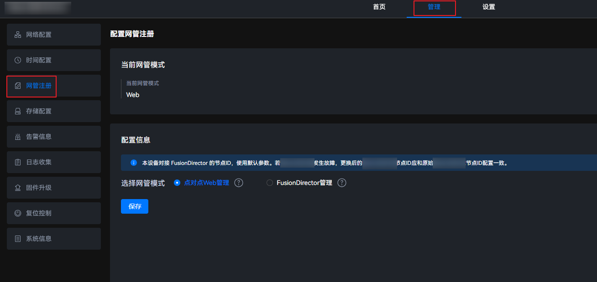

2. 在“配置信息”区域，选择网管模式。
    - 点对点Web管理：边缘管理系统默认采用点对点Web管理方式单独管理一台边缘设备，通过浏览器输入边缘设备的管理IP地址，进行点对点的设备管理。
    - FusionDirector管理：边缘设备作为边缘节点，与中心管理系统FusionDirector连接，纳入FusionDirector统一管理。根据实际的应用场景设置以下参数。

        **图 2** FusionDirector管理  
        

        > [!NOTE] 说明   
        > 1. 如果同一网卡上配置了多个IP地址，纳管到FusionDirector上显示的IP是随机的，无法确定是哪个设备。如果想要指定纳管到FusionDirector上的IP地址，可以通过绑定出口路由的方式实现。例如：假设FusionDirector的IP地址为192.168.100.15，设备上同一网卡上有2个IP地址192.168.1.100和192.168.1.101，如果要指定192.168.1.100纳管到FusionDirector上，则通过命令**ip route add 192.168.100.15 via 192.168.1.1 src 192.168.1.100**配置即可实现。
        > 2. 当已纳管FusionDirector处于就绪时，Web界面不允许上传FusionDirector根证书，需要去纳管就绪的FusionDirector上导入其他FusionDirector的根证书，以实现FusionDirector之间的网管切换。

        **表 1**  参数说明

        <table><thead align="left"><tr id="row4770114091712"><th class="cellrowborder" valign="top" width="15%" id="mcps1.2.4.1.1">
参数

       </th>
       <th class="cellrowborder" valign="top" width="15%" id="mcps1.2.4.1.2">
是否必选

       </th>
       <th class="cellrowborder" valign="top" width="70%" id="mcps1.2.4.1.3">
说明

       </th>
       </tr>
       </thead>
       <tbody><tr id="row6770164016170"><td class="cellrowborder" valign="top" width="15%" headers="mcps1.2.4.1.1 ">
节点ID

       </td>
       <td class="cellrowborder" valign="top" width="15%" headers="mcps1.2.4.1.2 ">
必选（自动识别）

       </td>
       <td class="cellrowborder" valign="top" width="70%" headers="mcps1.2.4.1.3 ">
本设备对接FusionDirector的节点ID，使用默认参数。

       
修改该参数需要填写满足UUID（通用唯一标识符）格式的字符串。UUID是一个长度为128位的标识符，通常用来表示网络中的实体。

       
该参数格式为由数字和字母a~f组成，包含8个数字和字母组成的一组（32位），使用“-”分隔，再由4个数字和字母组成的一组（16位），使用“-”分隔；再由4个数字和字母组成的一组（16位），使用“-”分隔，再由4个数字和字母组成的一组（16位），使用“-”分隔，最后是包含12个数字和字母组成的一组（48位）。

       
参考格式为1aab2222-abc3-de45-123d-56789abcfdff。

       
  > [!NOTE] 说明  

若边缘设备发生故障，更换后的边缘设备节点ID应和原始边缘设备节点ID配置一致。通过FusionDirector界面选择“菜单 &gt; 设备 &gt; 设备列表 &gt; 边缘设备”，在设备列表中查看故障设备的节点ID。

       

       </td>
       </tr>
       <tr id="row19770194051717"><td class="cellrowborder" valign="top" width="15%" headers="mcps1.2.4.1.1 ">
服务器名称

       </td>
       <td class="cellrowborder" valign="top" width="15%" headers="mcps1.2.4.1.2 ">
可选

       </td>
       <td class="cellrowborder" valign="top" width="70%" headers="mcps1.2.4.1.3 ">
如果用户在FusionDirector上导入自定义的服务证书，则需要在边缘设备上导入对应签发机构的根证书（通过Web界面上“FusionDirector根证书文件”字段可以导入），用于校验FusionDirector的自定义服务证书，同时还需要填写“服务器名称”字段校验FusionDirector自定义服务证书的域名。该字段要求与FusionDirector自定义服务证书的CN（Common Name）字段保持一致。

       
如果用户使用的是华为初始的服务证书，则无需填写此字段。

       
 > [!NOTICE] 须知  

用户自定义服务证书的CN字段不能包含关键字“huawei”，否则会导致设备与FusionDirector对接失败。

       
如果服务器名称输入以“*.”开头的域名，保存配置后，“*.”会被替换成“fd.”。

       

       </td>
       </tr>
       <tr id="row1677015405175"><td class="cellrowborder" valign="top" width="15%" headers="mcps1.2.4.1.1 ">
对接IP地址

       </td>
       <td class="cellrowborder" valign="top" width="15%" headers="mcps1.2.4.1.2 ">
必选

       </td>
       <td class="cellrowborder" valign="top" width="70%" headers="mcps1.2.4.1.3 ">
表示FusionDirector的访问IP地址，取值为IPv4地址。

       </td>
       </tr>
       <tr id="row17770840111720"><td class="cellrowborder" valign="top" width="15%" headers="mcps1.2.4.1.1 ">
对接端口号

       </td>
       <td class="cellrowborder" valign="top" width="15%" headers="mcps1.2.4.1.2 ">
必选

       </td>
       <td class="cellrowborder" valign="top" width="70%" headers="mcps1.2.4.1.3 ">
表示FusionDirector对接端口号，取值在[1, 65535]，目前只支持443。

       </td>
       </tr>
       <tr id="row6770240101710"><td class="cellrowborder" valign="top" width="15%" headers="mcps1.2.4.1.1 ">
对接账号

       </td>
       <td class="cellrowborder" valign="top" width="15%" headers="mcps1.2.4.1.2 ">
必选

       </td>
       <td class="cellrowborder" valign="top" width="70%" headers="mcps1.2.4.1.3 ">
表示FusionDirector对接账号，默认账号为EdgeAccount。

       
  > [!NOTE] 说明 

采用默认EdgeAccount对接成功之后，对接账号会自动采用FusionDirector下发的新的一机一密重新对接。一机一密账户和密码由FusionDirector的业务微服务自生成，详细信息请参考《<a href="https://support.huawei.com/enterprise/zh/doc/EDOC1100316872/426cffd9?idPath=23710424|251364417|251364851|252309137|23015464" target="_blank" rel="noopener noreferrer">FusionDirector 维护指南</a>》。

       

       </td>
       </tr>
       <tr id="row1977013403171"><td class="cellrowborder" valign="top" width="15%" headers="mcps1.2.4.1.1 ">
对接密码

       </td>
       <td class="cellrowborder" valign="top" width="15%" headers="mcps1.2.4.1.2 ">
必选

       </td>
       <td class="cellrowborder" valign="top" width="70%" headers="mcps1.2.4.1.3 ">
表示FusionDirector对接密码。 密码请参见《<a href="https://support.huawei.com/enterprise/zh/doc/EDOC1100317179/426cffd9?idPath=23710424|251364417|251364851|252309137|23015464" target="_blank" rel="noopener noreferrer">FusionDirector 操作指南</a>》中的“设备快速入门 &gt; 边缘设备 &gt; 添加边缘设备”章节。
       

       </td>
       </tr>
       <tr id="row377184020175"><td class="cellrowborder" valign="top" width="15%" headers="mcps1.2.4.1.1 ">
FusionDirector根证书文件

       </td>
       <td class="cellrowborder" valign="top" width="15%" headers="mcps1.2.4.1.2 ">
可选

       </td>
       <td class="cellrowborder" valign="top" width="70%" headers="mcps1.2.4.1.3 ">
第一次对接FusionDirector必须上传根证书文件。点击，上传根证书文件。如果是多级证书，需要合并成一个证书文件导入，建议上级证书放在后面。

       
该参数为可选参数，使用系统初始证书时可以不配置该参数。出于安全考虑，建议用户使用自己的证书和公私钥对，并定期更新，保证证书的有效性和安全性。当证书过期或者被吊销导致设备与FusionDirector对接不上时，请重新导入根证书文件。为了保证根证书的安全性，根证书使用的非对称加密算法和密钥长度要求如下：<ul id="ul1371345011170"><li>如果使用RSA算法，建议使用3072位及以上密钥。</li><li>如果使用椭圆曲线EC算法，建议使用256位及以上密钥。</li></ul>
       

       
证书其他格式要求如下：<ul id="ul1974318613435"><li>证书需要是PEM格式。</li><li>根CA证书中签名正确。</li><li>根CA证书处于有效期内。</li><li>摘要算法可以是SHA256、SHA384、SHA512。</li><li>签名算法可以是sha256WithRSAEncryption、sha384WithRSAEncryption、sha512WithRSAEncryption、ecdsa-with-SHA256。</li><li>证书须为X.509 V3数字证书，根CA证书的“基本限制”扩展域须标明为“CA”，“密钥用法”扩展域中须包含“证书签名”。</li><li>证书扩展域需要带有“使用者可选名称SAN”字段，且包含IP值。</li></ul>
       

       
建议使用用户自定义的根证书。另外华为也提供了根证书，获取方法如下：

       
登录FusionDirector，在FusionDirector界面上方依次选择“菜单 &gt;系统管理 &gt; 安全管理 &gt; 证书管理”，点击“服务证书”，单击“FusionDirectorServer”栏目里的“导出”，下载证书压缩包（rootCerts.zip）到本地。解压下载的证书压缩包，获取需要的证书rootCertChain.crt。

       
  > [!NOTE] 说明 

若设备处于已纳管状态，则不能再次上传证书。

       

       </td>
       </tr>
       <tr id="row677174015171"><td class="cellrowborder" valign="top" width="15%" headers="mcps1.2.4.1.1 ">
FusionDirector吊销列表文件

       </td>
       <td class="cellrowborder" valign="top" width="15%" headers="mcps1.2.4.1.2 ">
可选

       </td>
       <td class="cellrowborder" valign="top" width="70%" headers="mcps1.2.4.1.3 ">
为了安全起见，上传FusionDirector根证书后，建议导入证书吊销列表，用来校验FusionDirector证书是否被吊销，如果FusionDirector证书已被吊销，则设备与FusionDirector将不能对接。该证书由用户自行提供。

       </td>
       </tr>
       <tr id="row11771114021710"><td class="cellrowborder" valign="top" width="15%" headers="mcps1.2.4.1.1 ">
FusionDirector对接测试

       </td>
       <td class="cellrowborder" valign="top" width="15%" headers="mcps1.2.4.1.2 ">
必选

       </td>
       <td class="cellrowborder" valign="top" width="70%" headers="mcps1.2.4.1.3 ">
系统默认选择对接测试。

       <ul id="ul1971445014176"><li>如果选择对接测试，会对节点ID和设备与FusionDirector的连通性进行测试，如果测试不通过，则FusionDirector网管切换失败。</li><li>如果选择不测试，不会对节点ID和设备与FusionDirector的连通性进行测试，FusionDirector网管切换成功，但这可能会导致FusionDirector纳管失败。</li></ul>
       
在边缘设备离线集中配置（无法连接FusionDirector）的场景下，可以选择不测试，但需要保证FusionDirector参数的有效性，即节点ID不能在FusionDirector上重复，且IP地址、用户名和密码有效。其他场景建议都进行测试，避免输入错误导致纳管失败。

       </td>
       </tr>
       </tbody>
       </table>

3. 单击“保存”。

    页面提示“网管模式切换成功”，表示配置网管注册成功。

### 存储配置

本章节用于边缘设备的内部存储与外置存储的基本管理。

在FusionDirector或Web上为用户提供存储管理的界面，供用户进行以下操作：

- 查询当前所有的存储设备信息，如内置eMMC Flash、SD卡、M.2盘、HDD硬盘、USB盘，包含设备型号、容量、是否分区、文件系统格式等。
- 创建磁盘分区，并对磁盘分区进行相应操作。

#### 存储管理

**参数说明**

**表 1**  磁盘列表参数

|参数名称|参数说明|
|--|--|
|盘符|磁盘所在位置|
|设备类型|当前设备类型|
|总容量|设备的总容量|
|接口类型|设备接口类型|
|位置|设备所在位置|
|健康状态|设备的健康状态|
|操作|对磁盘进行的操作|

**查看磁盘列表信息**

1. 在主菜单中选择“管理 \> 存储配置 \> 存储管理”。

    **图 1**  存储管理  
    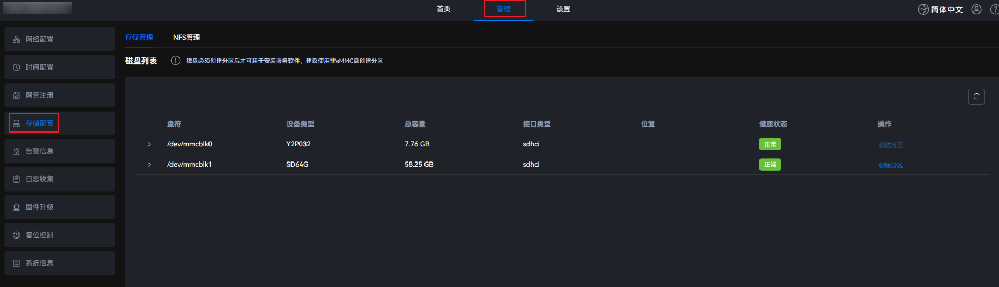

2. 在磁盘列表区域，选择需要查看的磁盘条目，单击条目前的。

    在展开的区域中，显示分区名称、系统分区、总容量、文件系统、剩余容量和挂载路径等信息。

    **图 2**  本地磁盘详细信息  
    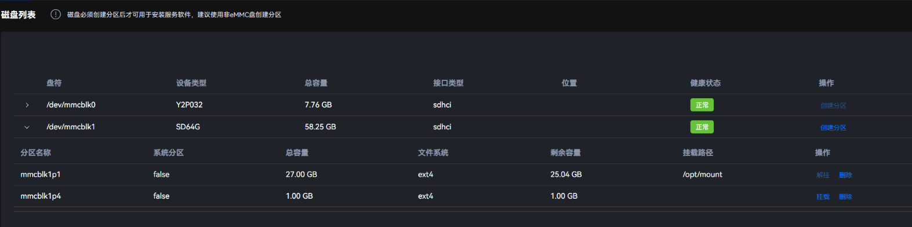

**创建分区**

建议用户创建独立的分区，用于挂载/var/lib/docker；在部署容器应用时，确保该容器应用不超过挂载了/var/lib/docker的分区总容量的90%。

> [!NOTE] 说明   
> 由于磁盘的厂商和磁盘类型之间存在差异，可能导致创建磁盘时间的差异。例如存在创建磁盘时间过长，导致页面出现操作失败的提示但实际创建成功的场景。

1. 在主菜单中选择“管理 \> 存储配置 \> 存储管理”。

    **图 3**  存储管理  
    

2. 在磁盘列表区域，单击磁盘“操作”列的“创建分区”，弹出“创建分区”窗口。

    **图 4**  创建分区  
    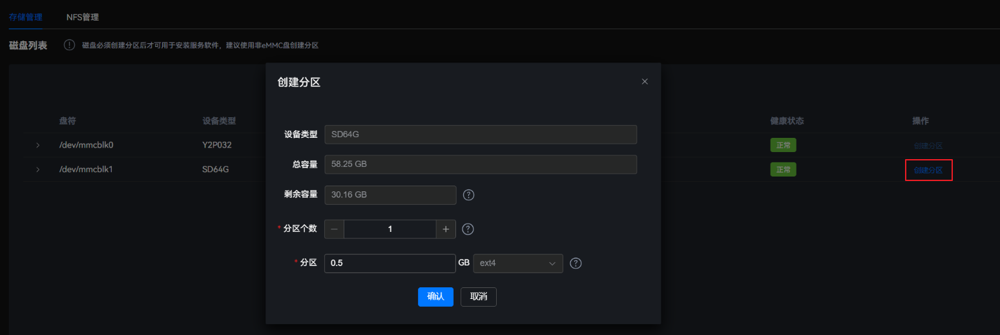

3. 配置创建分区参数。

    **图 5**  配置分区参数  
    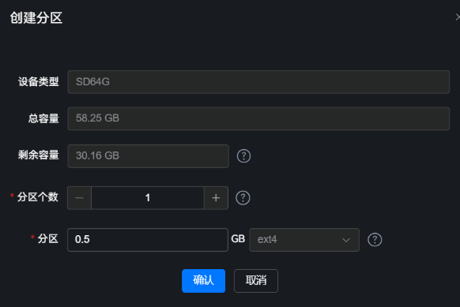

    **表 2**  创建分区参数

    |参数名称|参数说明|
    |--|--|
    |设备类型|当前设备类型。|
    |总容量|设备的总容量。|
    |剩余容量|设备的剩余容量。  > [!NOTE] 说明  由于磁盘分区碎片化，剩余容量可能是非连续分布，因此即使创建小于剩余容量的分区，也可能会提示磁盘容量不足而创建分区失败。|
    |分区个数|选择所需的分区个数。最多可选择16个分区。|
    |分区|包括分区容量和文件系统。<ul><li>分区容量：最大容量不超过剩余空闲容量，容量大小的单位为GB，最小值为0.5GB，必须是0.5GB的整数倍且最多一位小数。</li><li>文件系统：当前仅支持ext4。</li></ul>|

4. 单击“确认”。

**删除分区**

> [!NOTICE] 须知 
> 
> - 删除分区，将导致该分区中已有数据被删除，且无法恢复，请谨慎操作。
> - 删除分区时，需保证该分区上没有业务或业务已经停止；否则可能导致被删除的分区异常。

1. 在主菜单中选择“管理 \> 存储配置 \> 存储管理”。

    **图 6**  存储管理  
    

2. 在磁盘列表区域，选择需要查看的磁盘条目，单击条目前的，展开分区列表信息。

    **图 7**  本地磁盘详细信息  
    

3. 单击待删除条目后的“删除”，弹出操作确认提示框。

    **图 8**  删除磁盘条目  
    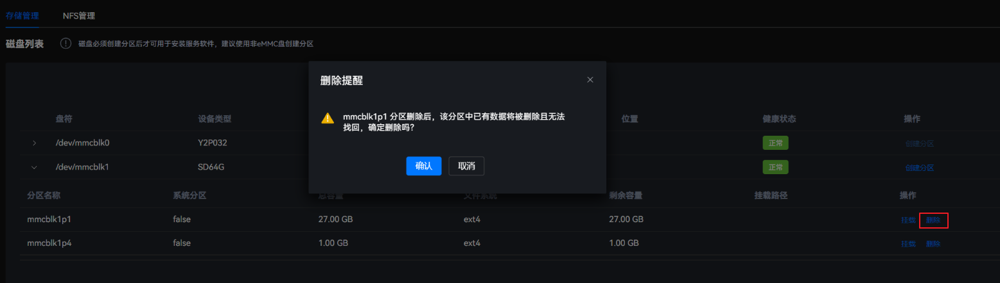

4. 单击“确认”。

**挂载分区**

eMMC不能频繁进行写操作，否则会造成eMMC不可用、导致整机不能使用。

1. 在主菜单中选择“管理 \> 存储配置 \> 存储管理”。

    **图 9**  存储管理  
    

2. 在磁盘列表区域，选择需要查看的磁盘条目，单击条目前的，展开分区列表信息。

    **图 10**  本地磁盘详细信息  
    

3. 单击待挂载条目后的“挂载”，弹出“挂载分区”对话框。

    **图 11**  挂载分区  
    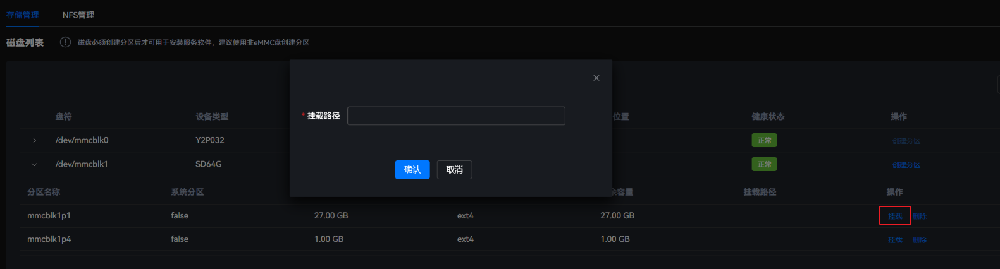

4. 输入挂载路径。

    - 挂载路径格式要求：最大长度为256个字符，可由数字、字母和-/\_任意字符组成，必须以“/”开头，不能包含空格。
    - 默认可输入的挂载路径为“/opt/mount/”。若用户想在其他路径下挂载，需要先执行<b>/usr/local/mindx/MindXOM/tools/mount\_white\_path add</b> <i>Absolute\_Path</i>命令，将挂载路径手动添加到白名单中。具体处理方式请参见[mount\_white\_path命令](./appendix.md#mount_white_path命令)。
    - 挂载路径不能为已有挂载路径的子目录。
    - 挂载路径不能在系统中存在。

    > [!NOTE] 说明   
    > 如果挂载失败，则该分区可能被损坏。请删除该分区，然后重新创建分区。

5. 单击“确认”。

    > [!NOTE] 说明  
    > 挂载点目录的默认权限为755。用户可通过登录develop模式下执行**chmod**命令来修改权限。

**解除挂载**

> [!NOTICE] 须知
> 解除挂载会导致已挂载到该分区的容器应用不可用，请谨慎操作。

1. 在主菜单中选择“管理 \> 存储配置 \> 存储管理”。

    **图 12**  存储管理  
    

2. 在磁盘列表区域，选择需要查看的磁盘条目，单击条目前的，展开分区列表信息。

    **图 13**  本地磁盘详细信息  
    

3. 单击待解挂条目后的“解挂”，弹出操作确认提示框。

    **图 14**  解除挂载  
    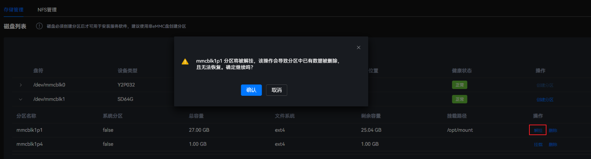

4. 单击“确认”。

#### NFS管理

用户除可以使用本地磁盘外，还可以使用NFS挂载存储服务器共享目录来扩展存储空间，用于存储业务数据。

> [!NOTE] 说明 
> 
>- NFS协议为不安全协议，没有用户认证机制，数据在网络上明文传输，存在一定的安全风险，建议仅在受信任的安全区域中使用，且不要传输敏感数据，默认使用V4协议。
>- NFS挂载的共享目录本地路径会同步NFS服务器共享目录的权限、属主和属组，请用户使用前确保NFS存储服务器安全，使用的目录和文件权限符合业务安全诉求。
>- NFS挂载的共享目录中如果有特殊权限位（setuid、setgid）的文件或者可执行文件，在挂载的本地路径中，该文件的特殊权限位无法生效、也无法执行该可执行文件。
>- 若Web界面长时间显示NFS挂载异常，可能是由于NFS服务端异常或关闭，导致边缘设备与NFS服务端网络不通，建议对长时间显示异常的NFS挂载进行解挂操作。

**创建共享目录**

1. 在主菜单中选择“管理 \> 存储配置 \> NFS管理”。

    **图 1**  NFS管理  
    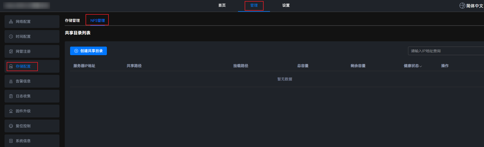

2. 单击“创建共享目录”，弹出“创建共享目录”对话框。

    **图 2**  创建共享目录  
    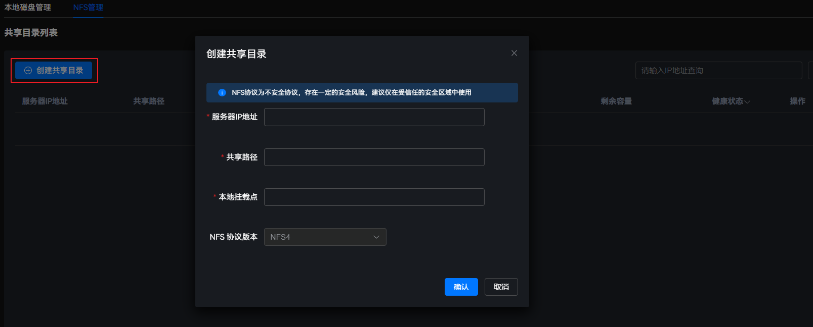

3. 根据界面提示配置参数，配置项参考[表1 创建共享目录参数说明](#创建共享目录参数说明table)。

    **表 1**  创建共享目录参数说明  

    |参数名称|参数说明|取值样例|
    |--|--|--|
    |服务器IP地址|NFS服务器IP地址。 取值为IPv4地址。|192.168.1.192|
    |共享路径|NFS服务器共享路径。 支持的最大取值长度为256，可由大小写字母（a\~z、A\~Z）、数字（0~9）和其他字符（/_-）组成，且以/开头。|/home/nfssharedir|
    |本地挂载点|边缘设备本地挂载路径。支持的最大取值长度为256，可由大小写字母（a\~z、A\~Z）、数字（0~9）和其他字符（/_-）组成，且需要以/开头。 > [!NOTE] 说明 挂载路径仅支持"/opt/mount"目录。|/opt/mount|
    |NFS协议版本|NFS协议的版本信息。 目前仅支持版本NFS4。|NFS4|

4. 单击“确认”。

    在展示区域中，显示服务器IP地址、共享路径、挂载路径、总容量、剩余容量、健康状态和操作等信息。

    > [!NOTE] 说明
    > - “健康状态”列展示信息为共享目录的工作状态。
    > - 挂载点目录的默认权限为755，目录下的文件权限用户需要自己审视并保证合理性。用户可通过登录develop模式下执行**chmod**命令来修改权限。

**解除挂载**

> [!NOTE] 说明  
>解除挂载会导致已挂载到该分区的容器应用不可用，请谨慎操作。如需解除挂载，请在没有容器应用使用该共享目录的情况下，执行此操作。

1. 在主菜单中选择“管理 \> 存储配置 \> NFS管理”。

    **图 3**  NFS管理  
    

2. 在需解挂载目录的“操作”列单击“解挂”，弹出操作确认提示框。

    **图 4**  解挂载目录  
    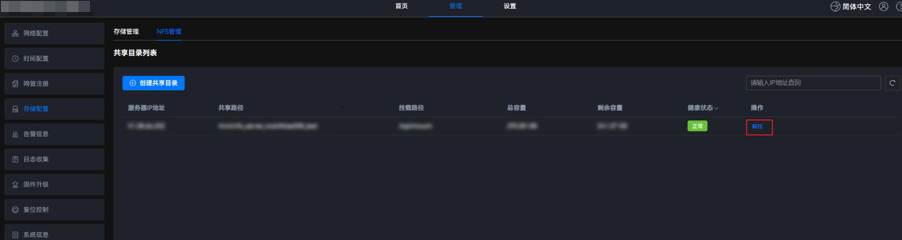

3. 单击“确认”。

### 告警信息

**使用场景**

当系统管理的外部设备发生故障时，告警会上报至边缘管理系统。运维人员可以通过告警页面获取告警相关信息，及时排查故障，提升运维效率。

**参数说明**

**表 1**  当前告警列表

|参数名称|参数说明|
|--|--|
|告警ID|告警在边缘设备中的唯一标识。|
|级别|告警的级别。 取值范围：紧急、严重和一般。<li>紧急级别的告警可能会使设备下电、系统中断。因此需要您马上采取相应的措施进行处理。</li><li>严重级别的告警会对系统产生较大的影响，有可能中断系统的正常运行，导致业务中断。</li><li>一般级别的告警不会对系统产生大的影响，但也需要您尽快采取相应的措施，防止故障升级。</li>|
|告警对象|产生告警的设备。|
|告警名称|告警的内容描述信息。|
|产生时间|告警的产生时间。|

#### 当前告警

**使用场景**

当系统发生故障时，此页面仅显示系统上报的未被屏蔽的告警信息。

**操作步骤**

1. 在主菜单中选择“管理 \> 告警信息 \> 当前告警”。

    进入“当前告警”界面，可查看当前系统上报的告警数量、告警ID、级别、告警对象、告警名称以及产生时间。

    **图 1**  当前告警  
    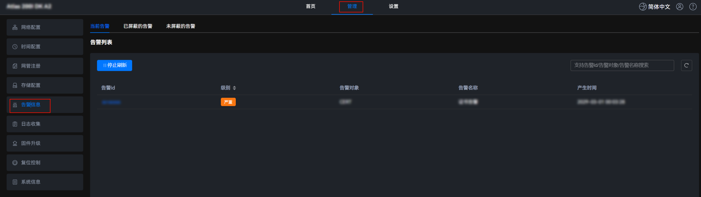

2. 单击目标告警所在行的告警ID，可查看对于本条告警的处理建议。

    **图 2**  处理意见  
    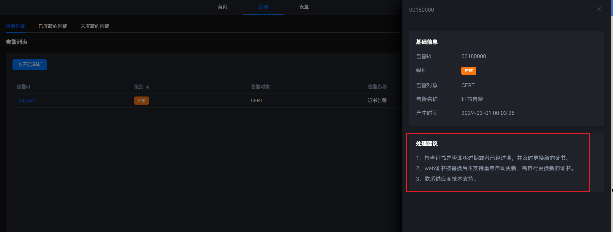

3. （可选）单击“开始刷新”，自动刷新告警信息。

    **图 3**  启动刷新  
    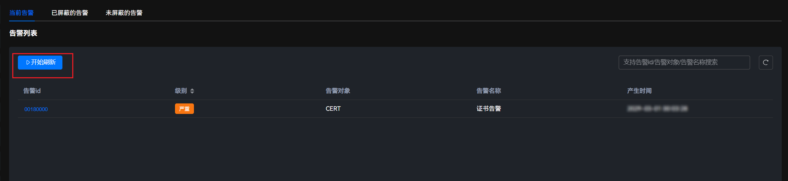

    > [!NOTE] 说明  
    > 用户根据告警处理建议清除告警后，可通过单击“开始刷新”确定告警是否消除。

#### 已屏蔽的告警

**使用场景**

用户可在此页面查看或取消已屏蔽的告警。当系统出现故障时，已取消屏蔽的告警会在“当前告警”页面显示。

**取消告警屏蔽**

1. 在主菜单中选择“管理 \> 告警信息 \> 已屏蔽的告警”。

    进入“已屏蔽的告警”界面，可查看已屏蔽的告警数量、告警ID、级别、告警对象以及告警名称。

    **图 1**  已屏蔽的告警  
    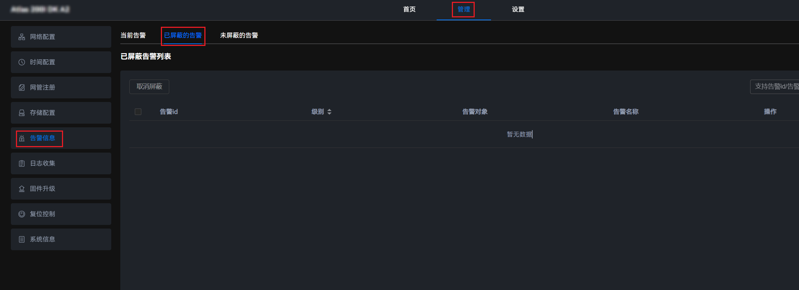

2. 勾选目标告警所在行的。

    **图 2**  选择告警  
    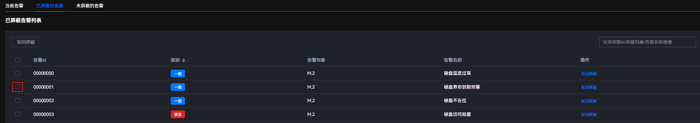

3. 单击“取消屏蔽”，弹出操作确认提示框。

    **图 3**  取消屏蔽  
    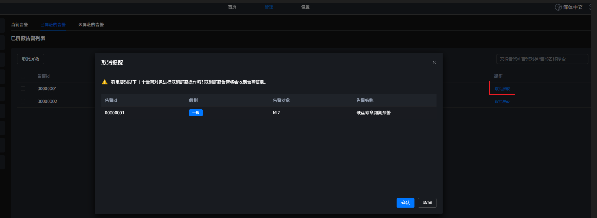

4. 单击“确认”。

#### 未屏蔽的告警

**使用场景**

初始状态下，用户可在此页面查看系统所有告警。若用户想忽略某些告警，可执行以下操作进行屏蔽，屏蔽后的告警在“当前告警”页面将不会再显示。

**添加告警屏蔽**

1. 在主菜单中选择“管理 \> 告警信息 \> 未屏蔽的告警”。

    进入“未屏蔽的告警”界面，可查看告警的数量、告警ID、级别、告警对象以及告警名称。

    **图 1**  未屏蔽的告警  
    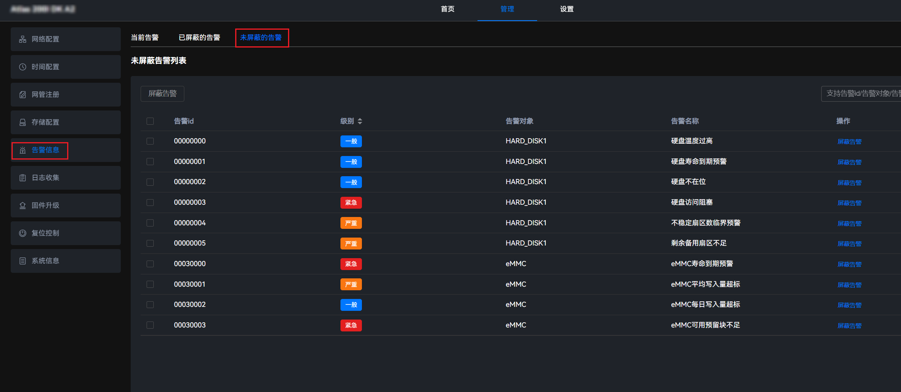

2. 勾选目标告警所在行的。

    **图 2**  选择告警  
    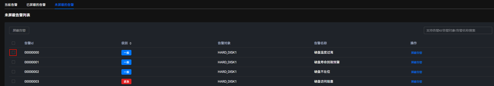

3. 单击“屏蔽告警”，弹出操作确认提示框。

    **图 3**  屏蔽告警  
    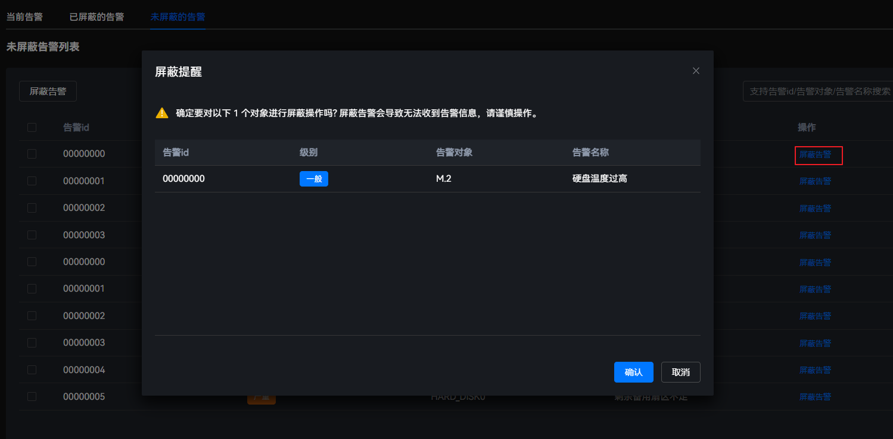

4. 单击“确认”。

### 日志收集

**使用场景**

用户需要收集日志时，使用该功能系统将会自动开始收集日志。

**操作步骤**

1. 在主菜单中选择“管理 \> 日志收集”。

    **图 1**  日志收集  
    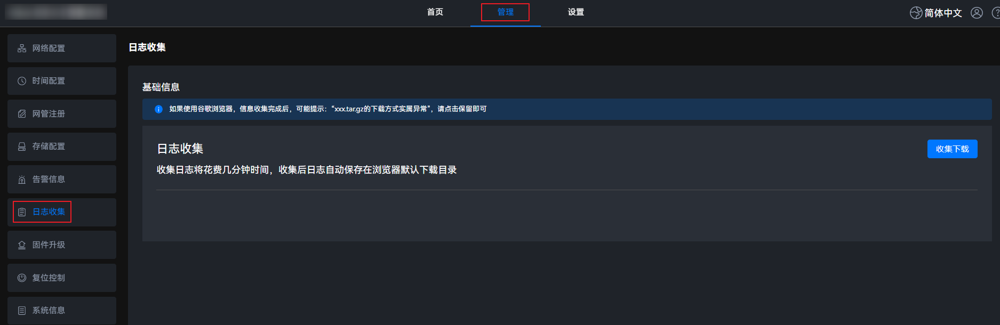

2. 单击“收集下载”，开始进行日志收集。系统会将收集到的日志信息进行打包下载。

    **图 2**  开始收集  
    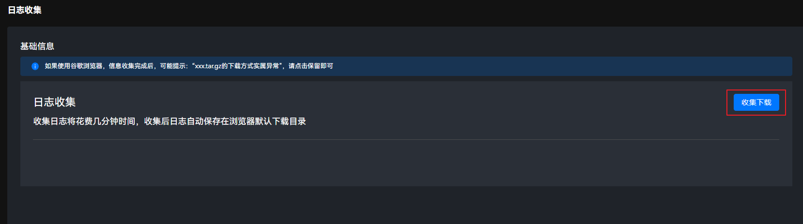

**表 1**  日志说明

|文件名称|内容说明|
|--|--|
|NPU.tar.gz|当前的NPU日志|
|OS_Drivers.tar.gz|OS_Driver日志|
|MindXOM.tar.gz|OM SDK日志|

> [!NOTE] 说明   
> 转存日志时会在日志文件名中增加日期和时间。

### 固件升级

本文档只提供在边缘管理系统界面中进行固件升级的操作指引。

#### 系统升级

**使用场景**

为了优化或增加特性，在推出新版本的固件时，由用户将新版本固件更新到边缘管理系统中，保证系统处于最佳工作状态。

升级固件的流程如[图1](#fig升级固件的流程)所示。

**图 1**  升级固件的流程  
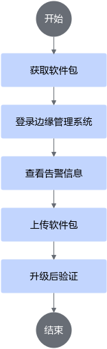

**流程说明**

1. 获取软件包。
2. 登录边缘管理系统。登录边缘管理系统的Web界面。
3. 查看告警信息。在主菜单中选择“管理 \> 告警 \> 当前告警”，查看当前设备上有无需要处理的告警，避免因环境问题导致升级失败。
4. 上传软件包。上传需要升级的软件包。当前支持2种升级场景，支持上传1个软件包后就生效的场景和3个软件包一起上传后再点击生效的场景。这2种场景并不会导致任何的差异，用户可以根据需要自行选择。
5. 升级后验证。在主菜单中选择“管理 \> 系统信息”，可以查看升级后的版本。

**操作步骤**

1. 在主菜单中选择“管理 \> 固件升级 \> 系统升级”。

    **图 2**  系统固件升级  
    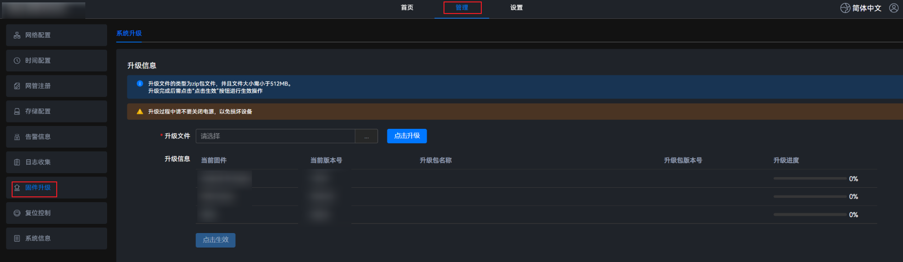

2. 单击“升级文件”后的，选择升级文件。

    **图 3**  选择升级文件  
    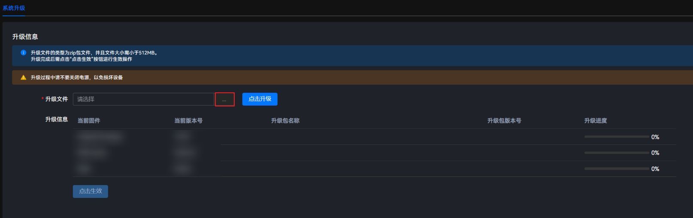

    > [!NOTE] 说明 
    >- 文件名称长度为1\~255个字符，可由英文字母、数字、下划线、点和短横线组成。
    >- 上传过程中，请勿切换或者关闭当前页面，否则会导致上传失败。
    >- 升级文件支持zip包文件，文件大小需要小于512MB。

3. 单击“点击升级”。升级时间大概花费2分钟，请耐心等待。

    > [!NOTICE] 须知 
    >- 升级过程中请不要关闭电源，以免损坏设备。
    >- 升级过程中请不要对边缘设备进行业务配置及其它维护类操作，以免配置丢失或升级失败。

    可在页面查看升级版本号、升级结果等信息。

    **图 4**  查看升级信息  
    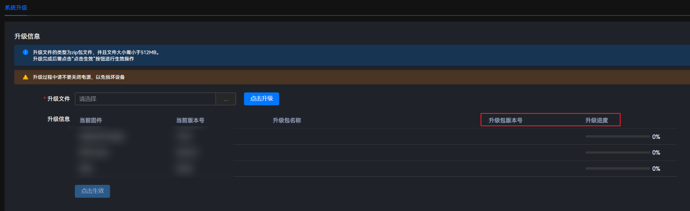

4. 单击“点击生效”，弹出操作确认提示框。

    **图 5**  点击生效  
    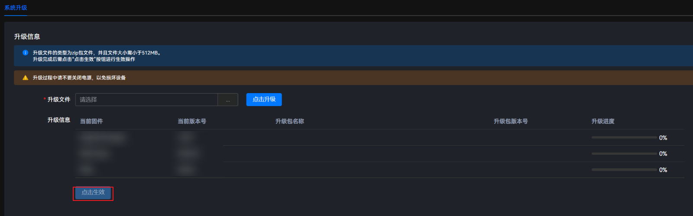

5. 单击“确认”。大概等待3分钟，等待系统完成重启。

    升级包生效后，系统自动重启，并跳转到登录界面，此时系统正在重启，请耐心等待，然后登录确认升级是否成功。

    > [!NOTE] 说明   
    > 升级固件版本后，请刷新浏览器或清除缓存后再登录边缘管理系统，避免因浏览器缓存问题导致页面加载不完全。

### 复位控制

**使用场景**

重启系统会影响正在执行的用户业务，强制下电再上电可能会损坏系统数据。在日常维护过程中，用户可根据需要进行选择。

**重启系统**

1. 在主菜单中选择“管理 \> 复位控制”。

    **图 1**  复位控制  
    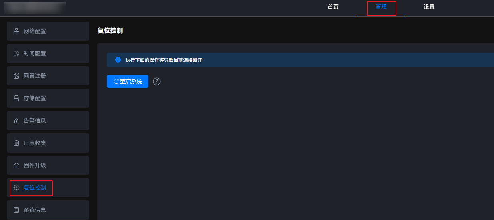

2. 单击“重启系统”，弹出操作确认提示框。

    **图 2**  系统重启  
    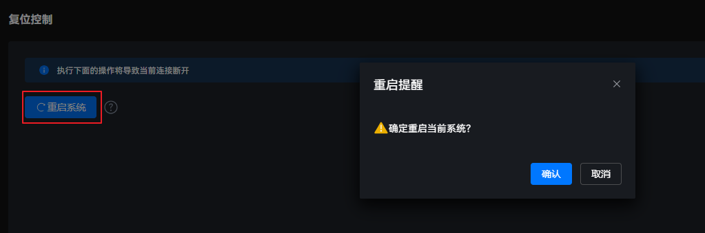

    > [!NOTE] 说明   
    > 单击“重启系统”后，系统将被强制重启，该操作会影响正在执行的用户业务。

3. 单击“确认”。等待系统完成重启。

### 系统信息

**使用场景**

可以通过此功能查看系统的基本信息和外部设备信息。

**操作步骤**

1. 在主菜单中选择“管理 \> 系统信息”。

    **图 1**  系统信息  
    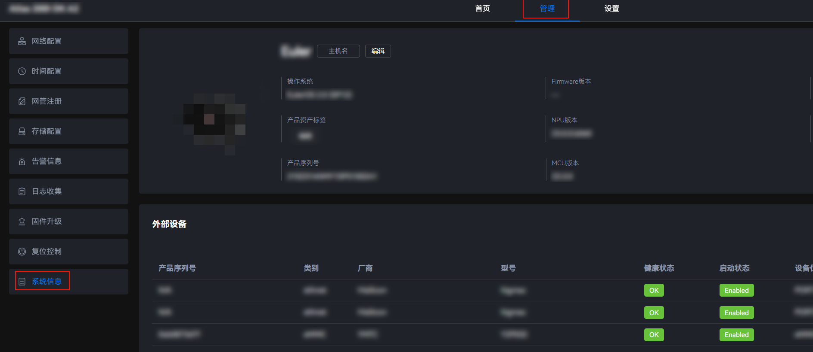

2. 查看系统信息。
    - 查看基本信息，参数如[表1 基本信息参数](#基本信息参数table1)所示。

        **表 1**  基本信息参数

        |参数名称|参数说明|
        |--|--|
        |主机名|管理系统的主机名称。单击“编辑”可进行修改。 取值范围：1～63位的字符串。 可由数字、英文字母和连字符（-）组成，且连字符不能出现在开头和结尾。|
        |操作系统|当前操作系统。|
        |产品资产标签|产品的资产标签。单击“编辑”可进行修改。 取值范围：1～255位的字符串。 可由数字、英文字母和英文标点符号组成。|
        |产品序列号|产品的唯一识别码。|
        |Firmware版本|当前固件版本信息。|
        |NPU版本|当前NPU固件版本。|
        |运行时间|当前系统的运行时间。|
        |型号|产品型号。|

    - 查看外部设备信息，参数如[表2 外部设备信息参数](#外部设备信息参数table2)所示。

        **表 2**  外部设备信息参数

        |参数名称|参数说明|
        |--|--|
        |产品序列号|产品的唯一识别码。|
        |类别|外部设备的类别。|
        |厂商|外部设备的生产厂商。  > [!NOTE] 说明  “unknown”表示边缘管理系统无法识别外部设备的厂商名称。|
        |型号|外部设备的型号。|
        |健康状态|外部设备的健康状态。<li>OK：正常</li><li>Critical：异常</li>|
        |启动状态|外部设备的启动状态。<li>Enabled：启动</li><li>Disabled：停止</li>|
        |设备位置|外部设备所在的总线位置。|
        |固件版本|外部设备的固件版本。|

## 设置

### 安全策略 

在主菜单中选择“设置 \> 安全策略”，您可以：

- 查看并设置边缘管理系统的超时时长。

- 查看并设置边缘管理系统用户的密码有效期。

- 查看并管理边缘管理系统的用户安全登录规则。

- 导入或导出边缘管理系统的弱口令信息。

- 边缘管理系统支持SSL服务器证书的导入，证书替换以及证书信息查询。
- 查看并设置边缘管理系统的证书提前告警天数。

> [!NOTE] 说明   
> 基于安全考虑，用户部署成功后，建议用户将Nginx侦听的IP地址修改为固定IP，同时关闭Nginx对IPv6的侦听。

#### Web超时

**设置Web超时时长**

1. 在主菜单中选择“设置 \> 安全策略 \> Web超时”。

    **图 1**  Web超时  
    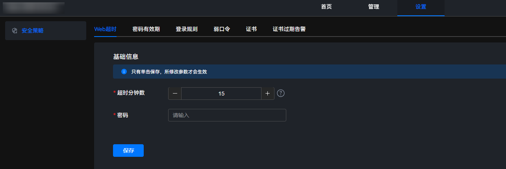

2. 设置超时分钟数。

    可以通过单击列表框手动输入超时分钟数。

    可以单击，设置超时分钟数。设置的起始超时分钟数为5分钟，单击后，每单击一次增加一分钟；每单击一次减少一分钟。

    **图 2**  Web超时设置  
    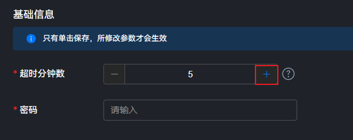

    > [!NOTE] 说明  
    > 超时分钟数取值范围为5\~120分钟，默认值是15分钟。

3. 在“密码”文本框中输入系统当前的用户密码。
4. 单击“保存”。

    界面弹出“保存成功”提示框，此时表示Web超时时间设置成功。

#### 密码有效期

**设置密码有效期**

1. 在主菜单中选择“设置 \> 安全策略 \> 密码有效期”。

    **图 1**  密码有效期  
    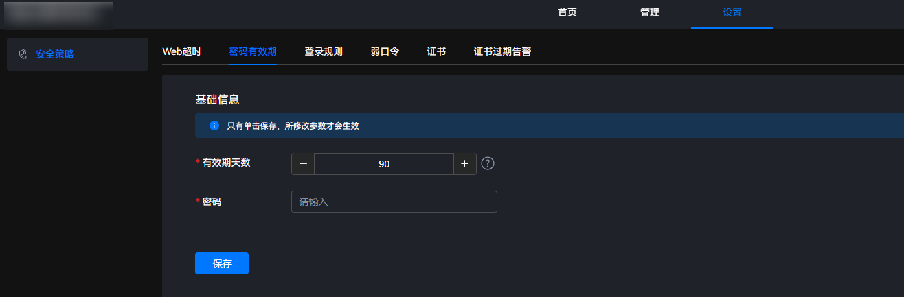

2. 设置有效期天数。

    可以通过单击列表框手动输入有效期天数。

    可以单击，设置有效期天数。每单击一次增加一天；每单击一次减少一天。

    **图 2**  密码有效期设置  
    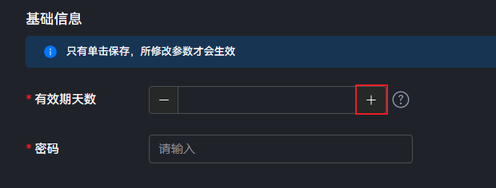

    > [!NOTE] 说明   
    > 取值范围为0～365，单位为天，默认值为90天；取值为0时表示密码有效期无限制；长期使用同一个密码会增加被暴力破解和恶意猜测的风险。  
    > 为保障系统安全性，建议设置合适的密码有效期，并定期更新密码。

3. 在“密码”文本框中输入系统当前的用户密码。
4. 单击“保存”。

    界面弹出“保存成功”提示框，此时表示密码有效期设置成功。

#### 登录规则

登录规则表示用户登录边缘管理系统需要满足的约束条件，包括登录时间段、登录IP网段、登录MAC地址等。单个规则内部的约束条件必须同时满足，多个规则中有一个规则满足约束条件即可。

**新增登录规则**

1. 在主菜单中选择“设置 \> 安全策略 \> 登录规则”。

    **图 1**  登录规则  
    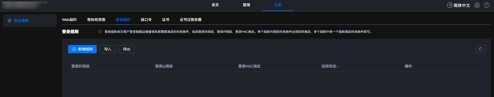

2. 单击“新增规则”。

    **图 2**  新增登录规则  
    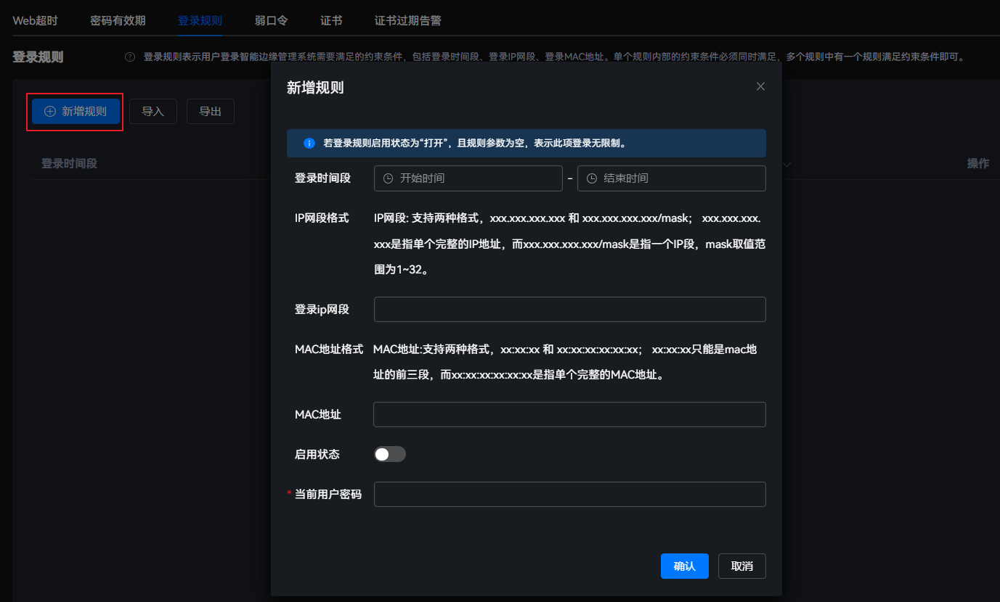

3. 根据[表1 登录规则](#登录规则table)提供的参数信息，设置系统登录规则。

    > [!NOTE] 说明   
    > 某条登录规则参数为空，规则状态为“启用”并保存时，表示此项登录无限制。

4. 单击“确认”。

    界面上方弹出“保存成功”提示框，表示新增登录规则成功。

**修改登录规则**

1. 在主菜单中选择“设置 \> 安全策略 \> 登录规则”。

    **图 3**  登录规则  
    

2. 单击待修改规则右侧的“修改”。

    **图 4**  修改登录规则  
    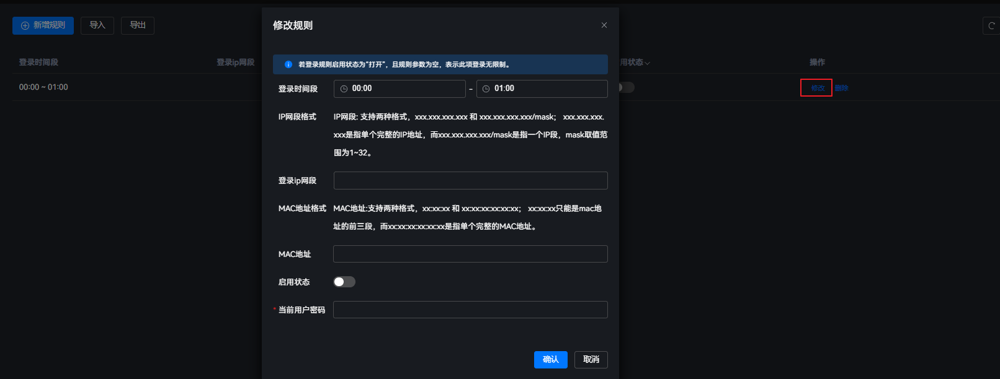

3. 根据[表1 登录规则](#登录规则table)提供的参数信息，修改系统登录规则。
4. 单击“确认”。

    界面上方弹出“保存成功”提示框，表示修改登录规则成功。

**删除登录规则**

1. 在主菜单中选择“设置 \> 安全策略 \> 登录规则”。

    **图 5**  登录规则  
    

2. 单击待删除规则右侧的“删除”。

    **图 6**  删除登录规则  
    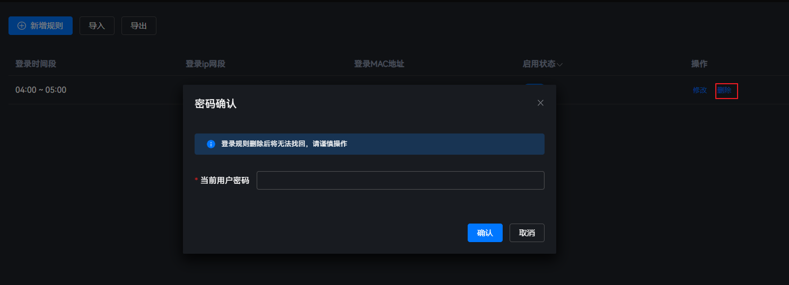

3. 在“当前用户密码”文本框中输入系统当前的用户密码。
4. 单击“确认”。

    界面上方弹出“删除成功”提示框，表示删除登录规则成功。

**修改登录规则状态**

1. 在主菜单中选择“设置 \> 安全策略 \> 登录规则”。

    **图 7**  登录规则  
    

2. 单击待启用规则右侧的“修改”，修改登录规则状态。

    - 单击使其变为，表示停用该规则。
    - 单击使其变为，表示启用该规则。

    **图 8**  修改登录规则  
    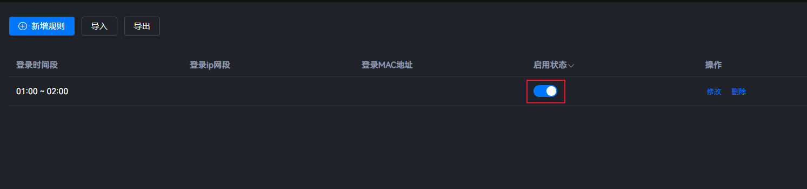

    > [!NOTE] 说明   
    > 某条登录规则参数为空，规则状态为“启用”并保存时，表示此项登录无限制。

3. 在“当前用户密码”文本框中输入系统当前的用户密码。
4. 单击“确认”。

    界面右上角弹出“登录规则状态切换成功”提示框，表示修改登录规则成功。

**导出登录规则**

1. 在主菜单中选择“设置 \> 安全策略 \> 登录规则”。

    **图 9**  登录规则  
    

2. 单击“导出”，将当前系统的登录规则保存至本地。

    **图 10**  导出规则  
    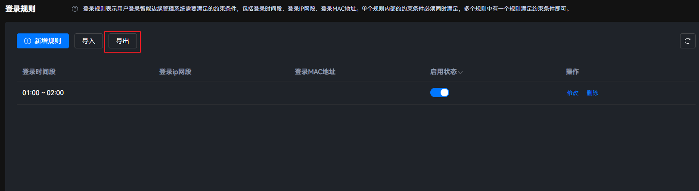

    > [!NOTICE] 须知 
    > 不允许用户修改导出的文件，否则造成该文件不可用。

**导入登录规则**

> [!NOTE] 说明   
> 登录规则不支持自行构造，只支持Web在线导出登录规则，迁移导入其他设备使用。

1. 在主菜单中选择“设置 \> 安全策略 \> 登录规则”。

    **图 11**  登录规则  
    

2. 单击“导入”，弹出“导入登录规则”对话框。

    **图 12**  导入登录规则  
    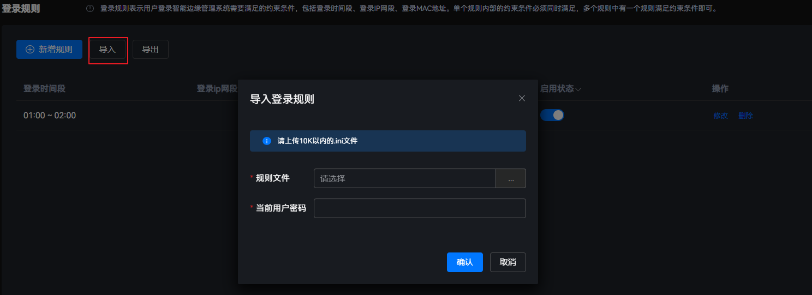

3. 在规则文件后单击，选择文件。上传10KB以内的.ini文件。

    > [!NOTE] 说明 
    >- 导入文件后会覆盖系统原有的登录规则。
    >- 导入的文件名长度为1\~255，可由大小写字母（a\~z、A\~Z）、数字（0\~9）和其他字符（\_.-）组成，且不能包含“..”且后缀为“.ini”。
    >- 导入的文件中最多可允许配置30条登录规则。

4. 在“当前用户密码”文本框中输入系统当前的用户密码。
5. 单击“确认”。

    界面上方弹出“登录规则导入成功！”提示框，表示导入登录规则成功。

**参数说明**

**表 1**  登录规则

|参数名称|参数说明|
|--|--|
|登录时间段|允许用户登录服务器的时间段。支持如下格式： xx:xx表示允许用户每日登录的时间段，如起始时间为06:00，结束时间为12:00。  > [!NOTE] 说明 <li>同一条规则的起始时间和结束时间的格式必须保持一致。</li><li>同一条规则的起始时间和结束时间必须同时配置，不可只配起始时间或结束时间。</li>|
|登录IP网段|允许用户登录的具体IP地址或IP网段。支持IPv4地址，支持如下两种格式：<li>xxx\.xxx.xxx.xxx：允许登录系统的单个用户的IP地址。</li><li>xxx\.xxx.xxx.xxx/mask：允许登录系统的用户IP网段，其中“mask”为子网掩码长度，取值范围为1～32。</li>|
|登录MAC地址|允许用户登录的具体MAC地址或MAC地址头。支持如下两种格式：<li>xx:xx:xx:xx:xx:xx：允许登录系统的单个用户的MAC地址。</li><li>xx:xx:xx：允许登录系统的用户MAC地址头。</li>|
|启用状态|是否启用登录规则。可单击“启用状态”后的，筛选登录规则的状态。可选的状态参数如下：<li>启用</li><li>停止</li> > [!NOTE] 说明  筛选成功后，可通过重置按键，清空筛选内容，恢复到筛选前。 若登录规则启用状态为“打开”，且规则参数为空，表示此项登录无限制。|
|当前用户密码|输入当前用户密码。|

#### 弱口令

**导入弱口令**

1. 在主菜单中选择“设置 \> 安全策略 \> 弱口令”。

    **图 1**  弱口令  
    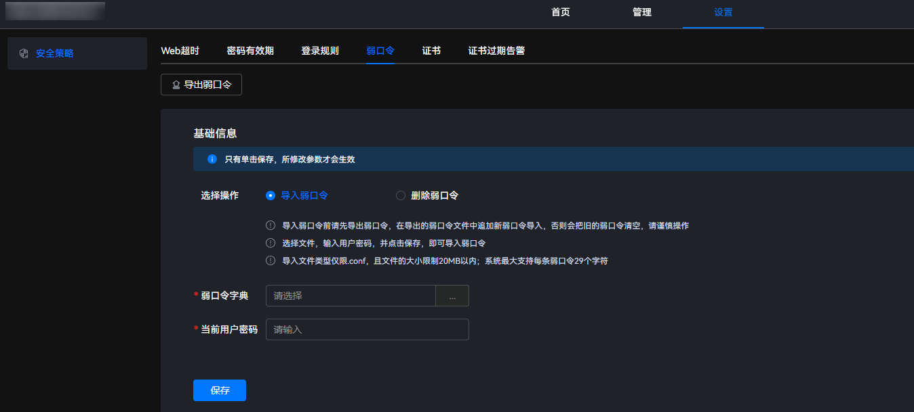

2. 单击“导入弱口令”。
    - 导入弱口令前请先导出弱口令，在导出的弱口令文件中追加新弱口令导入，否则会把旧的弱口令清空，请谨慎操作。
    - 选择文件，输入用户密码，并点击保存，即可导入弱口令。
    - 导入文件类型仅限.conf，且文件的大小限制20MB以内；系统最大支持每条弱口令29个字符。

3. 单击“弱口令字典”后的，并选择要上传的文件。
4. 上传文件。

    **图 2**  导入弱口令  
    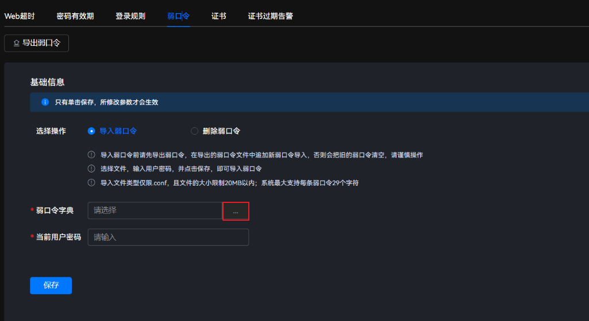

    > [!NOTE] 说明 
    > - 每次只允许导入一个配置文件。
    > - 导入文件后会覆盖系统当前的弱口令字典。
    > - 若要保留系统弱口令配置，请先导出系统弱口令后，在导出的弱口令文件上新增弱口令。
    > - 每条弱口令规则建议不超过30个字符，且不支持中文字符。

5. 在“当前用户密码”文本框中输入系统当前的用户密码。
6. 单击“保存”。

    界面上方弹出“弱口令导入成功”提示框，表示导入弱口令字典成功。

**导出弱口令**

1. 在主菜单中选择“设置 \> 安全策略 \> 弱口令”。

    **图 3**  弱口令  
    

2. 单击“导出弱口令”，将当前系统的弱口令字典保存至本地。

    **图 4**  导出弱口令  
    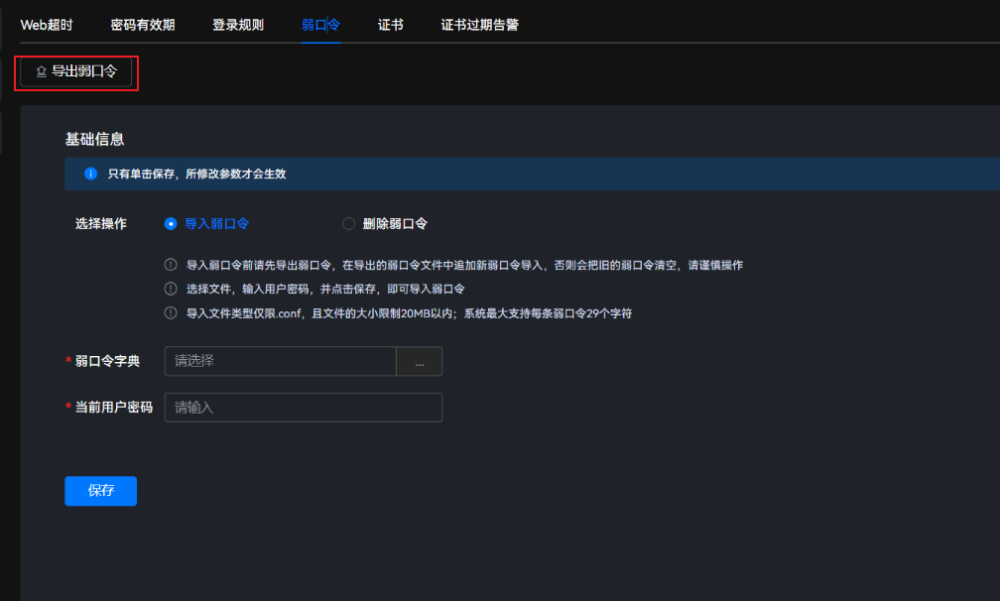

**删除弱口令**

1. 在主菜单中选择“设置 \> 安全策略 \> 弱口令”。

    **图 5**  弱口令  
    

2. 单击“删除弱口令”。

    - 删除的口令无法找回，请谨慎操作。
    - 输入用户密码，并点击保存，即可删除系统现有的弱口令。

    **图 6**  删除弱口令  
    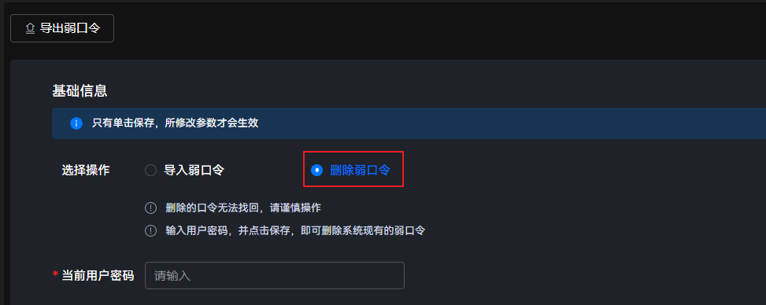

3. 在“当前用户密码”文本框中输入系统当前的用户密码。
4. 单击“保存”。

    界面上方弹出“弱口令删除成功”提示框，表示删除弱口令字典成功。

#### 证书

边缘管理系统支持SSL服务器证书的导入，证书替换以及证书信息查询。

SSL证书通过在客户端浏览器和Web服务器之间建立一条SSL安全通道（访问方式为HTTPS），实现数据信息在客户端和服务器之间的加密传输，可以有效防止数据信息的泄露。SSL保证了双方传递信息的安全性，同时用户可以通过服务器证书验证所访问的网站是否真实可靠。为提高边缘管理系统的安全性，需要用户导入自定义证书，并及时更新证书，保证证书的有效性，并在浏览器导入根证书。否则用户可能访问到伪造网站，导致用户名及密码被窃取，进而影响边缘设备的整体安全。

**上传自定义证书**

1. 在主菜单中选择“管理 \> 安全策略 \> 证书”。

    **图 1**  服务证书页面  
    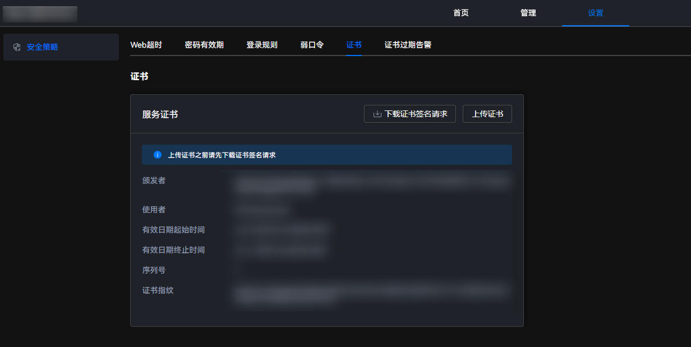

2. 在上传证书前，请单击“下载证书签名请求”，下载证书签名请求。

    **图 2**  下载证书签名请求  
    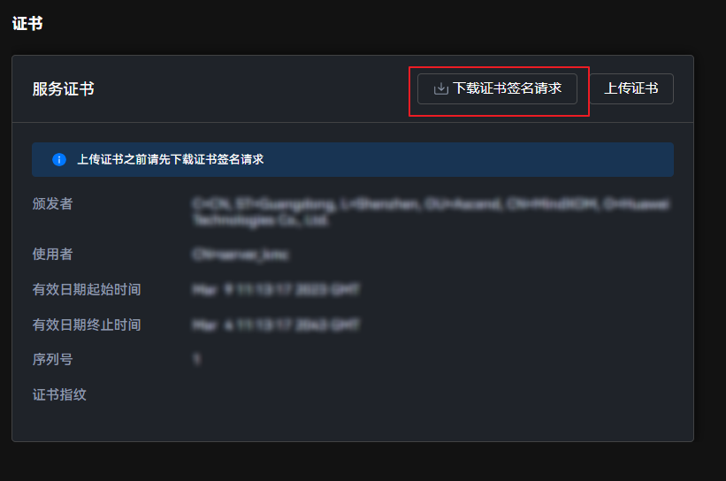

3. 单击“上传证书”，进入上传证书界面。

    **图 3**  上传证书  
    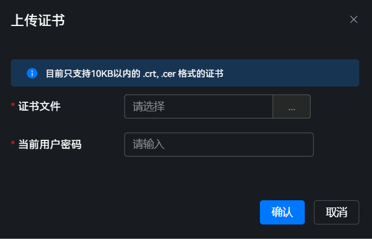

    - 服务器证书由客户使用第三方软件自行生成，且生成时建议采用安全性较高的加密算法，例如RSA4096。
    - 上传的证书文件不得大于10KB，目前仅支持.crt和.cer格式的证书。
    - 证书名长度为1\~255，可由大小写字母（a\~z、A\~Z）、数字（0\~9）和其他字符（\_.-）组成，且不含“..”，后缀只能为crt和cer。

4. 单击“证书文件”后的，选择需要上传的证书。

    **图 4**  上传证书文件  
    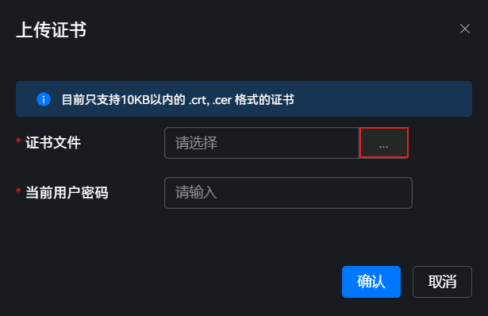

5. 在“当前用户密码”文本框中输入当前账户密码。
6. 单击“确认”。

    页面上方弹出“证书导入后，您可以在合适的时间重启小站使之生效”提示说明框。

    > [!NOTE] 说明  
    > 证书上传成功后，需要重启系统才能生效。

#### 证书过期告警

**设置证书过期提前告警时间**

1. 在主菜单中选择“设置 \> 安全策略 \> 证书过期告警”。

    **图 1**  证书过期告警  
    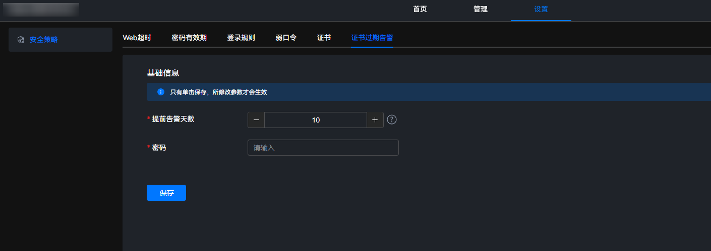

2. 设置提前告警天数。

    可以单击文本框，手动输入提前告警天数。

    可以单击，设置提前告警天数。设置的起始提前告警天数为7天，单击后，每单击一次增加一天；每单击一次减少一天。

    > [!NOTE] 说明  
    > 取值范围为7～180，单位为天，默认值为10天。  
    > 为保障系统安全性，建议设置合适的有效期，并定期更新证书。

3. 在“密码”文本框中输入系统当前的用户密码。
4. 单击“保存”。

    界面弹出“保存成功”提示框，表示证书过期提前告警时间设置成功。

# （可选）对接管理软件

## SmartKit批量管理

本章节指导用户对接SmartKit，实现对部署了边缘管理系统的设备进行批量管理。

**前提条件**

- 已安装SmartKit软件。
- 已登录SmartKit  Web界面。

    > [!NOTE] 说明   
    > 边缘管理系统支持对接SmartKit的版本为23.0.RC1及以上版本。

**操作步骤**

1. 在SmartKit  Web界面上添加设备。

    请参见《[SmartKit Computing 用户指南](https://support.huawei.com/enterprise/zh/doc/EDOC1100434746/426cffd9?idPath=23710424|251364417|251364851|253985677)》的“介绍SmartKit  \> 设备列表”章节添加边缘设备。在“设备列表”界面，可以添加需要维护和管理的设备，并对已添加的设备进行修改、移除、更新等操作，从而实现对边缘设备的批量管理。

2. 使用SmartKit进行批量管理。

    SmartKit软件为用户提供安装部署、例行维护、升级/补丁、扩容、部件更换等全流程配置和运维功能，用户可以参见《[SmartKit Computing 用户指南](https://support.huawei.com/enterprise/zh/doc/EDOC1100434746/426cffd9?idPath=23710424|251364417|251364851|253985677)》的“使用SmartKit”章节使用SmartKit的功能。

## FusionDirector集中式运维管理

FusionDirector为华为边缘设备（包含华为和第三方）统一运维管理软件，支撑公有云、企业客户对边缘设备在生命周期各阶段易用、高效的运维管理。实现了服务器的可视化管理和故障诊断，提供对边缘设备的设备纳管、设备配置、固件升级、设备监测、OS部署等全生命周期的管理能力，有效帮助运维人员提高运维效率、降低运维成本。更多FusionDirector的操作指导请参见《[FusionDirector 操作指南](https://support.huawei.com/enterprise/zh/doc/EDOC1100317179/426cffd9?idPath=23710424|251364417|251364851|252309137|23015464)》。

本章节指导用户对接FusionDirector，实现对部署了边缘管理系统的设备进行批量管理。

**前提条件**

要求待纳管的边缘设备系统时间与FusionDirector的系统时间一致，否则可能导致纳管失败。

> [!NOTE] 说明  
> FusionDirector纳管设备成功后，可以在后台环境查看操作日志，日志路径为“/var/plog/redfish/redfish\_operate.log”；运行日志路径为“/var/plog/redfish/redfish\_run.log”。

**操作步骤**

1. 登录边缘管理系统的Web界面。
2. 在主菜单中选择“管理 \> 网管注册”。

    **图 1**  配置网管注册  
    

3. 在“配置信息”区域，选择FusionDirector网管模式。
    - （默认）点对点Web管理：边缘管理系统默认采用点对点Web管理方式单独管理一台边缘设备，通过浏览器输入边缘设备的管理IP地址，进行点对点的设备管理。
    - FusionDirector管理：边缘设备作为边缘节点，与中心管理系统FusionDirector连接，纳入FusionDirector统一管理。根据实际的应用场景设置以下参数。

        **图 2** FusionDirector管理  
        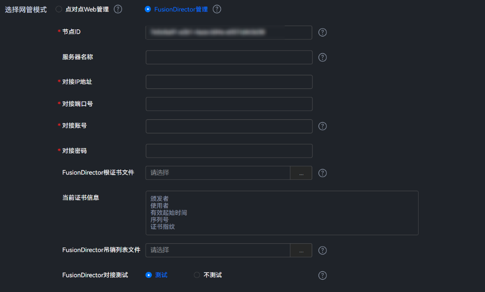

        > [!NOTE] 说明
        >1. 如果同一网卡上配置了多个IP地址，纳管到FusionDirector上显示的IP是随机的，无法确定是哪个设备。如果想要指定纳管到FusionDirector上的IP地址，可以通过绑定出口路由的方式实现。例如：假设FusionDirector的IP地址为192.168.100.15，设备上同一网卡上有2个IP地址192.168.1.100和192.168.1.101，如果要指定192.168.1.100纳管到FusionDirector上，则通过命令**ip route add 192.168.100.15 via 192.168.1.1 src 192.168.1.100**配置即可实现。
        >2. 当已纳管FusionDirector处于就绪时，Web界面不允许上传FusionDirector根证书，需要去纳管就绪的FusionDirector上导入其他FusionDirector的根证书，以实现FusionDirector之间的网管切换。

        **表 1**  参数说明

        
        <table><thead align="left"><tr id="row4770114091712"><th class="cellrowborder" valign="top" width="15%" id="mcps1.2.4.1.1">
参数

        </th>
        <th class="cellrowborder" valign="top" width="15%" id="mcps1.2.4.1.2">
是否必选

        </th>
        <th class="cellrowborder" valign="top" width="70%" id="mcps1.2.4.1.3">
说明

        </th>
        </tr>
        </thead>
        <tbody><tr id="row6770164016170"><td class="cellrowborder" valign="top" width="15%" headers="mcps1.2.4.1.1 ">
节点ID

        </td>
        <td class="cellrowborder" valign="top" width="15%" headers="mcps1.2.4.1.2 ">
必选（自动识别）

        </td>
        <td class="cellrowborder" valign="top" width="70%" headers="mcps1.2.4.1.3 ">
本设备对接FusionDirector的节点ID，使用默认参数。

        
修改该参数需要填写满足UUID（通用唯一标识符）格式的字符串。UUID是一个长度为128位的标识符，通常用来表示网络中的实体。

        
该参数格式为由数字和字母a~f组成，包含8个数字和字母组成的一组（32位），使用“-”分隔，再由4个数字和字母组成的一组（16位），使用“-”分隔；再由4个数字和字母组成的一组（16位），使用“-”分隔，再由4个数字和字母组成的一组（16位），使用“-”分隔，最后是包含12个数字和字母组成的一组（48位）。

        
参考格式为1aab2222-abc3-de45-123d-56789abcfdff。

        
 > [!NOTE] 说明 

若边缘设备发生故障，更换后的边缘设备节点ID应和原始边缘设备节点ID配置一致。通过FusionDirector界面选择“菜单 &gt; 设备 &gt; 设备列表 &gt; 边缘设备”，在设备列表中查看故障设备的节点ID。

        

        </td>
        </tr>
        <tr id="row19770194051717"><td class="cellrowborder" valign="top" width="15%" headers="mcps1.2.4.1.1 ">
服务器名称

        </td>
        <td class="cellrowborder" valign="top" width="15%" headers="mcps1.2.4.1.2 ">
可选

        </td>
        <td class="cellrowborder" valign="top" width="70%" headers="mcps1.2.4.1.3 ">
如果用户在FusionDirector上导入自定义的服务证书，则需要在边缘设备上导入对应签发机构的根证书（通过Web界面上“FusionDirector根证书文件”字段可以导入），用于校验FusionDirector的自定义服务证书，同时还需要填写“服务器名称”字段校验FusionDirector自定义服务证书的域名。该字段要求与FusionDirector自定义服务证书的CN（Common Name）字段保持一致。

        
如果用户使用的是华为初始的服务证书，则无需填写此字段。

        
 > [!NOTICE] 须知 

用户自定义服务证书的CN字段不能包含关键字“huawei”，否则会导致设备与FusionDirector对接失败。

        
如果服务器名称输入以“*.”开头的域名，保存配置后，“*.”会被替换成“fd.”。

        

        </td>
        </tr>
        <tr id="row1677015405175"><td class="cellrowborder" valign="top" width="15%" headers="mcps1.2.4.1.1 ">
对接IP地址

        </td>
        <td class="cellrowborder" valign="top" width="15%" headers="mcps1.2.4.1.2 ">
必选

        </td>
        <td class="cellrowborder" valign="top" width="70%" headers="mcps1.2.4.1.3 ">
表示FusionDirector的访问IP地址，取值为IPv4地址。

        </td>
        </tr>
        <tr id="row17770840111720"><td class="cellrowborder" valign="top" width="15%" headers="mcps1.2.4.1.1 ">
对接端口号

        </td>
        <td class="cellrowborder" valign="top" width="15%" headers="mcps1.2.4.1.2 ">
必选

        </td>
        <td class="cellrowborder" valign="top" width="70%" headers="mcps1.2.4.1.3 ">
表示FusionDirector对接端口号，取值在[1, 65535]，目前只支持443。

        </td>
        </tr>
        <tr id="row6770240101710"><td class="cellrowborder" valign="top" width="15%" headers="mcps1.2.4.1.1 ">
对接账号

        </td>
        <td class="cellrowborder" valign="top" width="15%" headers="mcps1.2.4.1.2 ">
必选

        </td>
        <td class="cellrowborder" valign="top" width="70%" headers="mcps1.2.4.1.3 ">
表示FusionDirector对接账号，默认账号为EdgeAccount。

        
 > [!NOTE] 说明 

采用默认EdgeAccount对接成功之后，对接账号会自动采用FusionDirector下发的新的一机一密重新对接。一机一密账户和密码由FusionDirector的业务微服务自生成，详细信息请参考《<a href="https://support.huawei.com/enterprise/zh/doc/EDOC1100316872/426cffd9?idPath=23710424|251364417|251364851|252309137|23015464" target="_blank" rel="noopener noreferrer">FusionDirector 维护指南</a>》。

        

        </td>
        </tr>
        <tr id="row1977013403171"><td class="cellrowborder" valign="top" width="15%" headers="mcps1.2.4.1.1 ">
对接密码

        </td>
        <td class="cellrowborder" valign="top" width="15%" headers="mcps1.2.4.1.2 ">
必选

        </td>
        <td class="cellrowborder" valign="top" width="70%" headers="mcps1.2.4.1.3 ">
表示FusionDirector对接密码。 密码请参见《<a href="https://support.huawei.com/enterprise/zh/doc/EDOC1100317179/426cffd9?idPath=23710424|251364417|251364851|252309137|23015464" target="_blank" rel="noopener noreferrer">FusionDirector 操作指南</a>》中的“设备快速入门 &gt; 边缘设备 &gt; 添加边缘设备”章节。
        

        </td>
        </tr>
        <tr id="row377184020175"><td class="cellrowborder" valign="top" width="15%" headers="mcps1.2.4.1.1 ">
FusionDirector根证书文件

        </td>
        <td class="cellrowborder" valign="top" width="15%" headers="mcps1.2.4.1.2 ">
可选

        </td>
        <td class="cellrowborder" valign="top" width="70%" headers="mcps1.2.4.1.3 ">
第一次对接FusionDirector必须上传根证书文件。点击，上传根证书文件。如果是多级证书，需要合并成一个证书文件导入，建议上级证书放在后面。

        
该参数为可选参数，使用系统初始证书时可以不配置该参数。出于安全考虑，建议用户使用自己的证书和公私钥对，并定期更新，保证证书的有效性和安全性。当证书过期或者被吊销导致设备与FusionDirector对接不上时，请重新导入根证书文件。为了保证根证书的安全性，根证书使用的非对称加密算法和密钥长度要求如下：<ul id="ul1371345011170"><li>如果使用RSA算法，建议使用3072位及以上密钥。</li><li>如果使用椭圆曲线EC算法，建议使用256位及以上密钥。</li></ul>
        

        
证书其他格式要求如下：<ul id="ul1974318613435"><li>证书需要是PEM格式。</li><li>根CA证书中签名正确。</li><li>根CA证书处于有效期内。</li><li>摘要算法可以是SHA256、SHA384、SHA512。</li><li>签名算法可以是sha256WithRSAEncryption、sha384WithRSAEncryption、sha512WithRSAEncryption、ecdsa-with-SHA256。</li><li>证书须为X.509 V3数字证书，根CA证书的“基本限制”扩展域须标明为“CA”，“密钥用法”扩展域中须包含“证书签名”。</li><li>证书扩展域需要带有“使用者可选名称SAN”字段，且包含IP值。</li></ul>
        

        
建议使用用户自定义的根证书。另外华为也提供了根证书，获取方法如下：

        
登录FusionDirector，在FusionDirector界面上方依次选择“菜单 &gt;系统管理 &gt; 安全管理 &gt; 证书管理”，点击“服务证书”，单击“FusionDirectorServer”栏目里的“导出”，下载证书压缩包（rootCerts.zip）到本地。解压下载的证书压缩包，获取需要的证书rootCertChain.crt。

        
 > [!NOTE] 说明 

若设备处于已纳管状态，则不能再次上传证书。

        

        </td>
        </tr>
        <tr id="row677174015171"><td class="cellrowborder" valign="top" width="15%" headers="mcps1.2.4.1.1 ">
FusionDirector吊销列表文件

        </td>
        <td class="cellrowborder" valign="top" width="15%" headers="mcps1.2.4.1.2 ">
可选

        </td>
        <td class="cellrowborder" valign="top" width="70%" headers="mcps1.2.4.1.3 ">
为了安全起见，上传FusionDirector根证书后，建议导入证书吊销列表，用来校验FusionDirector证书是否被吊销，如果FusionDirector证书已被吊销，则设备与FusionDirector将不能对接。该证书由用户自行提供。

        </td>
        </tr>
        <tr id="row11771114021710"><td class="cellrowborder" valign="top" width="15%" headers="mcps1.2.4.1.1 ">
FusionDirector对接测试

        </td>
        <td class="cellrowborder" valign="top" width="15%" headers="mcps1.2.4.1.2 ">
必选

        </td>
        <td class="cellrowborder" valign="top" width="70%" headers="mcps1.2.4.1.3 ">
系统默认选择对接测试。

        <ul id="ul1971445014176"><li>如果选择对接测试，会对节点ID和设备与FusionDirector的连通性进行测试，如果测试不通过，则FusionDirector网管切换失败。</li><li>如果选择不测试，不会对节点ID和设备与FusionDirector的连通性进行测试，FusionDirector网管切换成功，但这可能会导致FusionDirector纳管失败。</li></ul>
        
在边缘设备离线集中配置（无法连接FusionDirector）的场景下，可以选择不测试，但需要保证FusionDirector参数的有效性，即节点ID不能在FusionDirector上重复，且IP地址、用户名和密码有效。其他场景建议都进行测试，避免输入错误导致纳管失败。

        </td>
        </tr>
        </tbody>
        </table>

4. 单击"保存"。

    页面提示“网管模式切换成功”，表示配置网管注册成功。
